`UIKit`에서 `UICollectionView`를 구현하려면 Cell, Header, Footer를 register하는 코드를 작성해야 한다.

섹션 2개(`A`, `B`)가 있고, 각각 Cell, Header, Footer를 가지고 있다고 가정해 보자.<br>
총 6개의 View를 구현하고, 등록해야 한다.

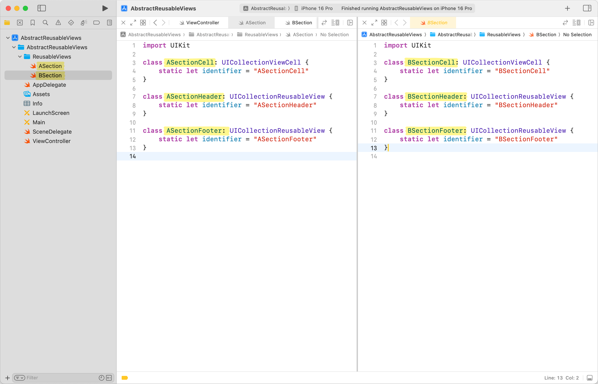

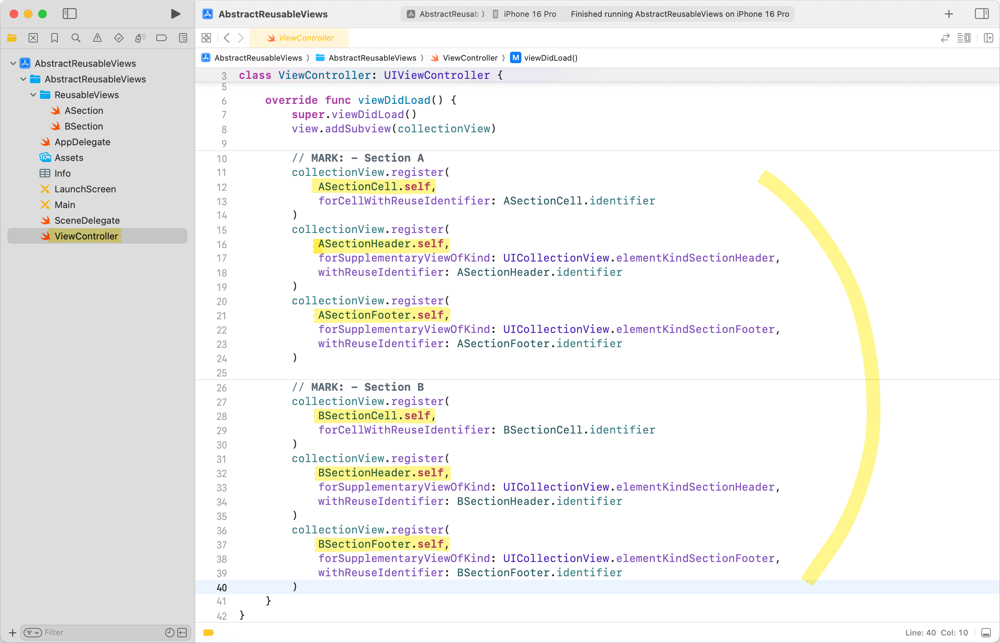

그렇지 않아도 코드 분량이 많은 `UICollectionView`이기에, 이 부분을 단순화하는 방법을 고민했다.

## 1️⃣ 클래스 상속 구조 분석

먼저, Header와 Footer는 모두 `UICollectionReusableView`를 상속받아 구현한다.<br>
타입으로 구분하는 것은 아니고, 등록할 때 `forSupplementaryViewOfKind`에 `String` 파라미터를 넘겨서 구분한다.<br>
`UICollectionView`에 미리 정의된 `elementKindSectionHeader`와 `elementKindSectionFooter`를 파라미터로 사용한다.

Cell은 `UICollectionViewCell`을 상속받아 구현하는데, 이 `UICollectionViewCell`도 `UICollectionReusableView`를 상속받은 클래스이다.

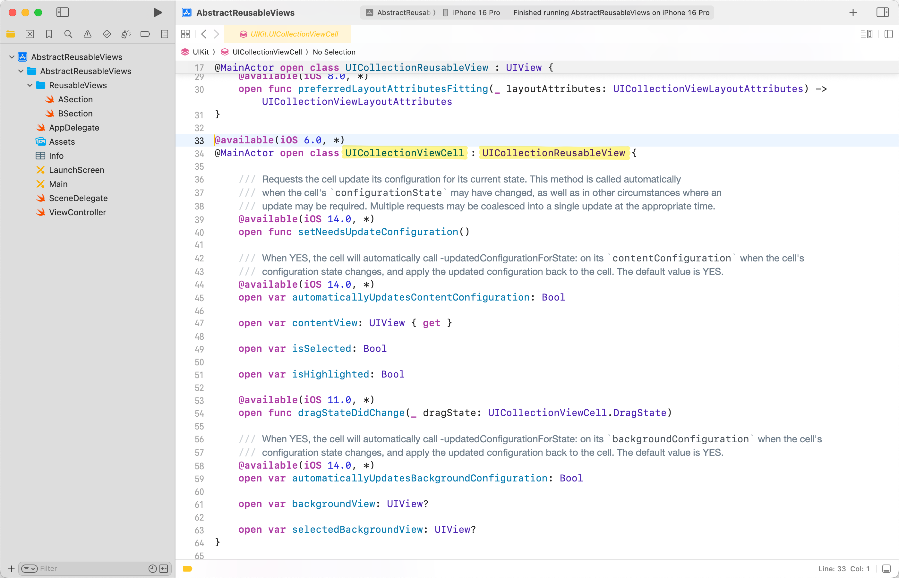

결국 Cell, Header, Footer 모두 `UICollectionReusableView`를 기반으로 두고 있기에, 별도의 프로토콜은 만들지 않고 `UICollectionReusableView`를 확장하여 진행하기로 했다.

## 2️⃣ identifier를 extension으로 분리

각 View에 있는 `identifier`를 `extension`으로 분리해 보자.<br>
이름이 좀 길지만, `UICollectionReusableView+Extensions.swift`를 만들고, 다음과 같이 연산 프로퍼티를 추가한다.

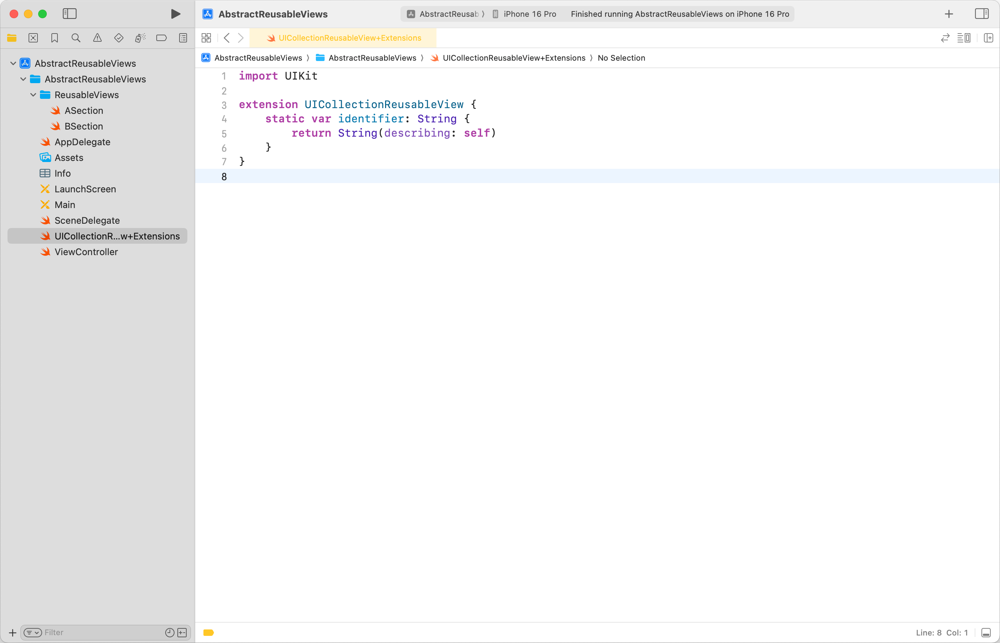

```swift
import UIKit

extension UICollectionReusableView {
    static var identifier: String {
        return String(describing: self)
    }
}
```

`String(describing:)`은 특정 값을 사람이 읽기 편한 문자열로 바꿔준다.<br>
`CustomStringConvertible`을 채택한 타입을 파라미터로 넣을 수 있는데, 재정의한 `description` 파라미터의 값이 출력된다.<br>
`description`을 재정의하지 않았다면, 타입의 이름이 문자열로 변환되어 출력된다.

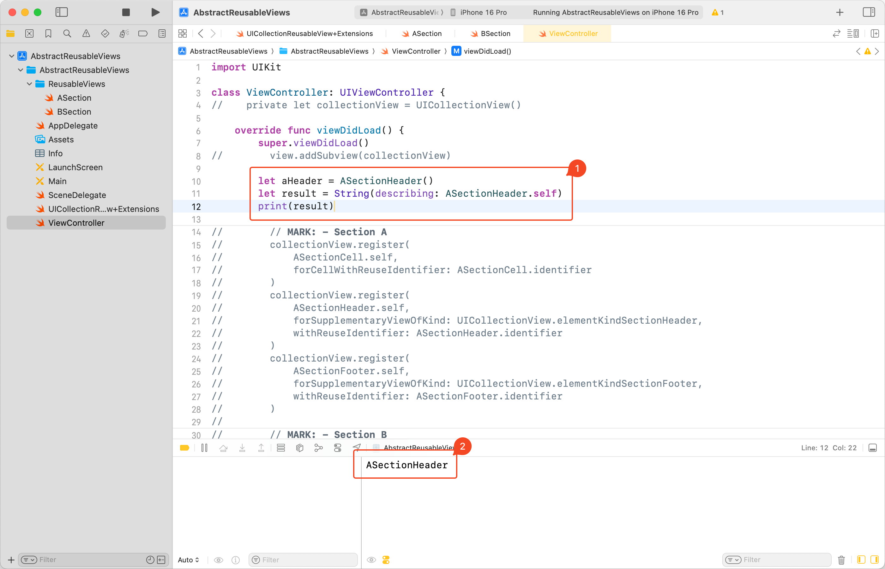

`extension`으로 분리했기 때문에, 각 View에는 `identifier`를 따로 정의하지 않아도 된다.<br>
기존 `identifier` 프로퍼티를 삭제한다.

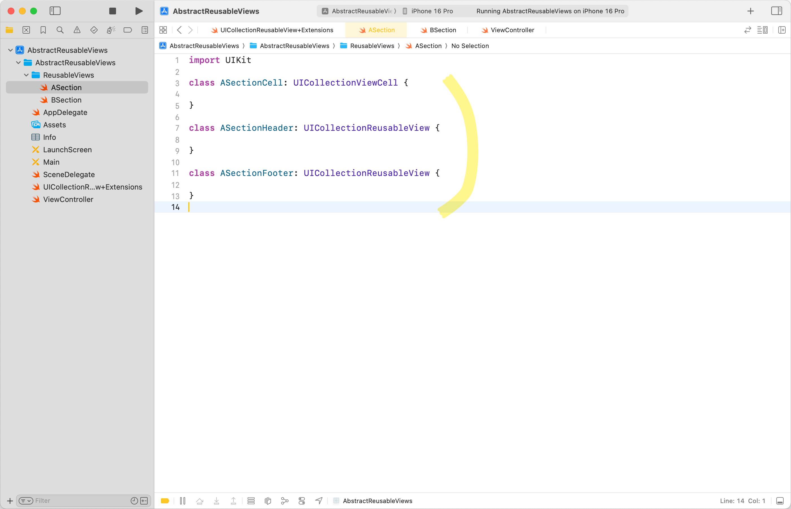

## 3️⃣ Cell, Header, Footer 구분하기

`identifier`를 재활용하여 Cell, Header, Footer를 구분해 보자.<br>
`ViewType`이라는 `enum`을 nested type으로 추가하고, suffix를 비교하여 구분하는 로직이다.<br>
타입의 suffix로 구분하기 때문에, 네이밍 컨벤션을 반드시 지켜야 한다는 한계점이 있다.

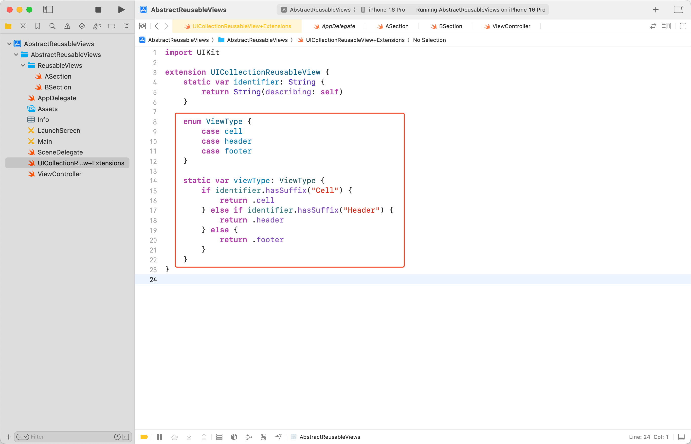

```swift
import UIKit

extension UICollectionReusableView {
    static var identifier: String {
        return String(describing: self)
    }

    enum ViewType {
        case cell
        case header
        case footer
    }

    static var viewType: ViewType {
        if identifier.hasSuffix("Cell") {
            return .cell
        } else if identifier.hasSuffix("Header") {
            return .header
        } else {
            return .footer
        }
    }
}
```

## 4️⃣ 통합 register 메서드 구현

이번엔 `UICollectionView+Extension.swift`를 만들고, 다음과 같이 `register(_:)` 메서드를 구현한다.

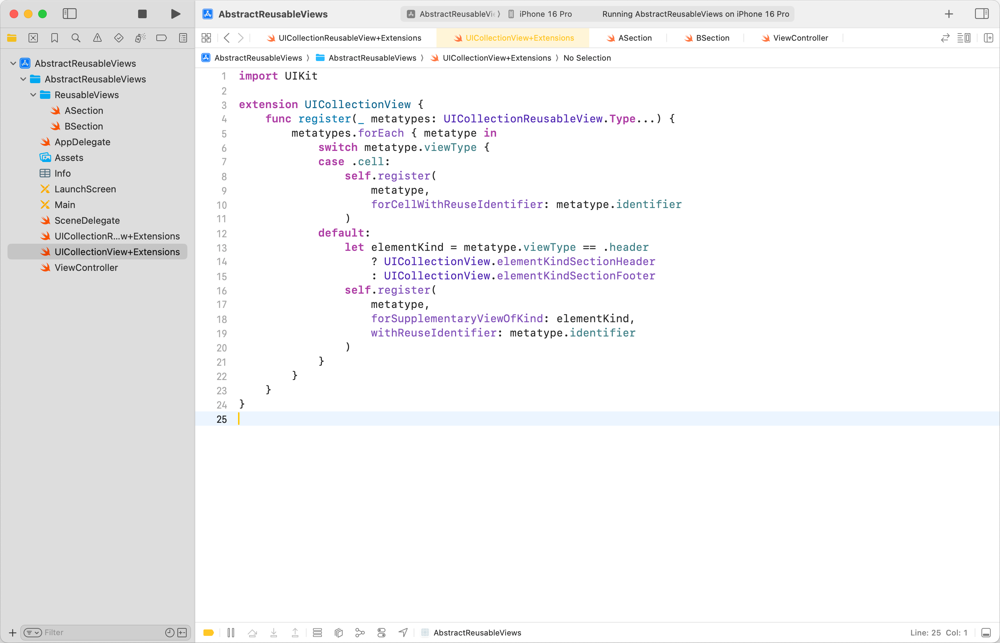

```swift
import UIKit

extension UICollectionView {
    func register(_ metatypes: UICollectionReusableView.Type...) {
        metatypes.forEach { metatype in
            switch metatype.viewType {
            case .cell:
                self.register(
                    metatype,
                    forCellWithReuseIdentifier: metatype.identifier
                )
            default:
                let elementKind = metatype.viewType == .header
                    ? UICollectionView.elementKindSectionHeader
                    : UICollectionView.elementKindSectionFooter
                self.register(
                    metatype,
                    forSupplementaryViewOfKind: elementKind,
                    withReuseIdentifier: metatype.identifier
                )
            }
        }
    }
}
```

주목할 것은 파라미터의 타입인 `UICollectionReusableView.Type...`이다.<br>
먼저, 뒤에 붙은 `...`은 [Variadic Parameters](https://docs.swift.org/swift-book/documentation/the-swift-programming-language/functions#Variadic-Parameters)임을 명시한다.<br>
Variadic Parameters는 개수 제한 없이 여러 개의 인자를 받을 수 있게 해주는 문법이고, 대표적으로 `print()`가 있다.

```swift
print("A")
print("A", "B")
print("A", "B", "C") // 3개 구문 모두 한 메서드로 처리한다.
```

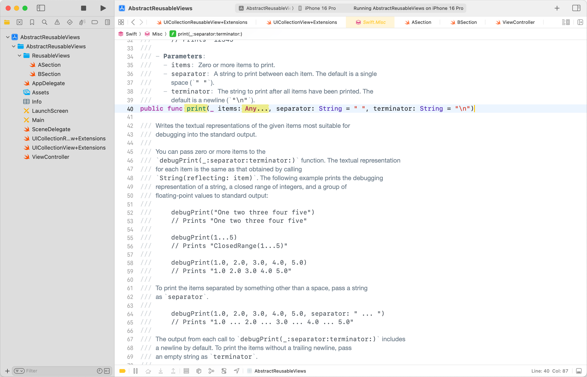

그리고, `.Type`은 해당 타입의 `Metatype`을 반환한다.<br>
`Metatype`은 '타입의 타입'으로, 해당 타입을 값으로 쓰기 위한 용도이다.<br>
`type(of:)` 메서드가 반환하는 값이 바로 `Metatype`이다.

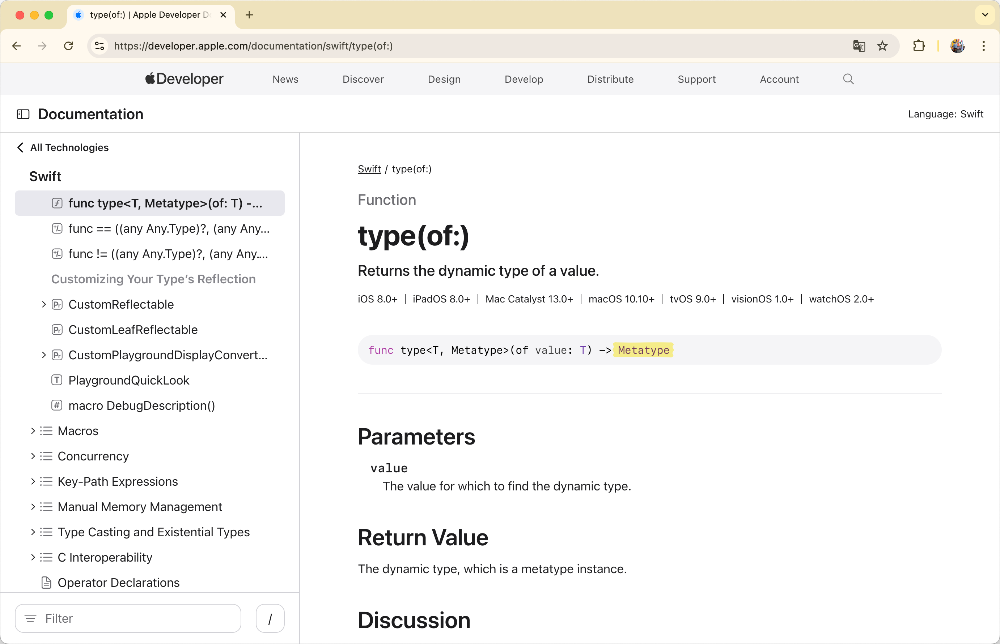

결국, `func register(_ metatypes: UICollectionReusableView.Type...) { }`은 `UICollectionReusableView` 혹은 이를 상속받은 View들의 `Metatype`을 개수 제한 없이 파라미터로 받는다는 뜻이 된다.

`Metatype`은 위에서 만든 타입 프로퍼티(`identifier`, `viewType`)에 접근할 수 있다.<br>
파라미터들을 순회하면서 Cell, Header, Footer 여부를 구분하고, 그에 맞는 `register`를 호출하는 방식이다.

## 5️⃣ 통합 register 메서드 호출

이제 VC에서 통합 register 메서드를 호출하면 추상화가 완료된다.

**적용 전**


**적용 후**

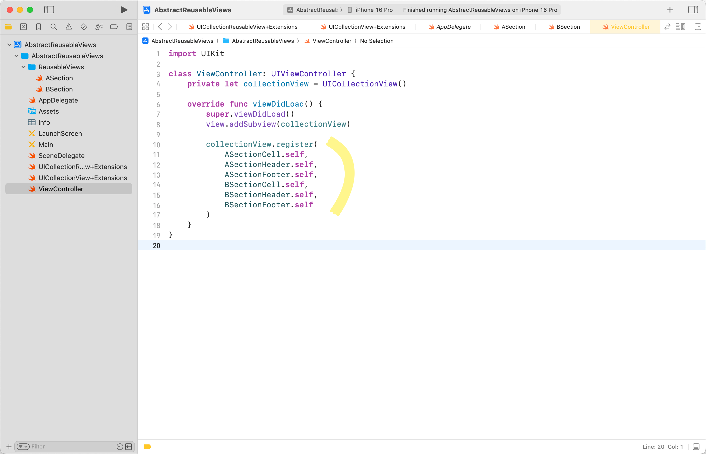

이전과 비교했을 때 `extension` 파일과 로직이 추가됐지만, VC의 가독성은 매우 좋아진 것을 확인할 수 있다.

## 마무리

앱의 진입점이 되는 MainVC의 경우, 누군가 프로젝트를 리뷰할 때 먼저 보게 될 확률이 높다고 생각한다.<br>
최근에 추상화 기법을 적극적으로 활용하여, 이러한 '먼저 볼 것 같은 파일'의 line 수를 줄이고 가독성을 높이는 코딩을 지향하고 있다.<br>
책상 위만 깨끗하고, 서랍 안은 더러워지는 느낌이 들 수 있지만, 나름대로 Reviewer의 심리적 부담을 줄여주는 방법이라고 생각한다.

바로 와닿지 않더라도, 추상화는 결국 재사용성과 유지보수성을 높이는 데 도움이 된다.<br>
비슷한 메서드 호출이 반복되거나 `switch` 구문이 있다면, 추상화를 한번 시도해 보자.

---

### 참고

- https://developer.apple.com/documentation/uikit/uicollectionview
- https://docs.swift.org/swift-book/documentation/the-swift-programming-language/functions#Variadic-Parameters
- [https://developer.apple.com/documentation/swift/type(of:)](https://developer.apple.com/documentation/swift/type(of:))
