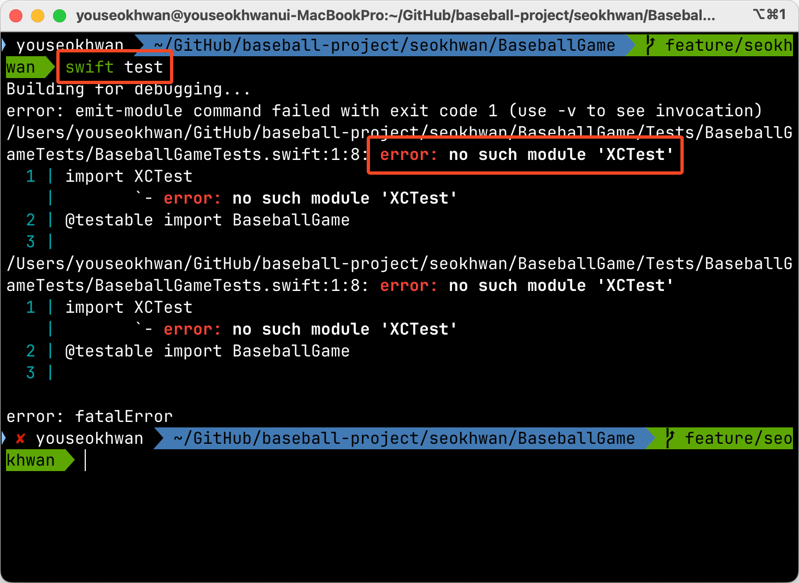
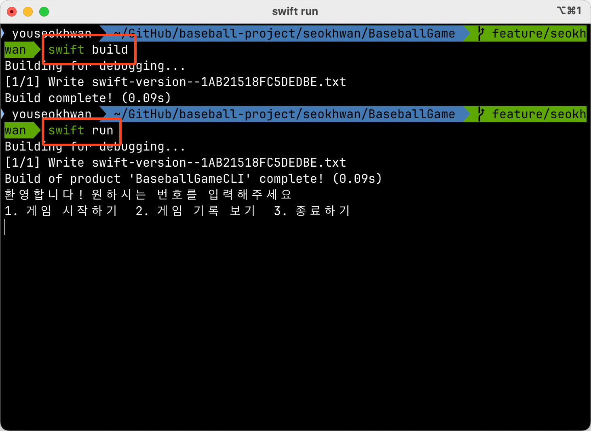
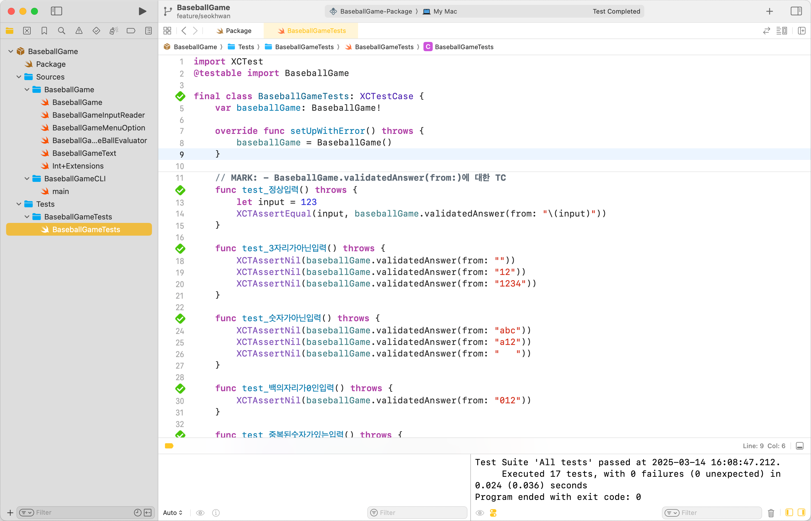
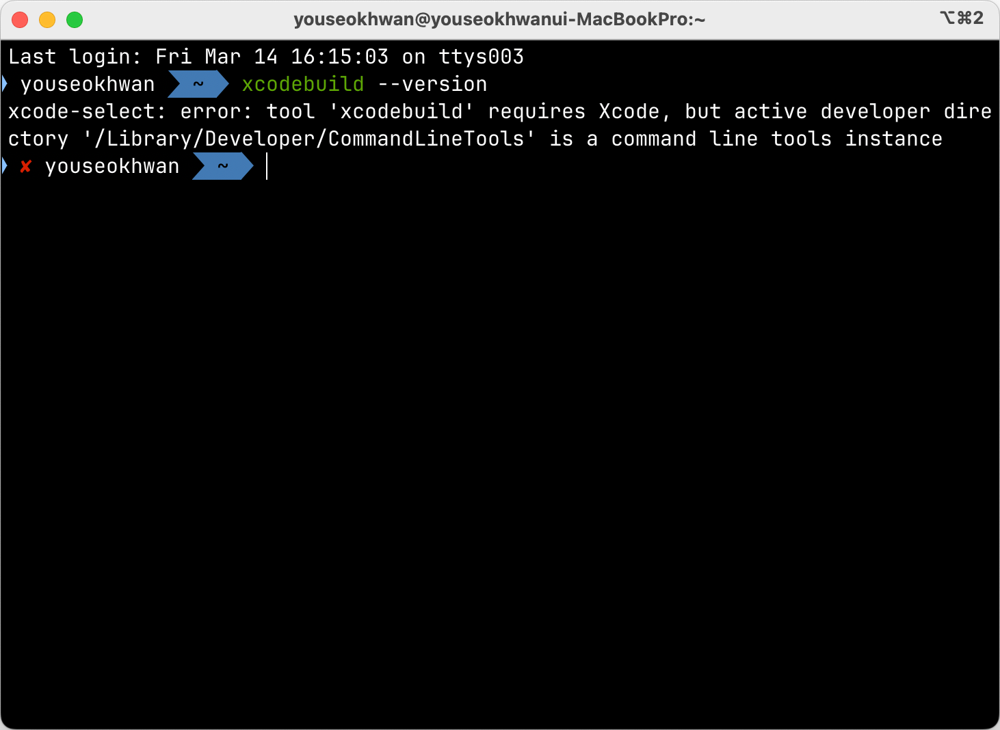
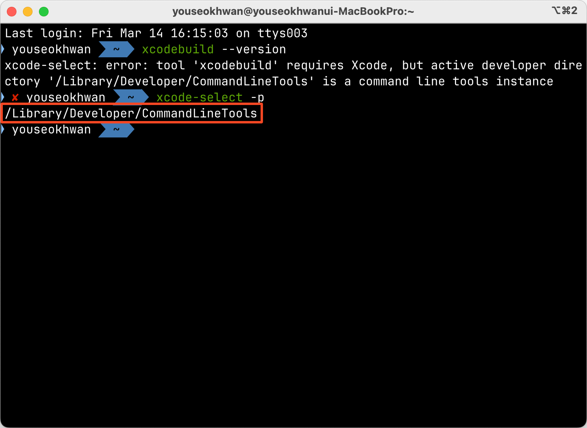
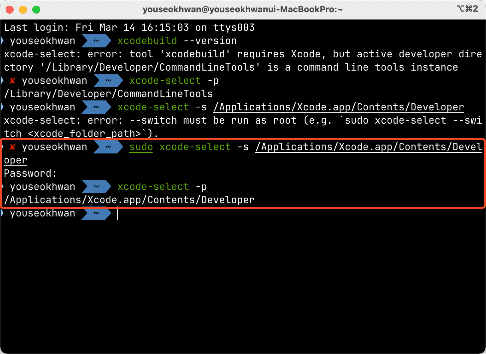
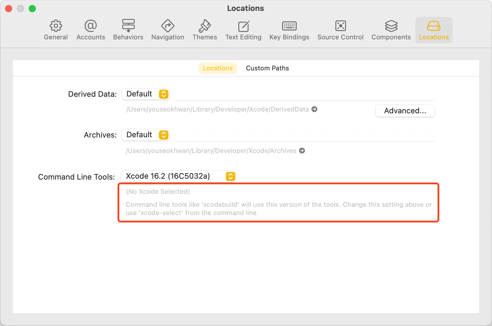
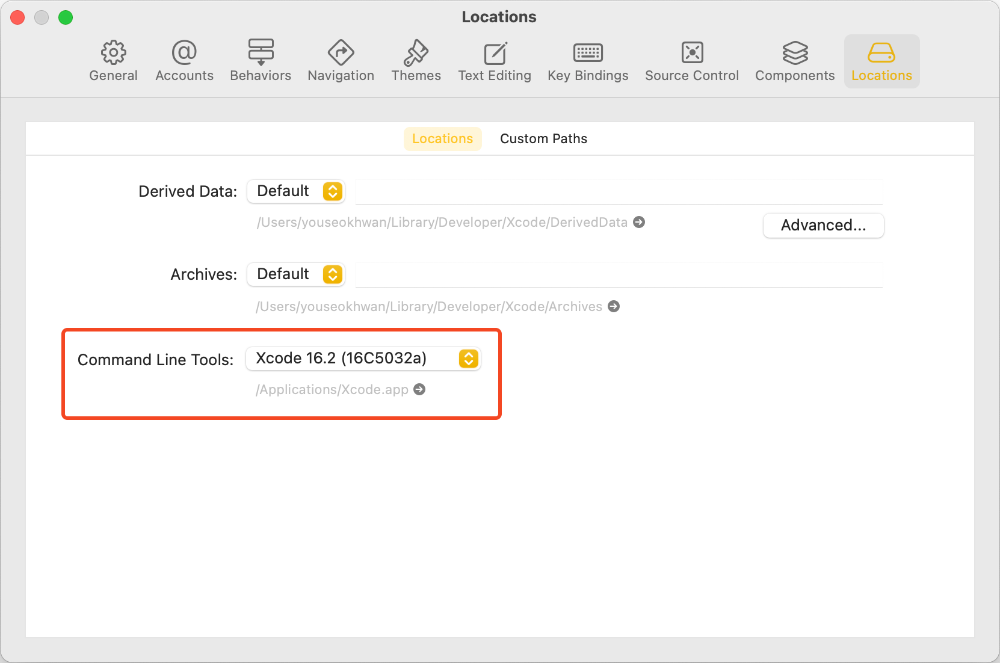
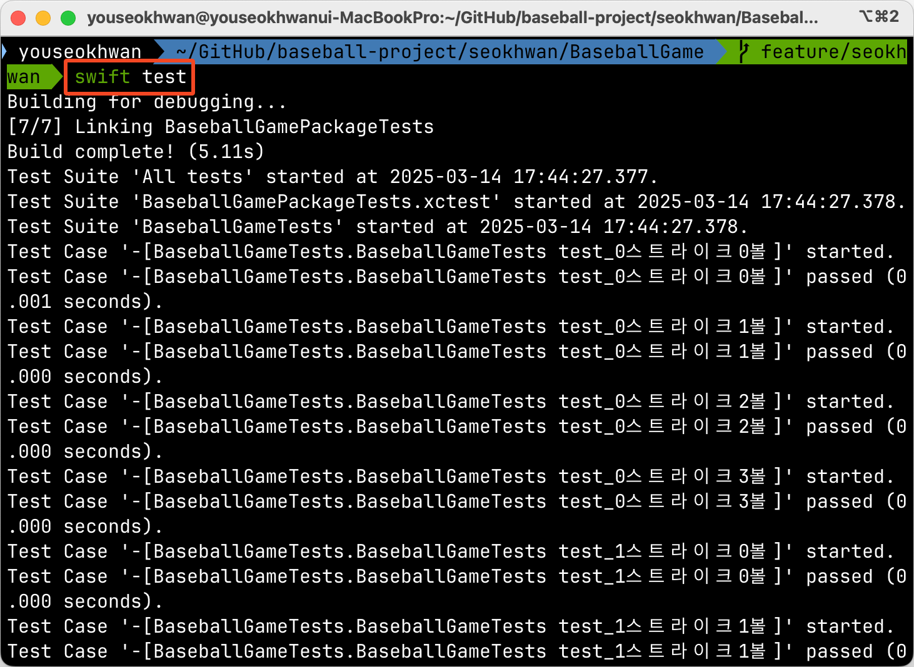
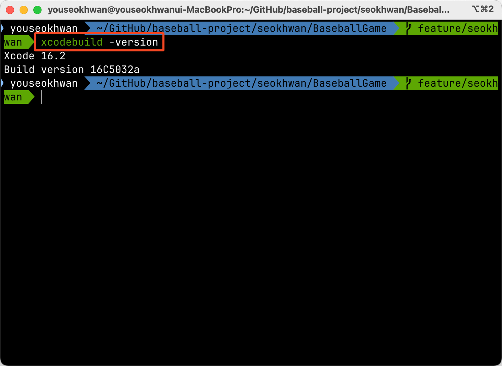

프로젝트를 SPM으로 관리하고 있다면, Xcode로 프로젝트를 열지 않고도 터미널에서 실행하거나 테스트할 수 있다.

```bash
swift build # 빌드
swift run # 실행
swift test # 테스트
```

마침 모듈화를 학습해보고 있어서 터미널로 위 명령어를 실행해봤는데,<br>
`swift test`에서 `no such module 'XCTest'` 에러가 발생하는 것을 확인했다.



의아한건 `swift build`와 `swift run`은 정상 작동이 된다는 점이였다.



물론, Xcode 프로젝트에서는 Run과 Test 모두 정상 작동한다.



완벽하게 이해하진 못했지만, 원인과 해결 방법을 분석해보았다.

## Environments

* M4 MacBook Pro 14
* Sequoia 15.3.2(프로젝트의 target version은 13)
* Xcode 16.2
* Swift: 6.0.3(프로젝트의 swift-tools-verison은 5.9)
* swift-driver: 1.115.1, swiftlang: 6.0.3.1.10

## 원인?

Xcode 프로젝트를 터미널에서 빌드할 일이 별로 없다보니, `xcodebuild` 명령어 자체가 작동하지 않는다는 사실을 뒤늦게 깨달았다.



> xcodebuild 명령어를 실행하려면 Xcode의 기능을 필요로 한다.<br>
> 그런데 현재 활성화된 개발자 디렉터리가 Xcode 디렉터리가 아닌 Command Line Tools 디렉터리이다.

자동 업데이트를 원치 않아서 AppStore의 Xcode를 삭제하고, 현재 고정된 버전(16.2)의 Xcode를 설치하여 사용하고 있다.<br>
아마 이 과정에서 경로 설정에 문제가 생긴게 아닐까? 추측하고 있다.

## Active Developer Directory 경로 변경

아무튼 active developer directory를 Xcode 디렉터리로 변경해주면 해결될 것 같다.<br>
현재 설정된 경로를 확인한다.

```bash
xcode-select -p
```

출력이 `/Library/Developer/CommandLineTools`라면 Command Line Tools고,<br>
`/Applications/Xcode.app/Contents/Developer`라면 Xcode로 정상적으로 설정돼있는 것이다.



현재 잘못 설정돼있는걸 확인할 수 있다.<br>
Xcode로 경로를 변경한다.

```bash
sudo xcode-select -s /Applications/Xcode.app/Contents/Developer
```



## 그냥 Xcode GUI에서도 변경 가능?

터미널에서 설정해버려서 직접 해보진 못했지만, Xcode에서도 직접 변경할 수 있는 것 같다.<br>
Settings(`⌘ + ,`) > `Locations` 탭에 `Command Line Tools` 항목이 있다.

### 변경 전



### 변경 후



## 정상 작동 확인

`swift test`와 `xcodebuild -version`이 정상 작동되는 것을 확인했다.





### 참고

- https://whitehyun.vercel.app/xcodebuild-1
- https://github.com/nodejs/node-gyp/issues/569
