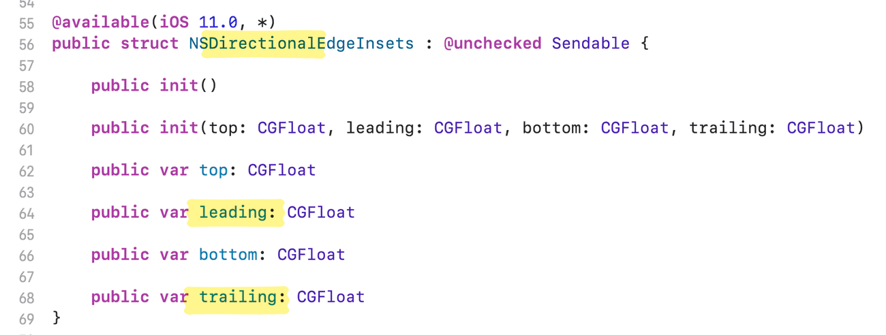

평소 `UIStackView`를 사용할 때 `spacing`, `distribution` 등을 사용하여 UI를 구현했다.<br>
여백이 필요할 땐, Auto Layout으로 해결했다.

그러던 중, 내부 요소의 좌우[^1]에도 여백을 줘야 할 일이 생겼는데, 위의 설정만으론 의도대로 구현하기 어려웠다.


이 문제를 `layoutMargins` 설정을 통해 해결하였고, 해당 내용을 정리해 보았다.

## 초기 상태

```swift
import UIKit
import SnapKit

class ViewController: UIViewController {
    // UI Components
    private lazy var stackView: UIStackView = {
        let stackView = UIStackView()
        stackView.axis = .horizontal
        stackView.spacing = 10
        stackView.distribution = .equalSpacing
        stackView.layer.borderWidth = 1
        return stackView
    }()
    private lazy var firstView = UIView()
    private lazy var secondView = UIView()
    private lazy var thirdView = UIView()

    override func viewDidLoad() {
        super.viewDidLoad()

        // Configure Layout
        firstView.backgroundColor = .first
        secondView.backgroundColor = .second
        thirdView.backgroundColor = .third

        // Add Subviews
        [firstView, secondView, thirdView].forEach {
            stackView.addArrangedSubview($0)
        }
        view.addSubview(stackView)

        // Constraints
        [firstView, secondView, thirdView].forEach {
            $0.snp.makeConstraints { make in
                make.size.equalTo(100)
            }
        }
        stackView.snp.makeConstraints { make in
            make.top.horizontalEdges.equalTo(view.safeAreaLayoutGuide).inset(20)
        }
    }
}
```

## layoutMargin

`UIStackView`에서 Padding을 구현하려면 `layoutMargins` 값을 수정해야 한다.

### isLayoutMarginsRelativeArrangement 설정

`layoutMargins` 값을 수정하기 전에 `isLayoutMarginsRelativeArrangement`을 `true`로 설정해야 한다.

```swift
stackView.isLayoutMarginsRelativeArrangement = true
```


`isLayoutMarginsRelativeArrangement`는 레이아웃 여백을 기준으로 하위 view들을 배치할지에 대한 여부이다.<br>
`true`면 하위 view들의 `UIStackView`에 대한 margin이 적용되고, `false`면 그냥 border를 기준으로 배치된다.

### layoutMargins 설정

`layoutMargins`는 `UIEdgeInsets`를 대입하여 상하좌우 값을 설정할 수 있다.

```swift
stackView.layoutMargins = UIEdgeInsets(top: 0, left: 15, bottom: 0, right: 15)
```


### directionalLayoutMargins 설정

만약 `left`, `right` 앵커가 아닌 `leading`, `trailing` 앵커에 대응해야 한다면, `directionalLayoutMargins`를 설정하면 된다.

```swift
stackView.directionalLayoutMargins = NSDirectionalEdgeInsets(top: 0, leading: 15, bottom: 0, trailing: 15)
```

`directional`이라는 prefix가 붙으면, `leading`과 `trailing`에 대응한다고 생각하면 된다.



`SnapKit`의 경우도, 같은 prefix를 찾아볼 수 있다.


```swift
stackView.snp.makeConstraints { make in
    // make.horizontalEdges.equalTo(view.safeAreaLayoutGuide).inset(20) // left, right
    make.directionalHorizontalEdges.equalTo(view.safeAreaLayoutGuide).inset(20) // leading, trailing
}
```

---

### 참고

- https://developer.apple.com/documentation/uikit/uistackview/islayoutmarginsrelativearrangement
- https://marlonjames.medium.com/padding-uistackviews-8e8a9c19e2ba
- https://ios-development.tistory.com/1498

[^1]: horizontal 기준
