`CoreData`를 비동기 방식으로, 최대한 클린 아키텍처 원칙에 위배되지 않도록 구현해 보자.<br>
처음엔 간단하게 구현한 뒤, 점진적으로 개선하는 방향으로 진행하며, 트러블슈팅 과정도 포함했다.<br>
`fetch`와 `insert`만 구현했으며, 에러 처리는 포함하지 않았다.

## 스키마 정의

본격적인 구현에 앞서, 이 포스트에서 예시로 사용할 `User` 스키마를 정의한다.

### Domain Layer에서 사용할 User

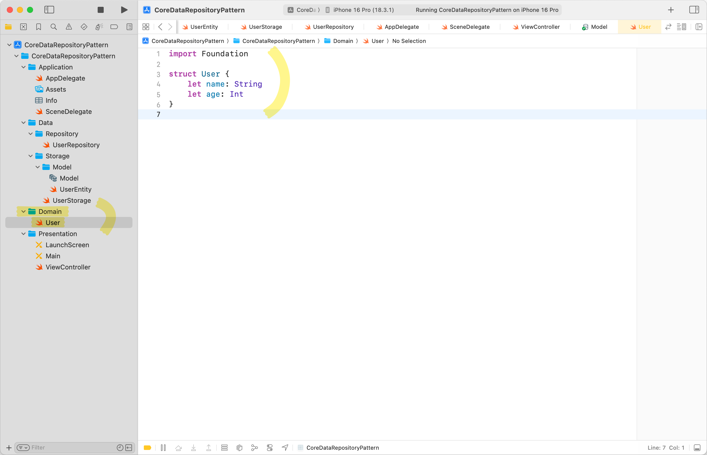

```swift
struct User {
    let name: String
    let age: Int
}
```

Domain Entity이기 때문에 최대한 순수한 상태로 작성한다.

### Data Layer의 Persistence(CoreData)에서 사용할 UserEntity

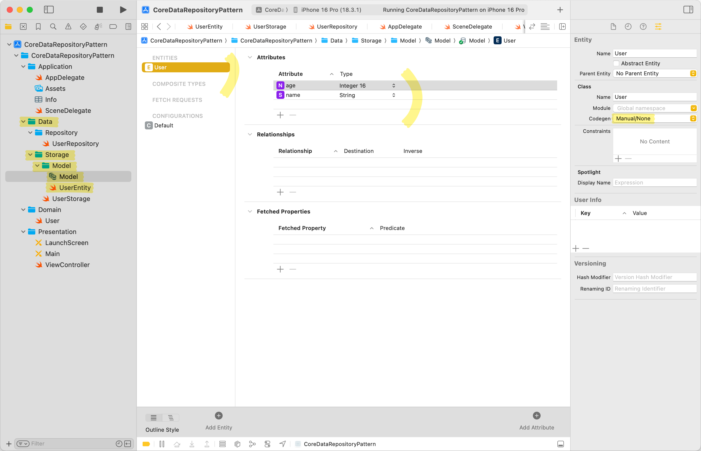

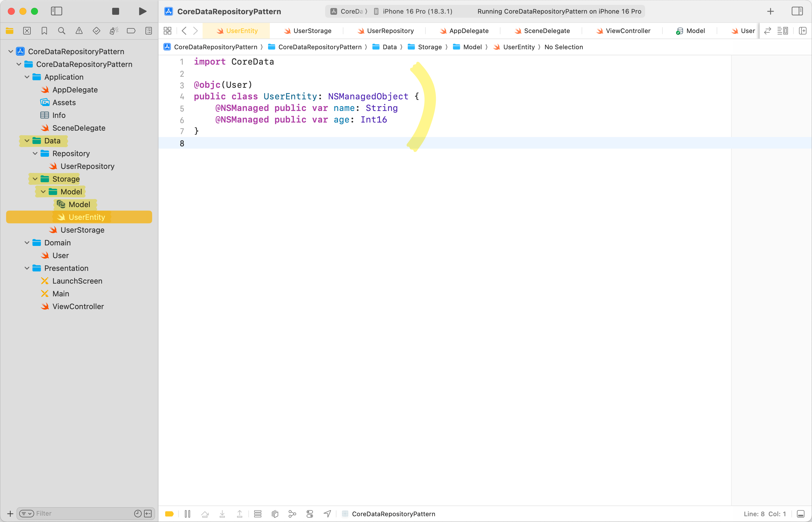

```swift
import CoreData

@objc(User)
public class UserEntity: NSManagedObject {
    @NSManaged public var name: String
    @NSManaged public var age: Int16
}
```

`Codegen`을 `Manual/None`으로 설정한 후, 직접 `UserEntity.swift`를 작성했다.

## 1️⃣ 가장 기본 형태의 UserStorage 구현

가장 간단한 형태로 `UserStorage`를 구현해 보자.

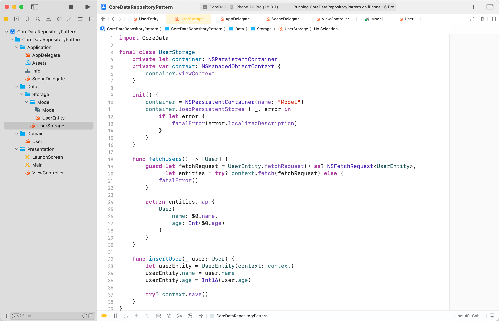

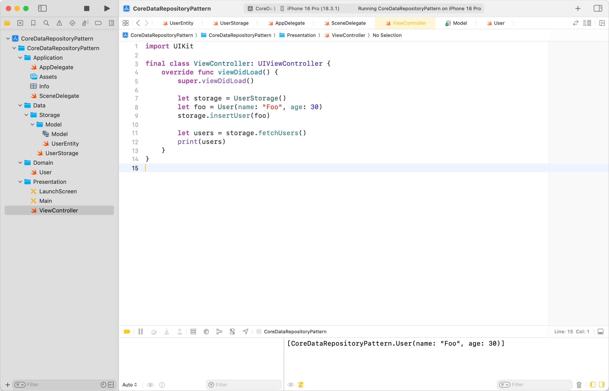

```swift
import CoreData

final class UserStorage {
    private let container: NSPersistentContainer
    private var context: NSManagedObjectContext {
        container.viewContext
    }

    init() {
        container = NSPersistentContainer(name: "Model")
        container.loadPersistentStores { _, error in
            if let error {
                fatalError(error.localizedDescription)
            }
        }
    }

    func fetchUsers() -> [User] {
        guard let fetchRequest = UserEntity.fetchRequest() as? NSFetchRequest<UserEntity>,
              let entities = try? context.fetch(fetchRequest) else {
            fatalError()
        }

        return entities.map {
            User(
                name: $0.name,
                age: Int($0.age)
            )
        }
    }

    func insertUser(_ user: User) {
        let userEntity = UserEntity(context: context)
        userEntity.name = user.name
        userEntity.age = Int16(user.age)

        try? context.save()
    }
}
```

## 2️⃣ Mapping 책임을 Repository로 분리

현재, `User`와 `UserEntity` 간의 매핑을 `Storage`가 직접 담당하고 있다.<br>
`Storage`는 이미 데이터 접근에 대한 책임을 담당하고 있으니, 매핑에 대한 책임은 `Repository`로 넘겨 추상화해 보자.

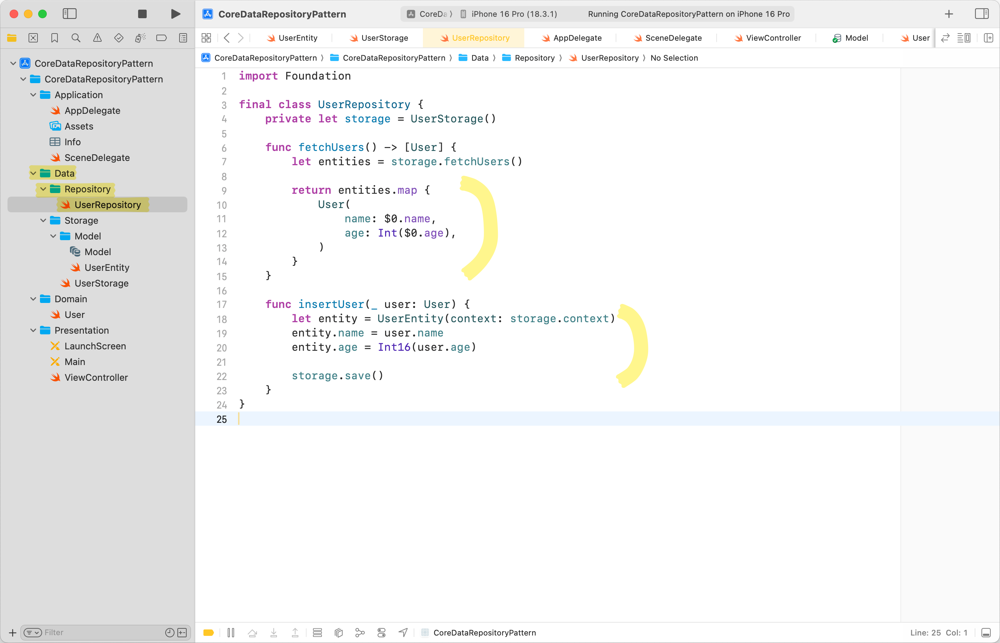

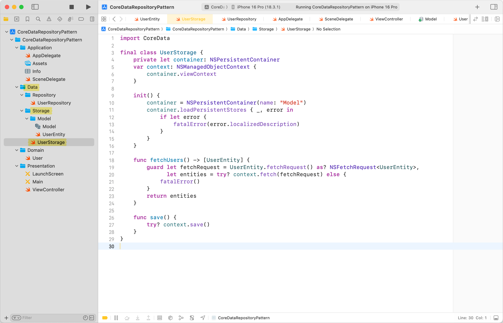

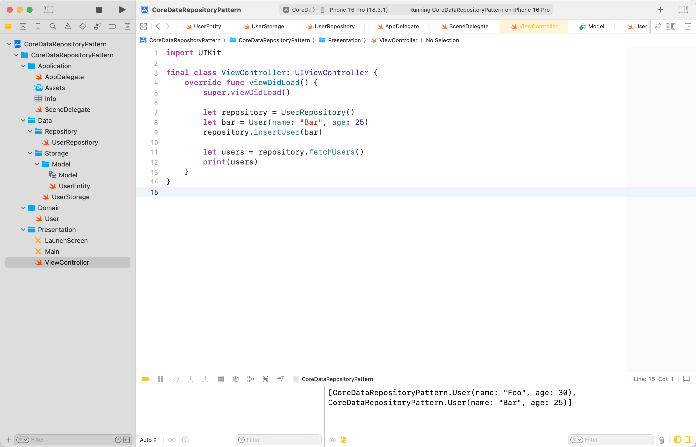

```swift
import Foundation

final class UserRepository {
    private let storage = UserStorage()

    func fetchUsers() -> [User] {
        let entities = storage.fetchUsers()

        return entities.map {
            User(
                name: $0.name,
                age: Int($0.age),
            )
        }
    }

    func insertUser(_ user: User) {
        let entity = UserEntity(context: storage.context)
        entity.name = user.name
        entity.age = Int16(user.age)

        storage.save()
    }
}
```

```swift
import CoreData

final class UserStorage {
    private let container: NSPersistentContainer
    var context: NSManagedObjectContext {
        container.viewContext
    }

    init() {
        container = NSPersistentContainer(name: "Model")
        container.loadPersistentStores { _, error in
            if let error {
                fatalError(error.localizedDescription)
            }
        }
    }

    func fetchUsers() -> [UserEntity] {
        guard let fetchRequest = UserEntity.fetchRequest() as? NSFetchRequest<UserEntity>,
              let entities = try? context.fetch(fetchRequest) else {
            fatalError()
        }
        return entities
    }

    func save() {
        try? context.save()
    }
}
```

## 3️⃣ CoreData를 비동기로 동작하도록 하기

위 코드에서, `viewContext`를 통해 데이터에 접근하고 있다.<br>
`viewContext`는 메인 스레드의 큐에 직접 바인딩 된 컨텍스트이기 때문에, 동기적으로 동작한다.<br>
따라서 대량의 데이터를 CRUD 할 경우, UI 업데이트가 지연되어 UX가 저하될 수 있다.

비동기로 동작하도록 변경해 보자.

### 3-1. newBackgroundContext() 방식

먼저, `backgroundContext`를 직접 만들어서 관리하는 방식이다.

```swift
func fetchUsers() async -> [UserEntity] { // 1
    let context = container.newBackgroundContext() // 2

    return await context.perform { // 3
        guard let fetchRequest = UserEntity.fetchRequest() as? NSFetchRequest<UserEntity>,
              let entities = try? context.fetch(fetchRequest) else {
            fatalError()
        }
        return entities
    }
}
```

1. `async`, `await` 키워드를 통해 작업이 끝날 때까지 기다린다.
2. `newBackgroundContext()`로 새로운 백그라운드 컨텍스트를 생성한다.
3. `perform` 클로저 내부의 작업은 백그라운드 스레드에서 실행된다.

이 방식은 여러 작업을 하나의 트랜잭션으로 묶는 복잡한 시나리오에서 사용하거나, 컨텍스트를 공유하는 등 높은 유연성이 장점이다.<br>
다만, 편의성이 낮고 스레드 관리를 개발자가 직접 해야 하는 리스크가 있다.

### 3-2. performBackgroundTask {} 방식

다음은 컨텍스트와 스레드를 자동으로 관리해 주는 `performBackgroundTask` 방식이다.

```swift
func fetchUsers() async -> [UserEntity] { // 1
    await withCheckedContinuation { continuation in // 2
        container.performBackgroundTask { context in // 3
            guard let fetchRequest = UserEntity.fetchRequest() as? NSFetchRequest<UserEntity>,
                  let entities = try? context.fetch(fetchRequest) else {
                fatalError()
            }
            continuation.resume(returning: entities) // 2
        }
    }
}
```

1. 마찬가지로 `async`, `await` 키워드를 통해 작업이 끝날 때까지 기다린다.
2. 아래에 사용되는 `performBackgroundTask`는 `async` 함수가 아닌, 콜백 기반의 비동기 코드다.<br>`withCheckedContinuation`[^1]는 이러한 콜백을 `async`/`await` 스타일로 래핑해주는 함수이다.
3. `performBackgroundTask`는 `CoreData`에서 제공하는 콜백 기반의 비동기 API다.<br>백그라운드 스레드에서 동작을 보장하며, 백그라운드 컨텍스트를 자동으로 생성하고 관리해 준다.

이 방식은 편의성이 높아, 대부분의 일반적이고 독립적인 백그라운드 CRUD 작업을 구현하기에 적합하다.<br>
다만, 단일 작업에 최적화돼 있기 때문에, 유연성이 낮다.

이 포스트에선 `performBackgroundTask` 방식으로 개선할 예정이다.

## 4️⃣ Repository에서 context를 직접 접근하는 코드 개선

위에서 매핑 책임을 `Repository`로 넘길 때, `Storage`의 `context`를 직접 접근하는 코드가 있었다.

```swift
func insertUser(_ user: User) {
    let entity = UserEntity(context: storage.context)
    // ...
}
```

이렇게 구현하면, `Repository`가 `CoreData`의 로직에 깊게 관여하게 되어, 결합도가 높아지고 관심사 분리 위반이 발생한다.<br>
이는 유연성과 테스트 용이성을 해치므로, 이 문제를 개선해야 한다.

### 4-1. 🚨 비어 있는 Entity를 만들어서 넘기기?

필자가 원했던 가장 깔끔한 형태는 `Repository`가 비어 있는 `UserEntity`를 만들고 `Storage`에 전달한 뒤, `Storage`에서 `context`를 주입하는 방식이었다.

```swift
// repository
let entity = UserEntity() // 🚨 비어있는 Entity를 만들고,
entity.name = user.name
entity.age = Int16(user.age)
storage.insertUser(entity) // Storage에 넘기기

// storage
entity.context = newBackgroundContext() // 🚨 Storage에서 context를 주입?
try context.save()
```

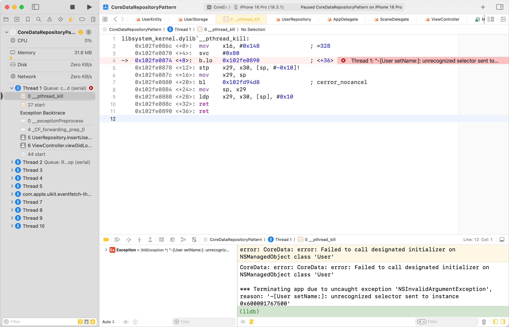

아쉽게도 `NSManagedObject`의 지연 로딩 특성과 `CoreData`의 생명 주기 방식에 의해 크래시가 발생한다.<br>
반드시 생성할 때부터 `context`를 연결해야만 한다. (뒤늦게 `context`를 주입하는 메서드도 제공되지 않는다.)

### 4-2. 클로저 활용

클로저를 활용한 Delegation으로 이 문제를 어느 정도 해결할 수 있다.

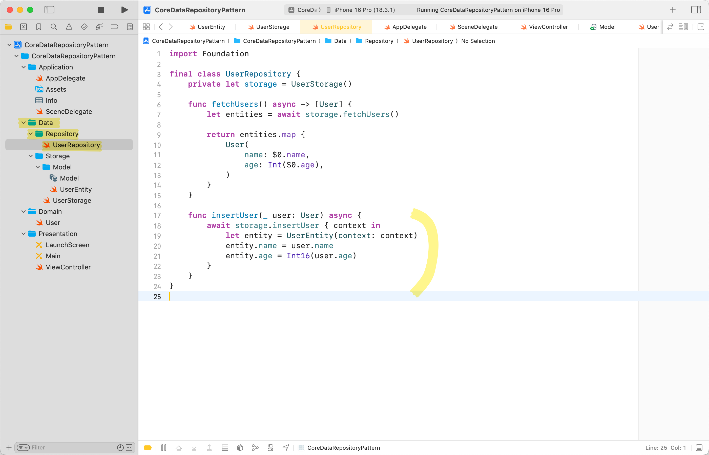

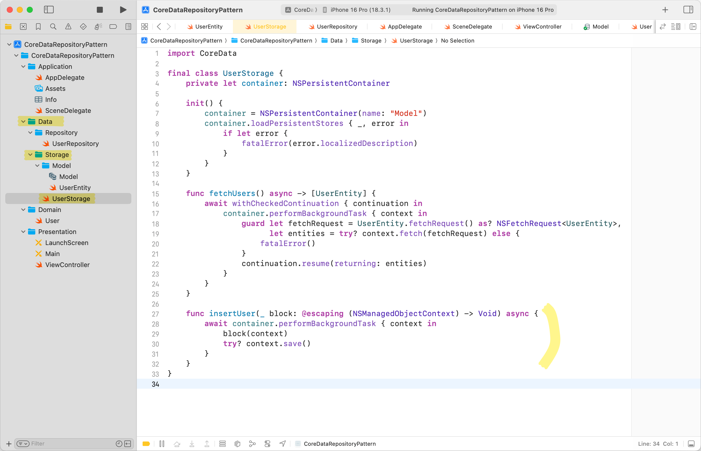

```swift
import Foundation

final class UserRepository {
    private let storage = UserStorage()

    func fetchUsers() async -> [User] {
        let entities = await storage.fetchUsers()

        return entities.map {
            User(
                name: $0.name,
                age: Int($0.age),
            )
        }
    }

    func insertUser(_ user: User) async {
        await storage.insertUser { context in
            let entity = UserEntity(context: context)
            entity.name = user.name
            entity.age = Int16(user.age)
        }
    }
}
```

```swift
import CoreData

final class UserStorage {
    private let container: NSPersistentContainer

    init() {
        container = NSPersistentContainer(name: "Model")
        container.loadPersistentStores { _, error in
            if let error {
                fatalError(error.localizedDescription)
            }
        }
    }

    func fetchUsers() async -> [UserEntity] {
        await withCheckedContinuation { continuation in
            container.performBackgroundTask { context in
                guard let fetchRequest = UserEntity.fetchRequest() as? NSFetchRequest<UserEntity>,
                      let entities = try? context.fetch(fetchRequest) else {
                    fatalError()
                }
                continuation.resume(returning: entities)
            }
        }
    }

    func insertUser(_ block: @escaping (NSManagedObjectContext) -> Void) async {
        await container.performBackgroundTask { context in
            block(context)
            try? context.save()
        }
    }
}
```

여전히 `UserRepository` 내부에 `NSManagementObjectContext` 타입이 작성되므로, 완벽하게 추상화했다고 표현하기는 어렵다.<br>
하지만, 클로저를 활용한 Delegation으로 계층 간의 의존성을 줄여, 최대한 클린 아키텍처에 부합하도록 구현했다.

## 5️⃣ 🚨 Fault 문제

위 구현으로 `insert` 및 `fetch`를 실행하면, `insert`는 정상적으로 되는데, `fetch`는 의도대로 되지 않는다.

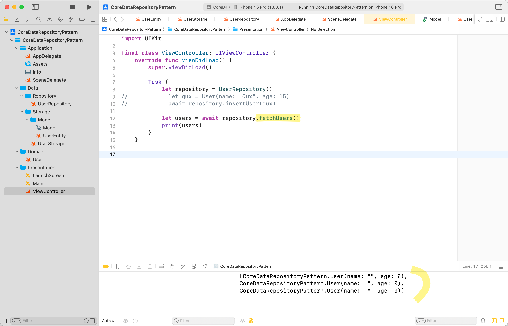

`Storage`에서 `fetch` 직후에 로그를 찍어보면, `insert`는 정상적으로 됐음을 확인할 수 있다.

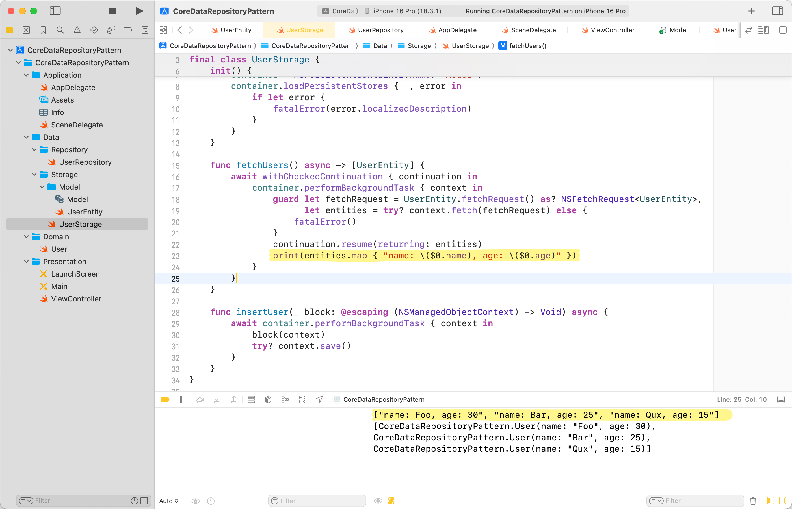

또한, `print`로 한번 객체에 접근한 이후에는 데이터가 정상적인 것을 확인할 수 있다.<br>
이 현상을 이해하기 위해서는 `CoreData`의 Fault 개념에 대한 학습이 필요하다.

### CoreData의 Fault 개념

`CoreData`는 객체를 가져올 때, 모든 데이터를 즉시 메모리에 로드하지 않는다.<br>
최소한의 정보(`objectID`)만 가지고 있다가, 실제 그 데이터에 접근할 때 나머지 데이터를 Lazy로 로드한다.<br>
이때, 최소한의 정보만 가지고 있는 상태를 '폴트 상태'라고 한다.

### 왜 지연 로딩이 안될까?

그렇다면 왜 지연 로딩이 되지 않고, 크래시가 발생하거나 Default Value로 초기화될까?

```swift
final class UserRepository {
    private let storage = UserStorage()

    func fetchUsers() async -> [User] {
        let entities = await storage.fetchUsers()

        return entities.map {
            User(
                name: $0.name, // <- 여기
                age: Int($0.age), // <- 여기
            )
        }
    }
}
```

이것에 대한 이유는 `context`의 생명 주기를 원인으로 보고 있다.<br>
`viewContext`의 경우, 일반적으로 `Storage`와 비슷한 생명 주기를 가지기 때문에, 매핑하는 시점에 메모리가 해제되지 않는다.<br>
그러나 지금은 `backgroundContext`이기 때문에, `fetch` 시점과 매핑 시점 사이에 `context`가 메모리에서 해제되어, Fault 상태가 Realized 상태가 되기 전에 데이터가 소실되는 것으로 유추해 볼 수 있다.

### ⚠️ 명시적으로 폴트 상태 해제

구글링을 통해 아래 두 가지 방법을 시도했으나, 의도대로 동작하지는 않았다.

```swift
let fetchRequest = UserEntity.fetchRequest() as? NSFetchRequest<UserEntity>
fetchRequest.returnsObjectsAsFaults = false
```

```swift
let entities = try? context.fetch(fetchRequest)
for entity in entities {
    _ = entity.name
    _ = entity.age
}
```

### ✅ 클로저 활용

`insert`처럼 `fetch`에서도 클로저를 활용하여 이 문제를 해결했다.

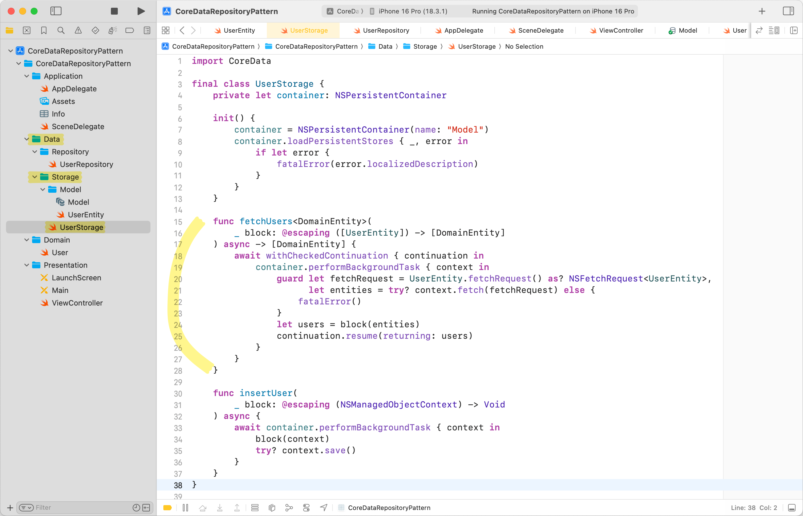

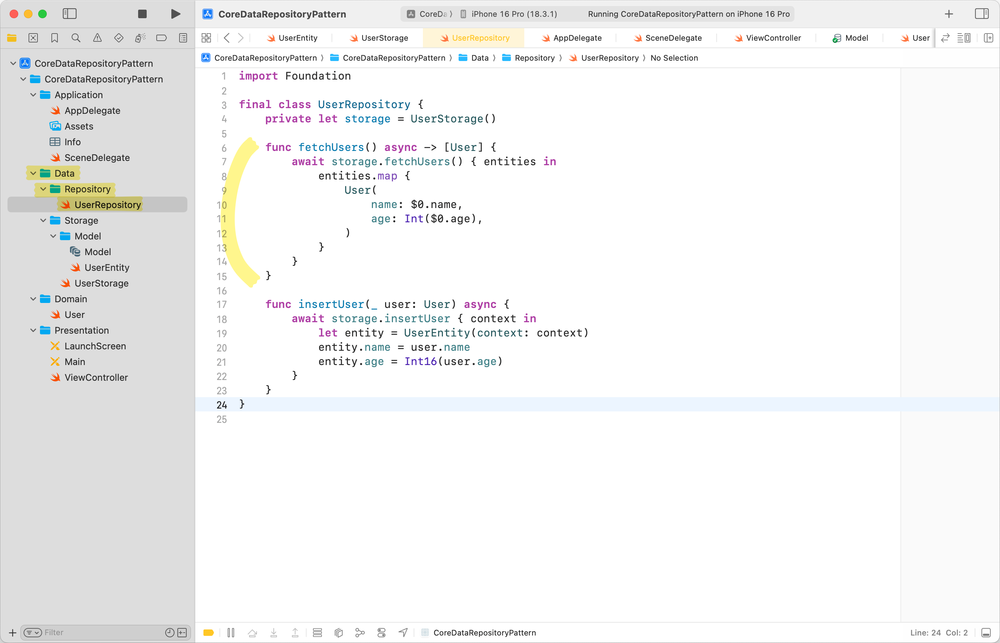

```swift
import CoreData

final class UserStorage {
    private let container: NSPersistentContainer

    init() {
        container = NSPersistentContainer(name: "Model")
        container.loadPersistentStores { _, error in
            if let error {
                fatalError(error.localizedDescription)
            }
        }
    }

    func fetchUsers<DomainEntity>(
        _ block: @escaping ([UserEntity]) -> [DomainEntity]
    ) async -> [DomainEntity] {
        await withCheckedContinuation { continuation in
            container.performBackgroundTask { context in
                guard let fetchRequest = UserEntity.fetchRequest() as? NSFetchRequest<UserEntity>,
                      let entities = try? context.fetch(fetchRequest) else {
                    fatalError()
                }
                let users = block(entities)
                continuation.resume(returning: users)
            }
        }
    }

    func insertUser(
        _ block: @escaping (NSManagedObjectContext) -> Void
    ) async {
        await container.performBackgroundTask { context in
            block(context)
            try? context.save()
        }
    }
}
```

```swift
import Foundation

final class UserRepository {
    private let storage = UserStorage()

    func fetchUsers() async -> [User] {
        await storage.fetchUsers() { entities in
            entities.map {
                User(
                    name: $0.name,
                    age: Int($0.age),
                )
            }
        }
    }

    func insertUser(_ user: User) async {
        await storage.insertUser { context in
            let entity = UserEntity(context: context)
            entity.name = user.name
            entity.age = Int16(user.age)
        }
    }
}
```

`context`가 메모리에서 해제되기 전에 `performBackgroundTask` 클로저에서 매핑을 완료한다.<br>
이 과정에서 `Storage`가 매핑에 직접 관여하면 관심사 분리가 안 되기 때문에, `block` 클로저를 통해 간접적으로 매핑하도록 했다.

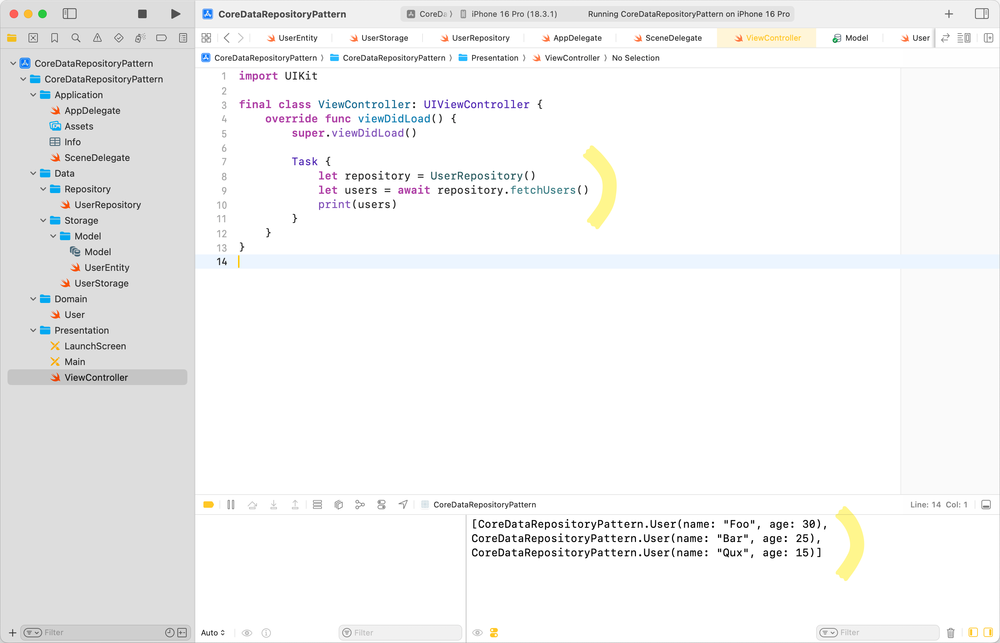

## 마무리

이번 포스트에서는 `CoreData`를 비동기로 개선하고, 최대한 클린 아키텍처 원칙에 맞춰 구현하였다.<br>
`CoreData` 특성상 Network Layer를 구성하는 것만큼 깔끔하게 관심사를 분리하지 못하여 아쉽지만, 클로저를 활용하여 트러블슈팅하는 과정에서 Deep Dive 할 수 있어 의미 있는 학습이었다.

---

### 참고

- https://developer.apple.com/documentation/coredata
- https://developer.apple.com/documentation/coredata/creating-a-core-data-model
- https://developer.apple.com/documentation/coredata/nspersistentcontainer/viewcontext
- https://developer.apple.com/documentation/swift/withcheckedcontinuation(isolation:function:_:)
- https://developer.apple.com/library/archive/documentation/Cocoa/Conceptual/CoreData/FaultingandUniquing.html
- https://developer.apple.com/documentation/coredata/nsfetchrequest/returnsobjectsasfaults

[^1]: CoreData가 아닌, Swift Concurrency 카테고리에 속한 개념이다.
