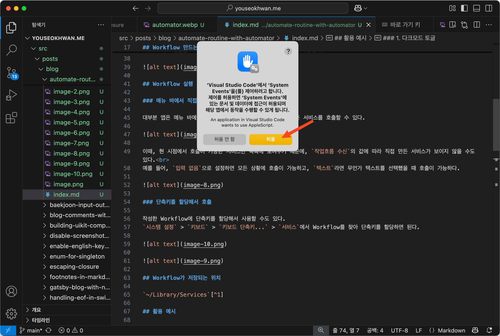

## Automator란?

Automator는 OS에서 할 수 있는 작업을 자동화할 수 있는 macOS 내장 앱이다.<br>
비개발자를 위한 GUI 항목도 많고, 개발자들이 AppleScript나 셸 스크립트를 이용해서 작업을 구체화할 수도 있다.<br>
무엇보다 내장 앱이기 때문에 OS, 다른 앱들과 상호작용을 하기도 수월하다.

Automator로 자신만의 루틴을 자동화된 Workflow로 만들어, 작업의 생산성을 높여보자.

## Workflow 만드는 방법

Automator 앱을 실행하고 `새로운 문서`를 클릭한다.


8가지 항목이 제공되는데, 이 포스트에서는 `빠른 동작`에 대해서만 다룬다.<br>
`빠른 동작`을 선택하고, `선택`을 클릭한다.


왼쪽 영역에 GUI로 제공되는 항목들이 있고, 오른쪽 영역에서 원하는 항목들을 가져와서 흐름을 구축하면 된다.


원하는 기능이 제공돼 있으면 바로 사용하면 된다.<br>
원하는 기능이 없으면, `AppleScript 실행`이나 `셸 스크립트 실행`으로 직접 스크립트를 작성할 수 있다.


Workflow 편집을 마치고, `⌘ + S`를 눌러 이름을 지어준 뒤 저장한다.


## Workflow 실행

앱마다 Workflow를 처음 실행하면, 퍼미션을 요청할 수 있다.<br>
허용해 주어야 정상 작동한다.



### 메뉴 바에서 직접 호출

대부분 앱은 메뉴 바에 `서비스` 항목이 있고, 여기서 직접 만든 서비스를 호출할 수 있다.


이때, 현시점에서 호출이 가능한 서비스만 목록에 보여주기 때문에, `작업흐름 수신`의 값에 따라 직접 만든 서비스가 보이지 않을 수도 있다.<br>
예를 들어, `입력 없음`으로 설정하면 모든 상황에 호출이 가능하고, `텍스트`라면 무언가 텍스트를 선택했을 때 호출이 가능하다.


### 단축키를 할당해서 호출

작성한 Workflow에 단축키를 할당해서 사용할 수도 있다.<br>
`시스템 설정` > `키보드` > `키보드 단축키...` > `서비스`에서 할당하면 된다.


단축키가 충돌할 경우, 각 앱의 단축키가 우선으로 적용된다는 점을 알아두자.

## Workflow가 저장되는 위치

`~/Library/Services`[^1]

## 활용 예시

다음은 필자가 사용하는 Workflow 예시이다.

### 1. 다크 모드 토글

다크 모드를 토글 하려면 제어 센터를 열고, 디스플레이를 누르고, 다크 모드 버튼을 눌러야 한다.<br>
AppleScript를 이용해 이 토글 작업을 `F6`에 할당했다.

```applescript
tell application "System Events"
    tell appearance preferences
        if dark mode is true then
            set dark mode to false
        else
            set dark mode to true
        end if
    end tell
end tell
```


### 2. 블로그 새 포스트 만들기

이 Gatsby 블로그는 지정된 곳에 디렉터리를 만들고, `index.md`에 내용을 입력해 포스트를 추가한다.<br>
기존에는 새 포스트를 만들 때 기존 포스트를 복사한 뒤, 내용을 수정하는 방식으로 추가했는데, 이를 자동화했다.

기본적인 틀만 잡혀있는 포스트 템플릿을 만들어두고, 서비스가 호출되면 복사해 오는 방식이다.


`새 포스트 만들기` 서비스를 호출하면, 다음과 같이 새 디렉터리와 마크다운 파일이 자동으로 생성된다.


## Alfred 5의 Powerpack(유료)

사실 이러한 Workflow 자동화는 Alfred 5의 Powerpack 라이선스를 구매해서 구축하는 것이 더 권장된다.<br>
Automator에 비해 Alfred 5가 더 강력한 기능을 제공하는 상위 호환 앱이기 때문이다.

다만, 작성 시점 라이선스 비용은 £34(현재 환율로 약 6.4만원)로, 적은 금액은 아니다.


기본 앱인 Automator로 자동화를 체험해 보고, 라이선스를 구매할 만한 가치가 있는지 판단해 보면 좋을 것 같다.

---

### 참고

- https://support.apple.com/ko-kr/guide/automator/welcome/mac
- https://support.apple.com/ko-kr/guide/automator/aut7cac58839/2.10/mac/15.0
- https://support.apple.com/ko-kr/guide/automator/aut4bb6b2b4f/2.10/mac/15.0

[^1]: Library는 숨김 디렉터리다.
