블로그에 댓글 기능을 추가하기 위해 구글링을 해보았다.<br>
예전에는 [facebook comments](https://developers.facebook.com/products/social-plugins/comments/) 혹은 [disqus](https://blog.disqus.com/)를 사용했던 것 같은데, 접근성이 아쉽거나 관리 비용이 발생한다.<br>
최근 기술 블로그에서는 GitHub 계정을 기반으로 한 서비스를 많이 사용하는 것으로 보인다.

GitHub 계정 기반 서비스는 [utterances](https://utteranc.es/)가 대표적이고, 최근에는 [giscus](https://giscus.app/)도 쓰인다.<br>
필자는 giscus를 쓰기로 결정했는데, 그 이유는 다음과 같다.

- utterances는 repository의 issue를, giscus는 discussion을 기반으로 작동한다.<br>utterances의 경우, 기존 issue들(bug report)과 섞이면 혼잡해지기 때문에 댓글 전용 repository를 따로 둔다.<br>반면 discussion은 카테고리를 나눌 수 있기 때문에 repository를 나눌 필요가 없다.
- 상대적으로 theme가 다양하고, 원할 경우 직접 CSS를 작성해서 적용할 수 있다.
- 상대적으로 최근까지 활발하게 기능 개발과 유지보수를 진행하고 있다.

이제 giscus를 적용해 보자. [이 글](https://jojoldu.tistory.com/704)에서 정보를 얻어 진행했다. 🙏

## 블로그에 giscus 적용하기

### GitHub Discussions 활성화

먼저, 블로그 Repository의 `Settings`로 이동하여 `Discussions` 항목을 활성화한다.

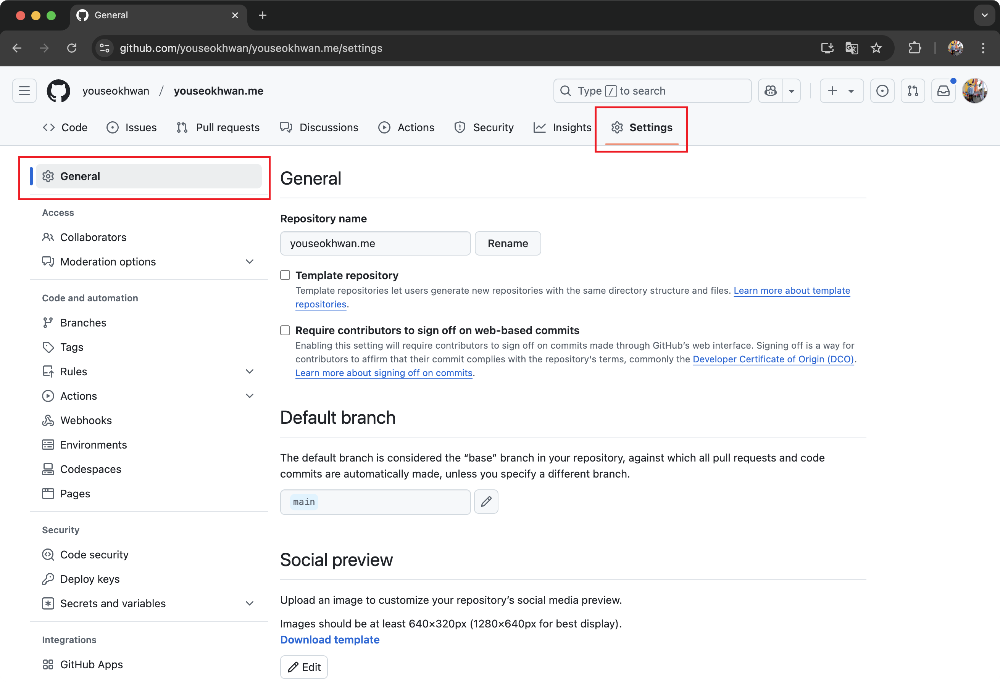

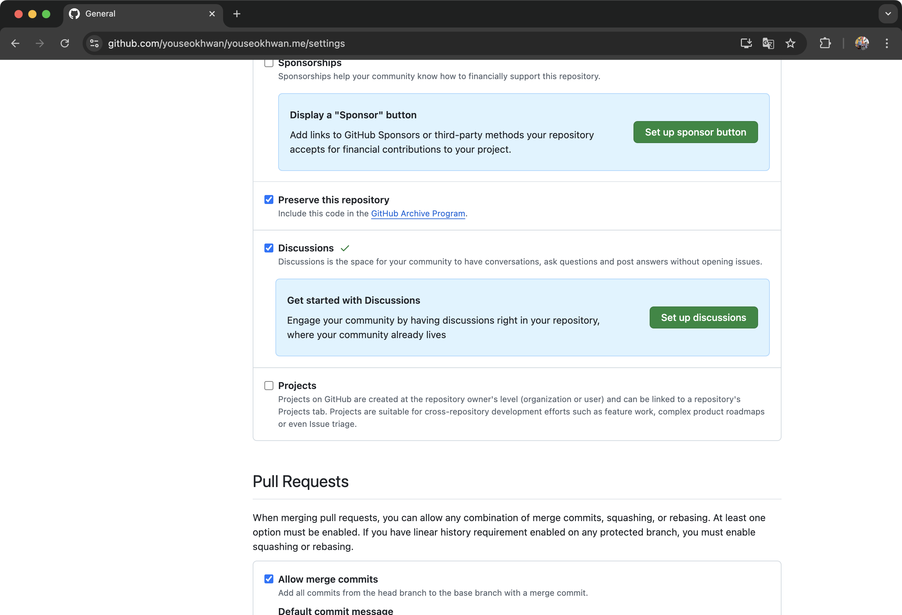

### 카테고리 생성

comment들을 모아놓을 전용 카테고리를 생성할 것이다.<br>
`Discussions` 탭으로 이동하여 `Categories` 옆에 있는 펜 모양 버튼을 클릭한다.

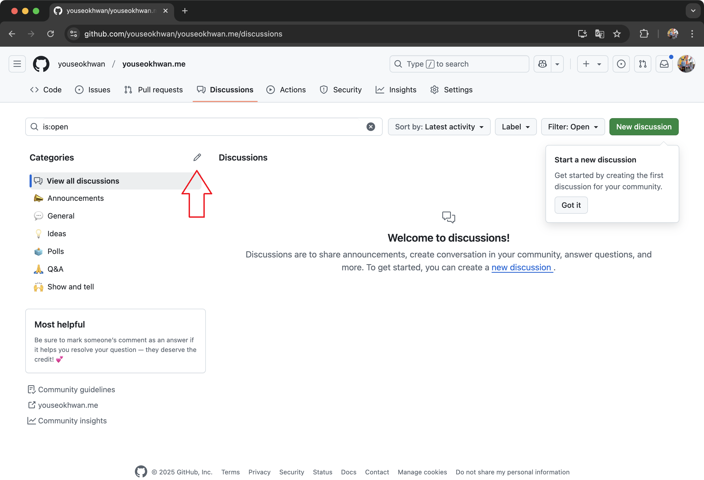

우측 `New category`를 클릭한다.

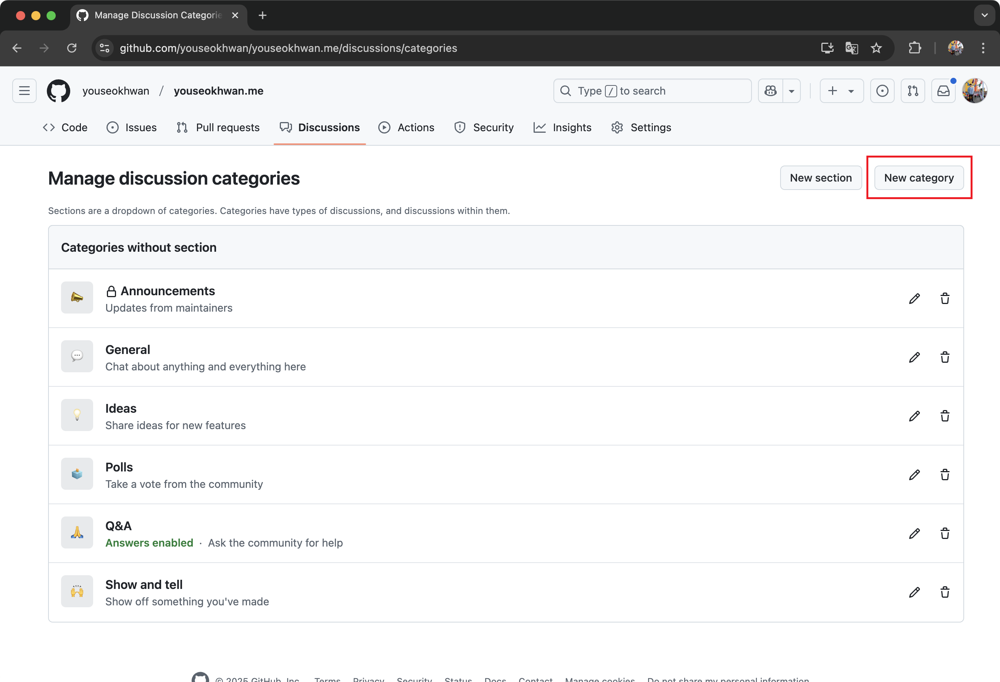

`Category name`과 `Description`을 입력하고, `Discussion Format`은 `Announcement`를 선택한다.<br>
`Announcement`의 경우 권한이 있는 사람만 discussion을 만들 수 있고, 댓글과 대댓글은 누구나 쓸 수 있다.<br>
우하단의 `Create`를 클릭해 생성을 완료한다.

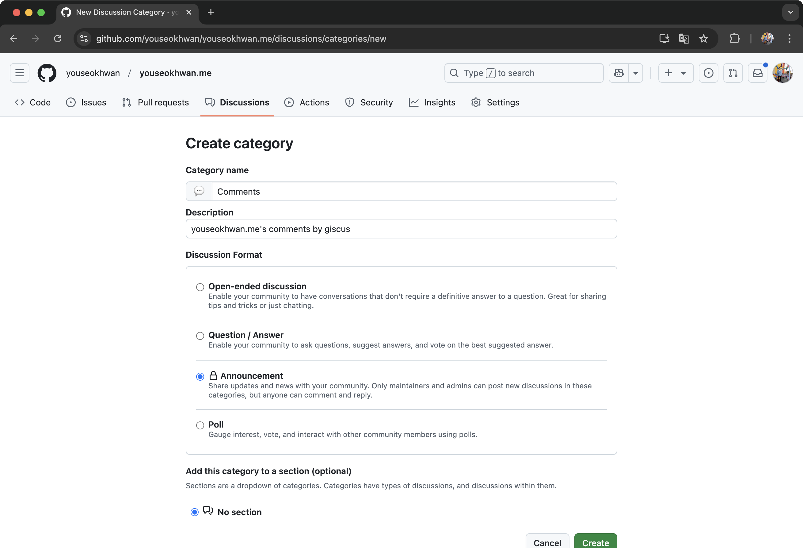

### giscus 앱 설치

repository에 giscus 앱을 설치한다.<br>
[https://github.com/apps/giscus](https://github.com/apps/giscus)로 접속해 `Install`을 클릭한다.

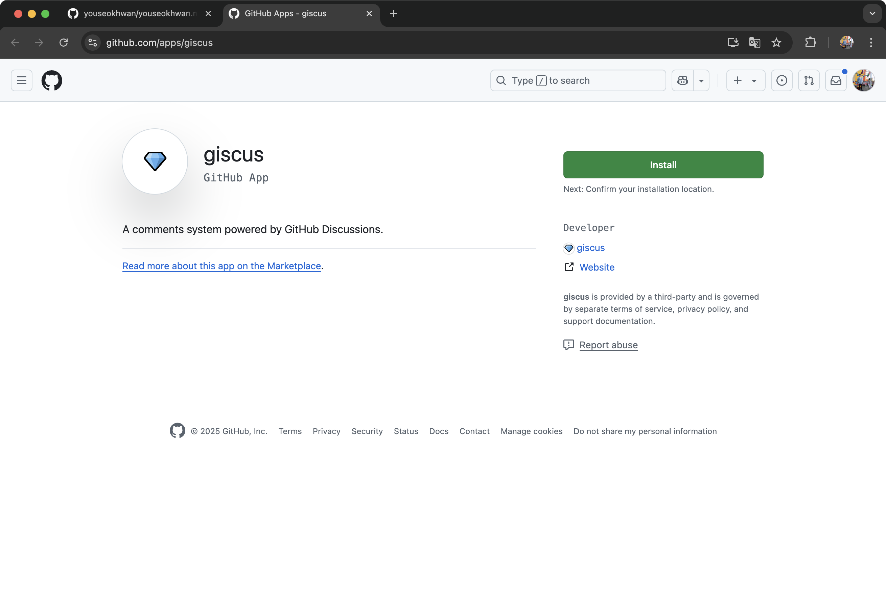

`Only select repositories`를 선택하고, 블로그 repository를 추가하여 이 repository에만 접근할 수 있도록 한다.<br>
하단의 `Install`을 클릭한다.

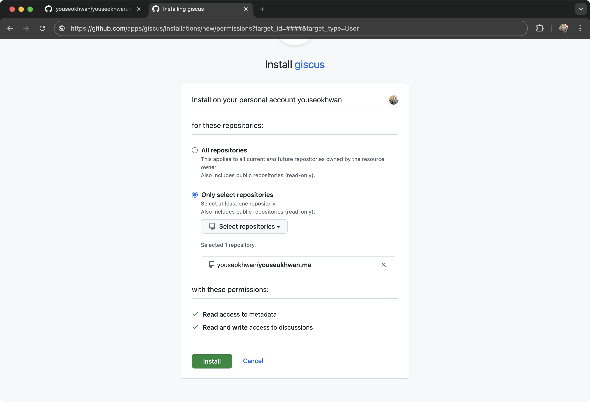

### script 태그 작성

html에 넣을 `script` 태그를 직접 작성해도 되지만, 공식 가이드의 도움을 받았다.<br>
[https://giscus.app/ko](https://giscus.app/ko)로 접속해 스크롤을 조금 내려서 `설정` 섹션으로 이동한다.

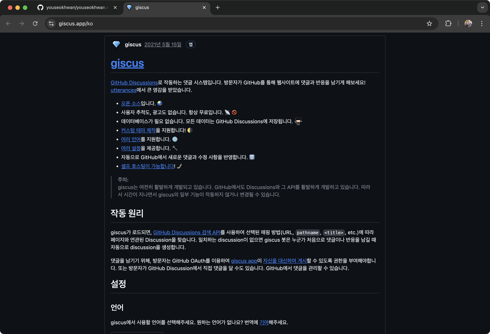

`저장소`와 `Discussion 카테고리`를 알맞게 입력하는 것에 유의하고, 나머지 항목은 취향에 맞게 선택한다.

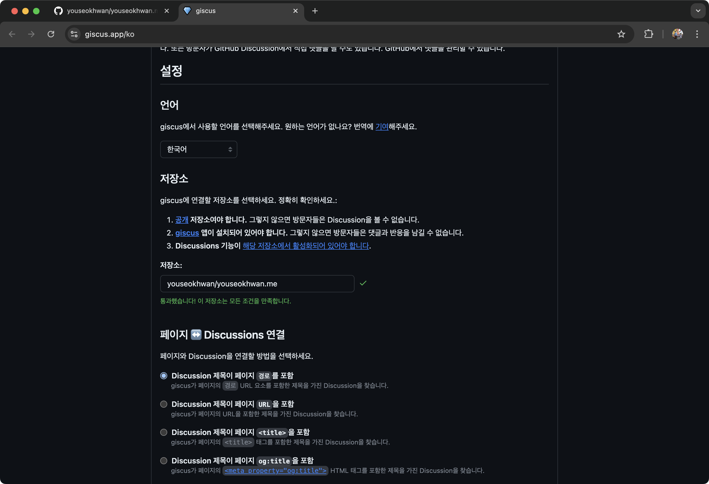

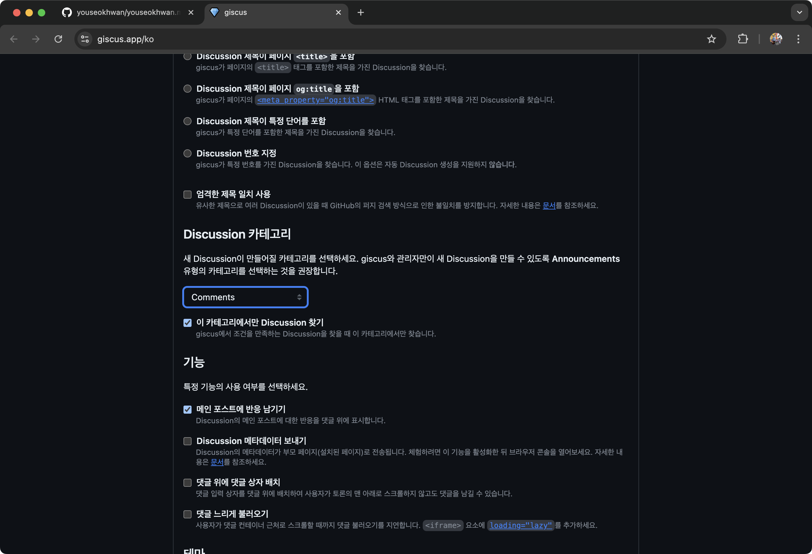

하단에 설정값에 따른 `script` 태그가 자동으로 생성된다.

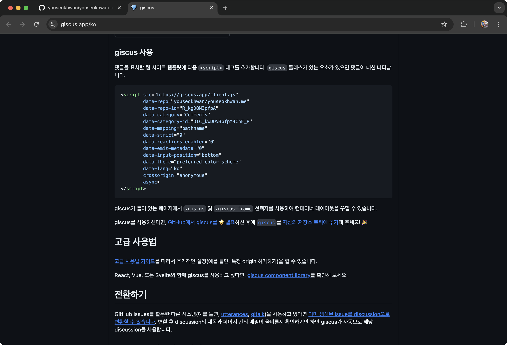

### script 태그 넣기

자동 생성된 `script` 태그를 원하는 곳에 붙여 넣으면 된다.<br>
다만, 프로젝트 구성에 따라 방법이 다를 수 있다.<br>
필자는 React 기반 템플릿을 사용 중이기 때문에, utterances가 있었던 코드를 걷어내고 그 자리에 giscus를 적용했다.<br>
다음은 `comment.tsx` 파일의 일부분이다.

```ts
useEffect(() => {
  if (!giscus || !containerReference.current) return

  const script = document.createElement("script")
  script.src = giscus.src ?? ""
  script.setAttribute("data-repo", giscus.data_repo ?? "")
  script.setAttribute("data-repo-id", giscus.data_repo_id ?? "")
  script.setAttribute("data-category", giscus.data_category ?? "")
  script.setAttribute("data-category-id", giscus.data_category_id ?? "")
  script.setAttribute("data-mapping", "pathname")
  script.setAttribute("data-strict", "0")
  script.setAttribute("data-reactions-enabled", "0")
  script.setAttribute("data-emit-metadata", "0")
  script.setAttribute("data-input-position", "bottom")
  script.setAttribute("data-theme", theme ?? "")
  script.setAttribute("data-lang", "ko")
  script.setAttribute("crossorigin", "anonymous")
  script.async = true

  containerReference.current.appendChild(script)
}, [theme])
```

### 구현 결과

잘 적용된 것을 확인할 수 있다.

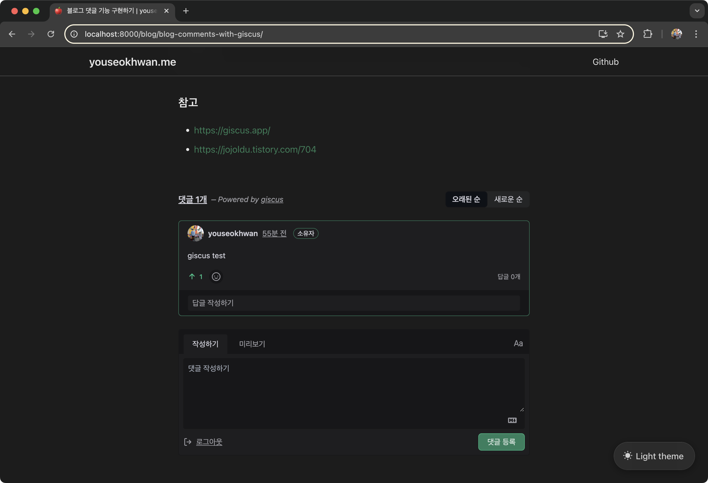

코멘트를 작성하면, `Discussions` 탭에 자동으로 추가된다.

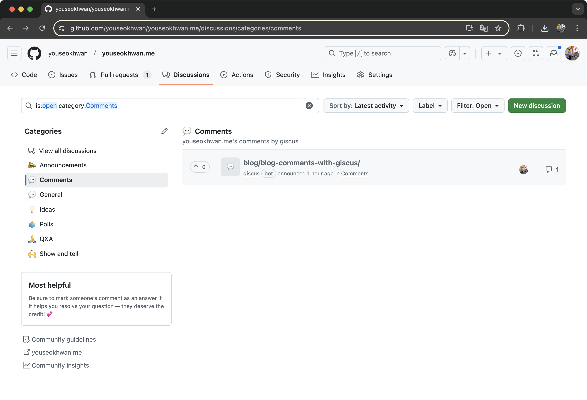

---

### 참고

- https://giscus.app/
- https://jojoldu.tistory.com/704
