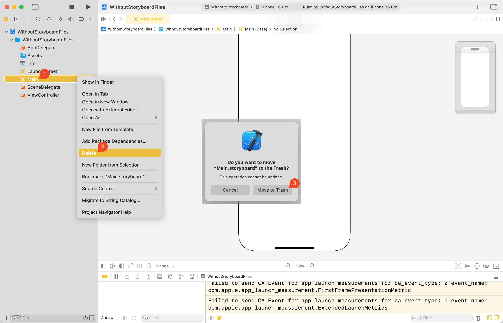
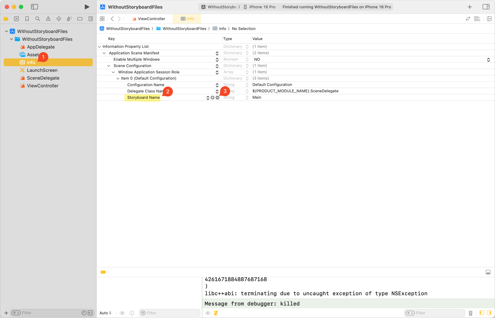
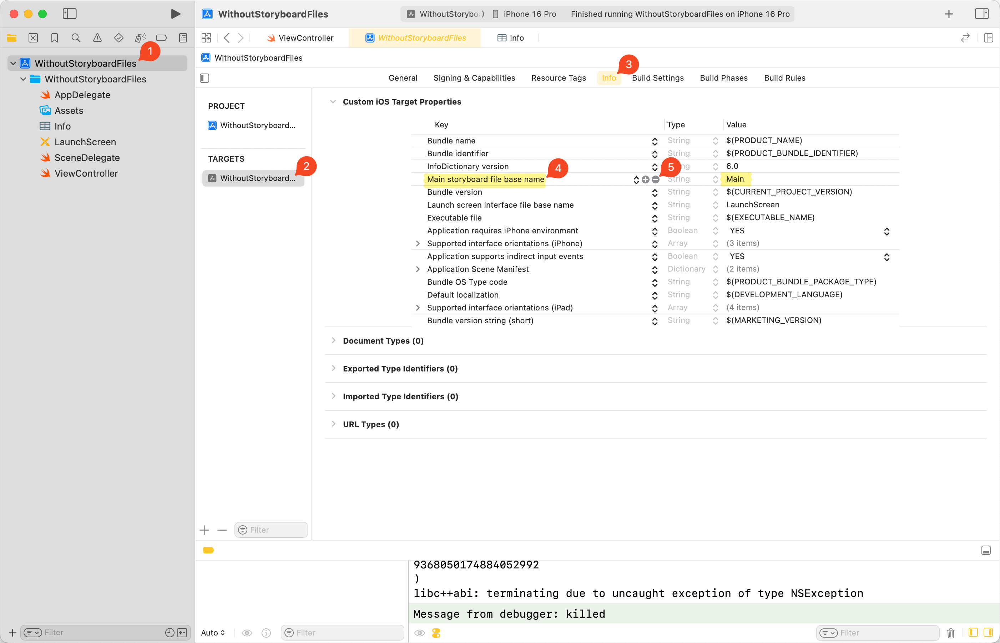
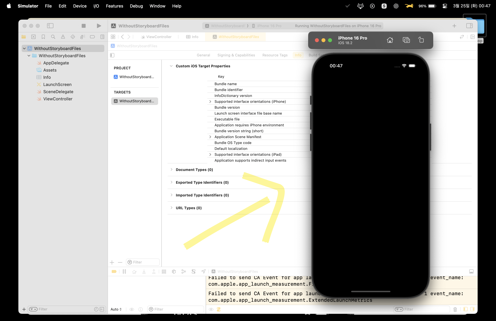
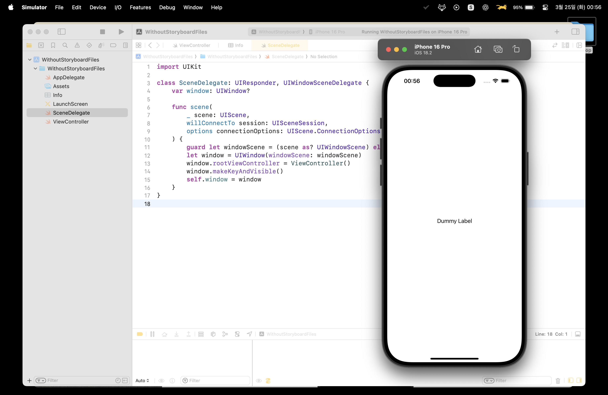
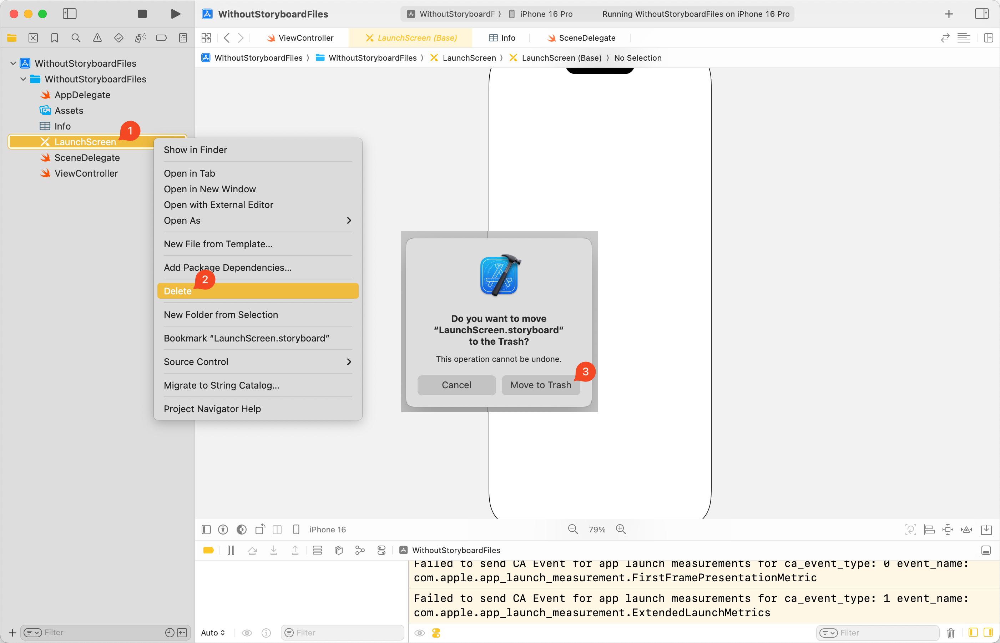
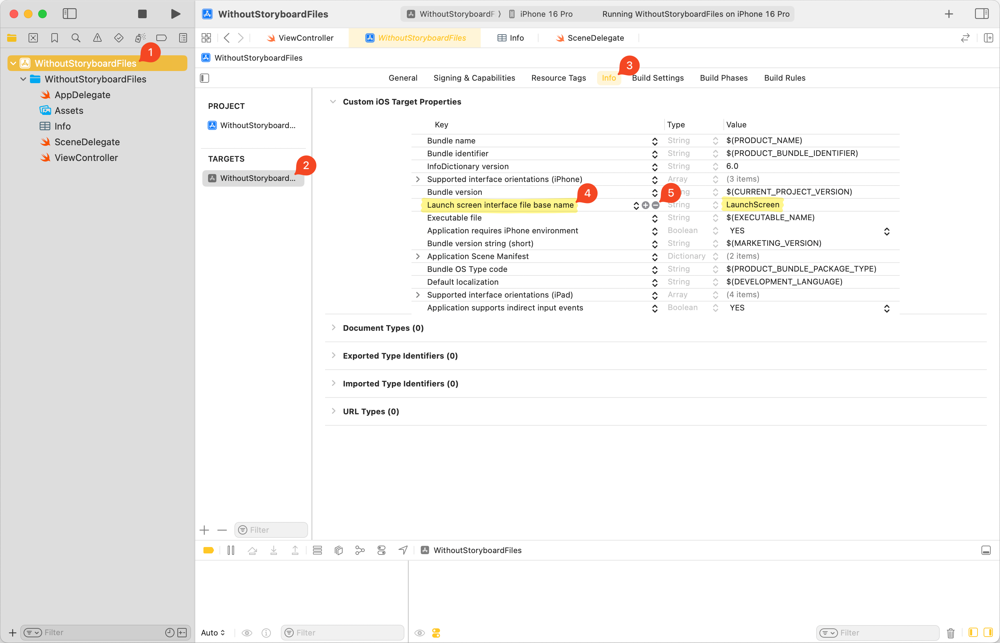
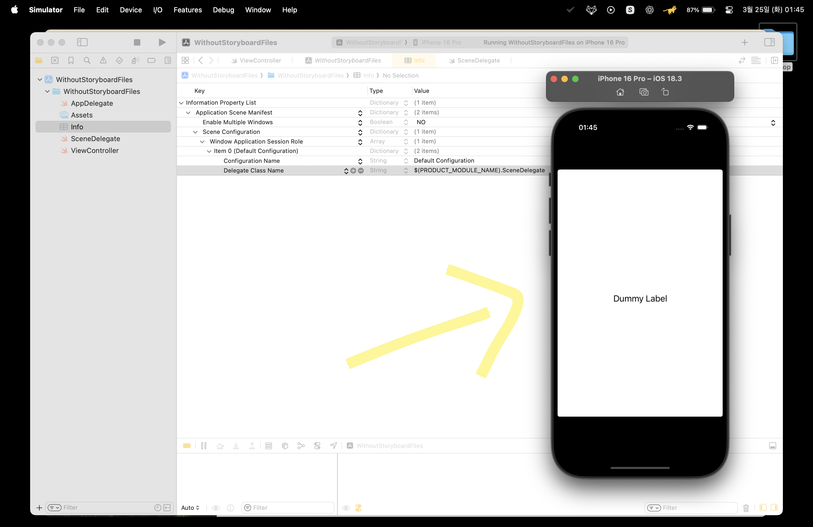
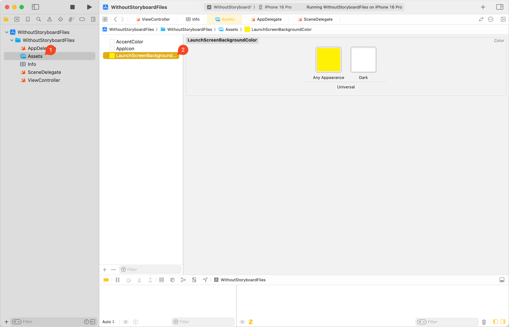
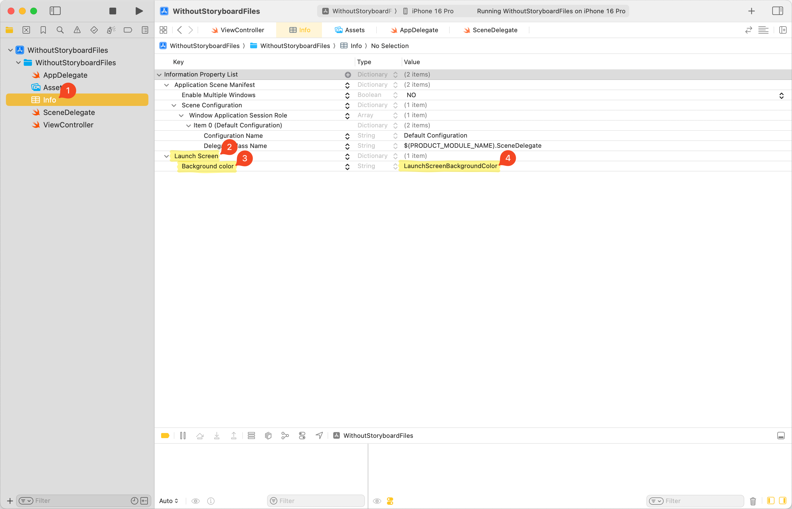

UIKit에서 UI를 구현할 때, storyboard를 사용하지 않고 코드를 기반[^1]으로 구현하는 선택지가 있다.<br>
이때, `Main.storyboard`와 `LaunchScreen.storyboard`를 제거하지 않고 그대로 뒀었는데, 이 파일들을 아예 프로젝트에서 제외하는 방법을 알게 되어 내용을 정리해 보았다.

## Main.storyboard 걷어내기

### 1. Main.storyboard 파일 삭제



### 2. info.plist에서 Storyboard Name 항목 삭제

`-` 버튼을 눌러 항목을 삭제한다.



### 3. pbxproj에서 target의 Main storyboard file base name 항목 삭제

`-` 버튼을 눌러 항목을 삭제한다.



여기까지 진행하면 빌드 오류는 없으나, `UIWindow`의 `rootViewController`가 설정되지 않아서 화면은 표시되지 않는다.



### 4. rootViewController 설정

`SceneDelegate.swift`에서 `UIWindow`의 `rootViewController`를 수동으로 지정한다.

```swift
import UIKit

class SceneDelegate: UIResponder, UIWindowSceneDelegate {
    var window: UIWindow?

    func scene(
        _ scene: UIScene,
        willConnectTo session: UISceneSession,
        options connectionOptions: UIScene.ConnectionOptions
    ) {
        guard let windowScene = (scene as? UIWindowScene) else { return }
        let window = UIWindow(windowScene: windowScene)
        window.rootViewController = ViewController()
        window.makeKeyAndVisible()
        self.window = window
    }
}
```

`makeKeyAndVisible()`은 해당 window를 Key Window로 지정하고, 화면에 표시한다.<br>
Key Window로 지정하면, 유저와 상호작용[^2] 할 수 있는 활성 Window가 된다.



## LaunchScreen.storyboard 걷어내기

> 공식 레퍼런스를 찾지 못해, 출처가 명확하지 않은 자료들과 약간의 추측으로 작성한 문단입니다.

`Main.storyboard`를 제거하는 것은 간단하지만, `LaunchScreen.storyboard`의 경우 신중한 결정이 필요하다.<br>
Launch Screen의 구성 방식이 App Store의 가이드라인을 따르지 않으면 심사에서 거절될 리스크가 있다고 한다.<br>
또한 이 포스트에선 다루지 않지만, HIG를 기반으로 신경 써야 할 UX가 많은 점도 있다.

iOS 14 이상에서 `UILaunchScreen` 키를 이용한 구성 방식에 대해 학습하되, 실제 적용 여부는 신중히 판단하자.

### 1. LaunchScreen.storyboard 파일 삭제



### 2. pbxproj에서 target의 Launch screen interface file base name 항목 삭제

`-` 버튼을 눌러 항목을 삭제한다.



여기까지 진행하면 빌드 오류는 없으나, `Launch screen interface file base name` 값이 없으면 UI가 하위 디바이스 버전에서 호환되는 해상도[^3]로 표시된다.



### 3. UILaunchScreen 키 값 설정

어차피 [이 문서](https://developer.apple.com/documentation/xcode/specifying-your-apps-launch-screen) 상단에 '모든 iOS 앱은 Launch Screen을 반드시 제공해야 한다'는 언급이 있다.<br>
`info.plist`에서 target의 `Launch Screen` 항목을 추가하여, 간단한 Launch Screen을 구성할 수 있다.

`Assets.xcassets`에 Launch Screen의 배경색으로 사용할 `LaunchScreenBackgroundColor`를 추가한다.



`info.plist`에서 target의 `Launch Screen` 항목과 `Background color` 하위 항목을 추가한다.<br>
`Background color`에는 위에서 만든 `LaunchScreenBackgroundColor`를 입력한다.



Launch Screen을 눈으로 확인하기 위해, 임의의 delay를 넣었다.

<video src='video.mp4' controls></video>

---

### 참고

- https://developer.apple.com/design/human-interface-guidelines/launching
- https://developer.apple.com/documentation/xcode/specifying-your-apps-launch-screen
- https://developer.apple.com/documentation/uikit/uiwindow/makekeyandvisible()
- https://developer.apple.com/documentation/BundleResources/Information-Property-List/UILaunchScreen
- https://bicycleforthemind.tistory.com/38
- https://tngusmiso.tistory.com/87
- https://sarunw.com/posts/launch-screen-without-storyboard/

[^1]: Programmatically. 한국에선 코드베이스라고도 표현함.
[^2]: 터치, 키보드 입력 등
[^3]: 아이폰 4보다도 이전인 320x480
