iOS 앱을 개발할 때, 설정값이나 간단한 데이터를 저장하기 위한 목적으로 `UserDefaults`를 사용한다.<br>
`UserDefaults`는 접근성이 매우 좋은데, `Foundation`에 속해 있기 때문에 별도의 import가 필요 없고, `UserDefaults.standard`로 접근하면 인스턴스를 생성하지 않고도 접근할 수 있다.

그러나 이런 이점을 활용하게 되면, 클린 아키텍처의 지향점과 멀어질 수 있다.<br>
접근성을 포기하는 대신, Testable하고 Maintainable한 `UserDefaults`를 설계해 보자.

## 1️⃣ 초기 상태

`name`을 저장하는 아주 단순한 MVVM 앱을 만들고, 그 앱을 리팩터링해보자.<br>
기능은 2가지이다.

1. `save` 버튼을 누르면 `nameTextField`의 `text`를 `UserDefaults`로 저장
2. 앱을 실행하면, `UserDefaults`에 저장된 `name`을 `nameTextField`에 반영

### 프로젝트 생성


### ViewModel 구현

`UserDeafults`를 다루는 `ViewModel`을 구현한다.

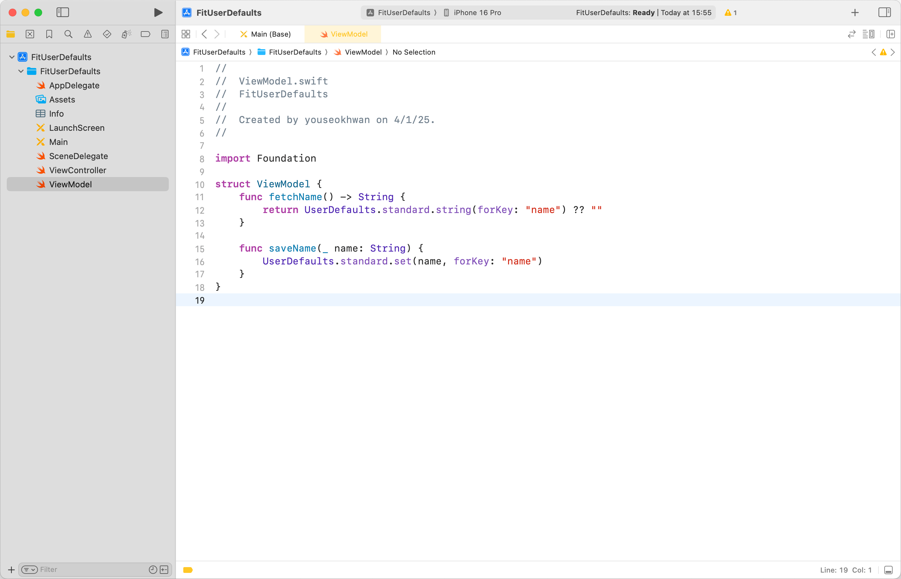

```swift
import Foundation

struct ViewModel {
    func fetchName() -> String {
        return UserDefaults.standard.string(forKey: "name") ?? ""
    }

    func saveName(_ name: String) {
        UserDefaults.standard.set(name, forKey: "name")
    }
}
```

### UI 구현

`UITextField`와 `UIButton`을 하나씩 추가한다.

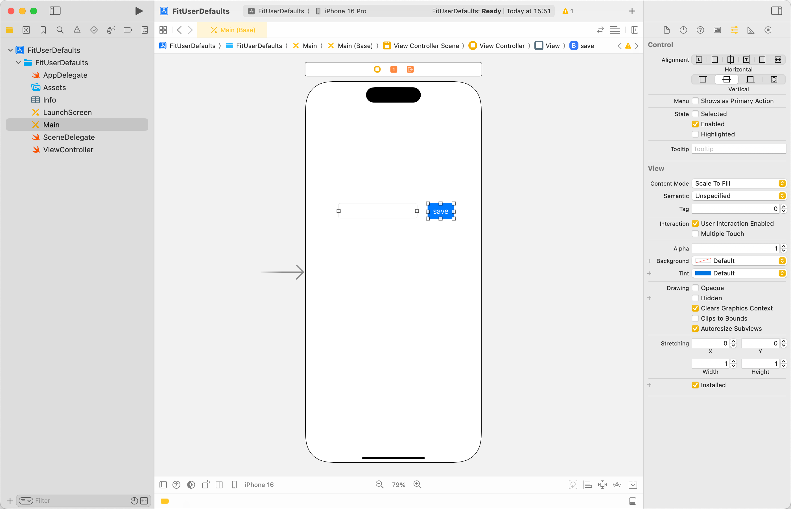

### VC, VM 연결

`ViewController`의 유저 인터렉션과 `ViewModel`의 로직을 연결한다.

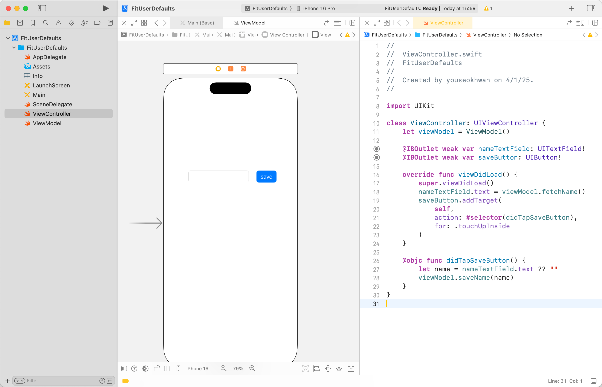

```swift
import UIKit

class ViewController: UIViewController {
    let viewModel = ViewModel()

    @IBOutlet weak var nameTextField: UITextField!
    @IBOutlet weak var saveButton: UIButton!
    
    override func viewDidLoad() {
        super.viewDidLoad()
        nameTextField.text = viewModel.fetchName()
        saveButton.addTarget(
            self,
            action: #selector(didTapSaveButton),
            for: .touchUpInside
        )
    }

    @objc func didTapSaveButton() {
        let name = nameTextField.text ?? ""
        viewModel.saveName(name)
    }
}
```

### 실행 결과

<video src="video.mp4" controls></video>

## 2️⃣ Storage 레이어로 분리

`ViewModel`에서 `UserDefaults`를 직접 접근하지 말고, `Storage`로 분리해 보자.<br>
글 제목은 클린 아키텍처라고 써놓았지만, 내용을 명료하게 전달하기 위해 `UseCase`와 `Repository`는 생략했다.<br>
`VC ↔︎ VM ↔︎ Storage`로 구성된다.

### UserDefaultsStorage 구현

`UserDefaultsStorage`를 구현한다.<br>
아까 `ViewModel`에 작성한 로직과 동일하다.

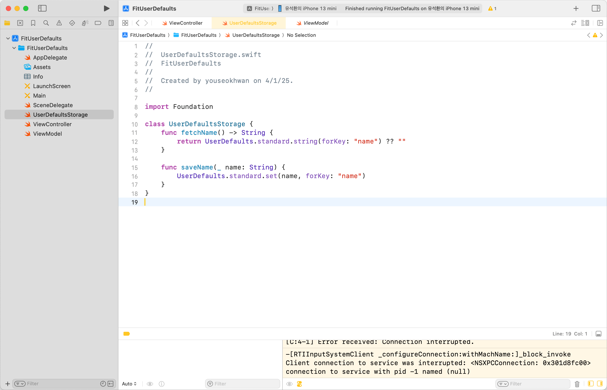

```swift
import Foundation

class UserDefaultsStorage {
    func fetchName() -> String {
        return UserDefaults.standard.string(forKey: "name") ?? ""
    }

    func saveName(_ name: String) {
        UserDefaults.standard.set(name, forKey: "name")
    }
}
```

### ViewModel 로직 수정

`ViewModel`을 `Storage`를 통해 데이터에 접근하도록 수정한다.

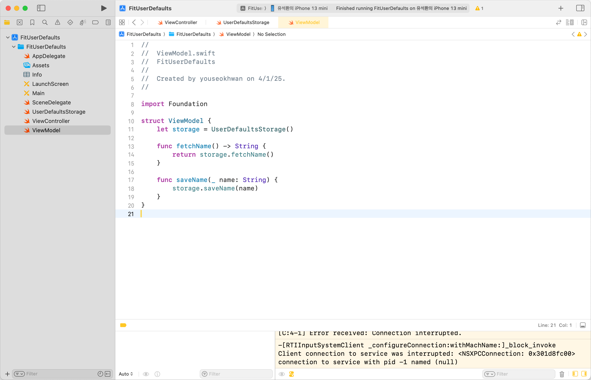

```swift
import Foundation

struct ViewModel {
    let storage = UserDefaultsStorage()

    func fetchName() -> String {
        return storage.fetchName()
    }

    func saveName(_ name: String) {
        storage.saveName(name)
    }
}
```

이 단락의 핵심은 `UserDefaults`를 `CoreData`같은 DB로 취급하는 것이다.<br>
이후에 `CoreData`, `Realm` 등으로 대체할 때, `Presentation` 혹은 `Domain` 레이어의 수정을 최소화할 수 있다.

또한 `ViewModel`은 `View`에 사용될 데이터를 다루는 역할을 하는데, 기존 코드는 데이터를 데이터 로드, 저장까지 담당하고 있었다.<br>
레이어를 나누면 SRP를 위반하지 않게 되고, 유닛 테스트를 용이하게 만들 수 있다.

## 3️⃣ 테스트 코드 작성

유닛 테스트가 용이하도록 설계했으니, 직접 테스트 코드를 작성해 보자.<br>
`XCTest`로 `saveName(_:)`이 잘 작동하는지에 대한 테스트 케이스를 추가했다.

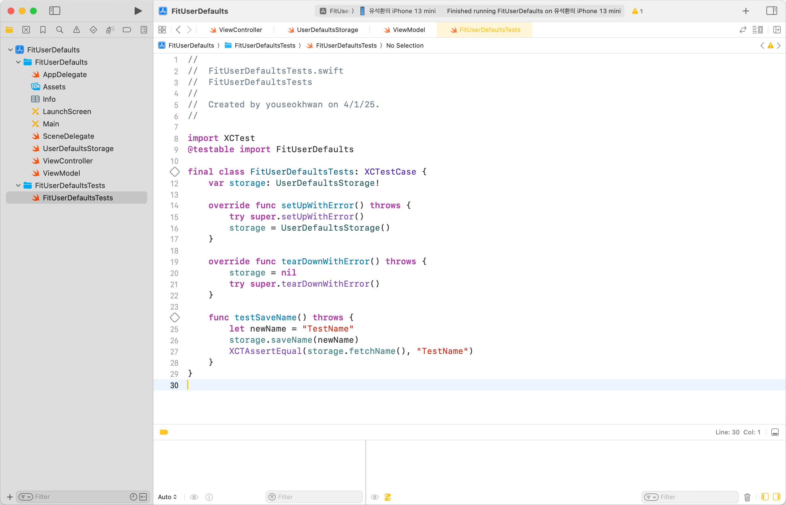

```swift
import XCTest
@testable import FitUserDefaults

final class FitUserDefaultsTests: XCTestCase {
    var storage: UserDefaultsStorage!

    override func setUpWithError() throws {
        try super.setUpWithError()
        storage = UserDefaultsStorage()
    }

    override func tearDownWithError() throws {
        storage = nil
        try super.tearDownWithError()
    }

    func testSaveName() throws {
        let newName = "TestName"
        storage.saveName(newName)
        XCTAssertEqual(storage.fetchName(), "TestName")
    }
}
```

### 테스트 결과

테스트 케이스가 통과된 것을 확인할 수 있다.

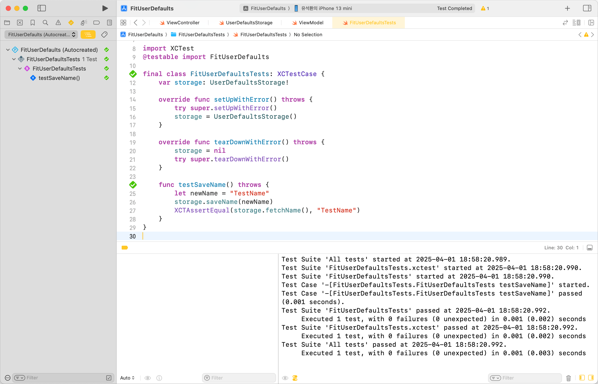

## 🚨 이슈 발생

그러나 이 테스트 코드에는 큰 문제가 하나 있는데, `App Target`과 `Test Target`이 같은 영역을 공유할 가능성이 있다.<br>
예를 들어, 기존에 저장된 이름을 `TestName`으로 덮어써서 테스트하여, 기존 데이터가 소실되는 시나리오가 있다.

<video src="video-1.mp4" controls></video>

## 4️⃣ Suite 구분

이는 `UserDefaults`의 Suite를 구분하여 해결할 수 있다.<br>
Suite는 프로그래밍에서 공통된 목적이나 기능을 가진 모음을 의미하는데, `UserDefaults`에선 `suiteName`을 지정하여 데이터 영역을 구분할 수 있다.

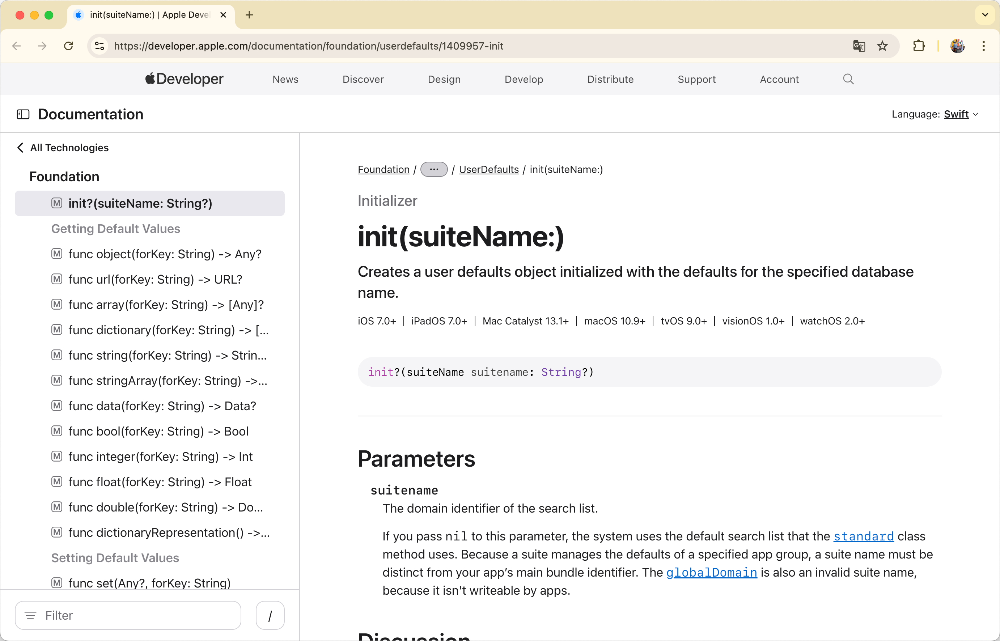

`UserDefaultsStorage`를 수정해 보자.

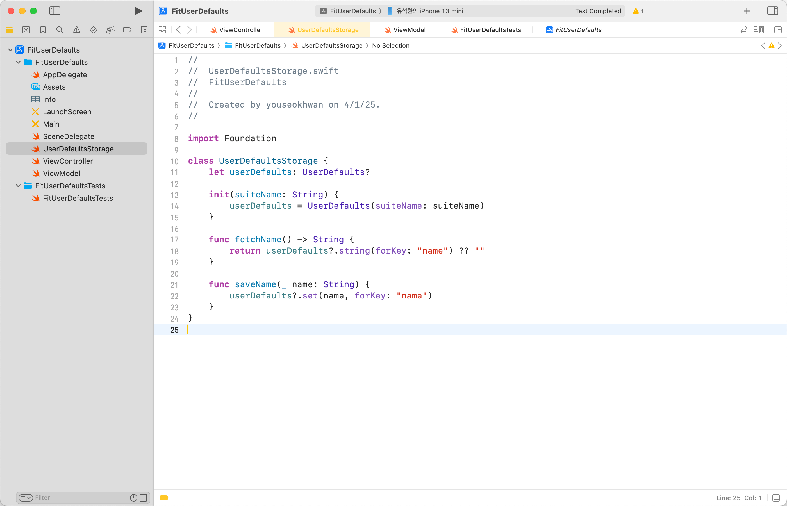

```swift
import Foundation

class UserDefaultsStorage {
    let userDefaults: UserDefaults?

    init(suiteName: String) {
        userDefaults = UserDefaults(suiteName: suiteName)
    }

    func fetchName() -> String {
        return userDefaults?.string(forKey: "name") ?? ""
    }

    func saveName(_ name: String) {
        userDefaults?.set(name, forKey: "name")
    }
}
```

연계된 부분들도 수정한다.

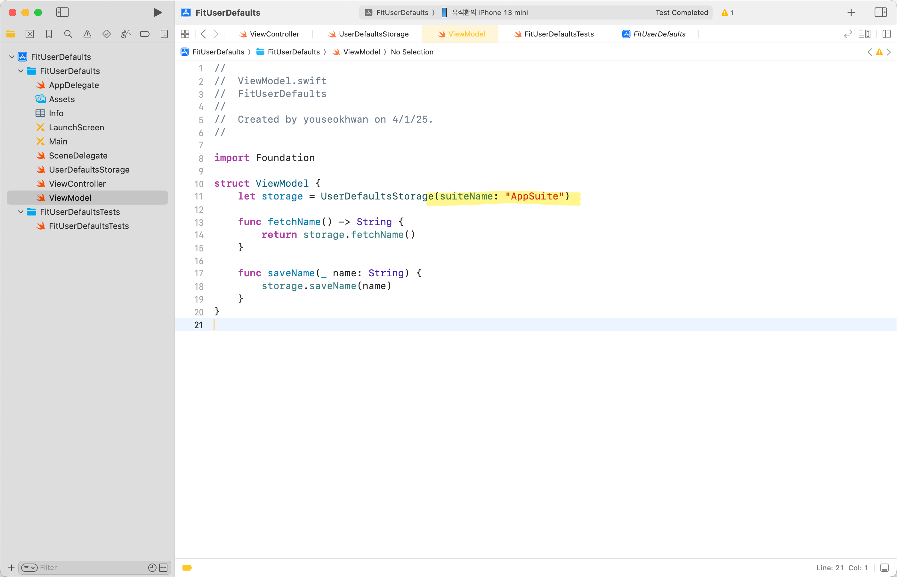

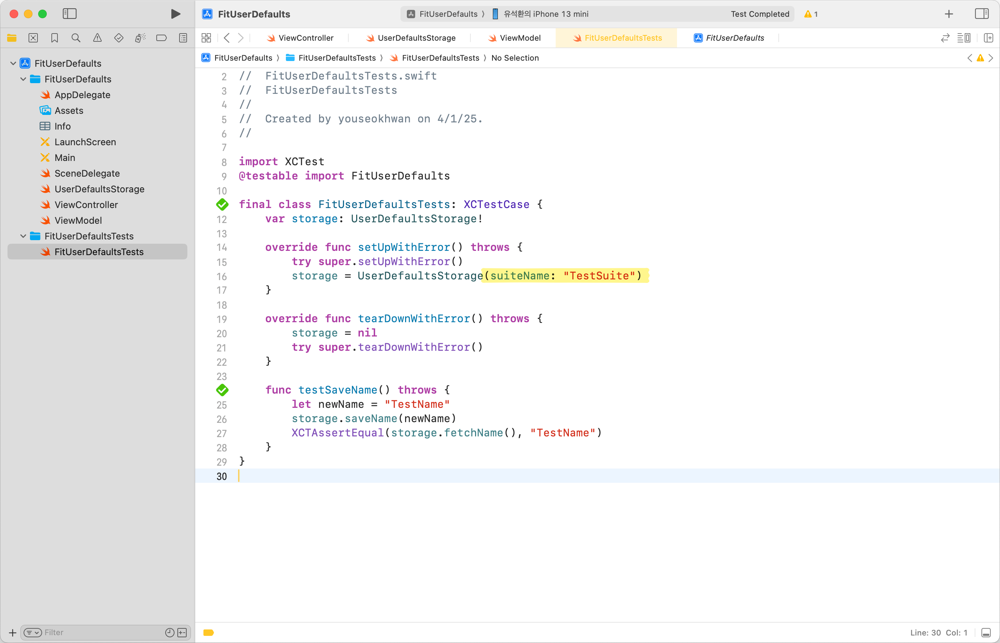

이제 `App Target`은 `AppSuite` 영역을 사용하고, `Test Target`은 `TestSuite` 영역을 사용한다.

### 🚀 결과

<video src="video-2.mp4" controls></video>

이슈를 해결하고 나름대로 Testable & Maintainable한 `UserDefaults` 구현을 완료했다.

클린 아키텍처에 어울리지만, 접근성이 낮아지고 코드가 길어지기 때문에 상황에 맞게 판단하여 채택하면 좋을 것 같다.

---

### 참고

- https://developer.apple.com/documentation/foundation/userdefaults
