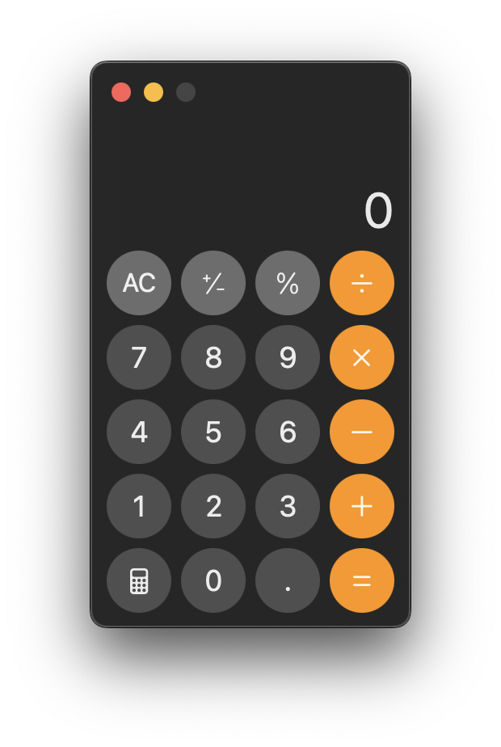
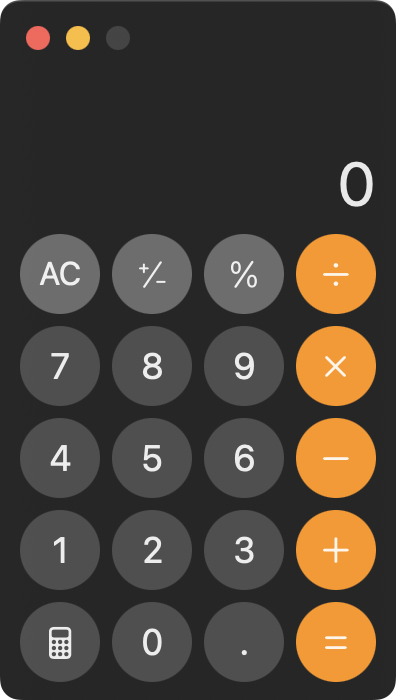

mac에서 스크린샷 단축키는 다음과 같다.

- `cmd + ctrl + 3`: 전체화면 캡처하여 파일로 저장
- `cmd + ctrl + shift + 3`: 전체화면 캡처하여 클립보드에 저장
- `cmd + shift + 4`: 드래그한 영역 캡처하여 파일로 저장
- `cmd + ctrl + shift + 4`: 드래그한 영역 캡처하여 클립보드에 저장

`cmd + shift + 4`와 `cmd + ctrl + shift + 4`의 경우, 드래그하지 않고 `space`를 눌러주면 원하는 윈도우를 편하게 캡처할 수 있다.



---

## 그림자 없애기

이때, macOS는 윈도우를 살짝 들어올려 그림자를 배치한다.<br>
테두리가 자연스러운 장점이 있으나, 이를 원하지 않을 경우 2가지 방법이 있다.

### option키 사용

`space`를 누른 상태에서 `option`을 누른 채로 캡처하면 그림자 없이 캡처할 수 있다.



### 그림자 없이 캡처하는 것을 기본값으로 설정

`option`을 매번 누르기 귀찮다면, 터미널에 명령어를 입력하여 기본값으로 지정할 수 있다.

```bash
defaults write com.apple.screencapture disable-shadow -bool true
```

### 설정 되돌리기

설정을 되돌리고 싶다면 `false`를 입력한다.

```bash
defaults write com.apple.screencapture disable-shadow -bool false
```

---

### 참고

- https://support.apple.com/ko-kr/102646
- https://macpaw.com/how-to/remove-mac-screenshot-shadow
