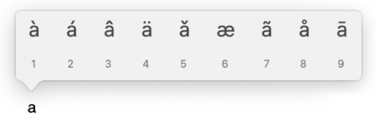
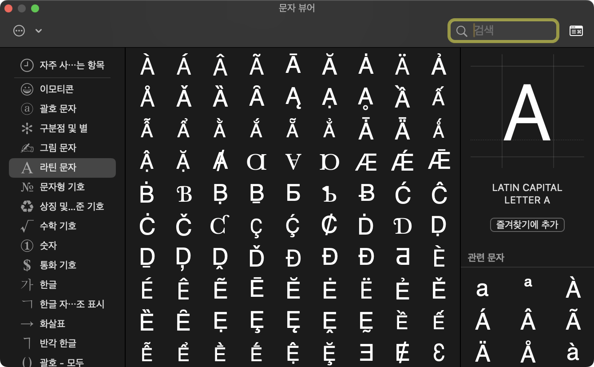

## Diacritics

다이어크리틱(Diacritic)은 알파벳의 위나 아래에서 발음이나 의미를 다르게 부여하는 기호이다.<br>
(예시: `à`, `á`, `â`)<br>
macOS에서는 영어 자판을 길게 누르면 다이어크리틱을 선택할 수 있는 팝업이 나온다.



## Diacritics 팝업 비활성화

한국어, 영어를 주로 사용하는 개발환경에서는 이 다이어크리틱을 입력할 일이 별로 없다.
기존처럼 길게 눌렀을 때, 연속 입력이 되도록 원한다면 이 팝업을 비활성화하면 된다.

터미널에 다음 명령어를 입력한다. (재부팅이나 로그아웃해야 적용된다.)

```bash
defaults write -g ApplePressAndHoldEnabled -bool false
```

## 설정 되돌리기

기능을 다시 활성화하고 싶다면, `false` 대신 `true`로 설정한다.

```bash
defaults write -g ApplePressAndHoldEnabled -bool true
```

가끔 한두글자를 입력해야하는 상황이라면, 이모지(`cmd + ctrl + space`)의 라틴 문자 탭을 이용해서 입력하는 것을 추천한다.



---

### 참고

- https://support.apple.com/ko-kr/guide/mac-help/mh27474/mac
- https://www.idownloadblog.com/2015/01/14/how-to-enable-key-repeats-on-your-mac/
