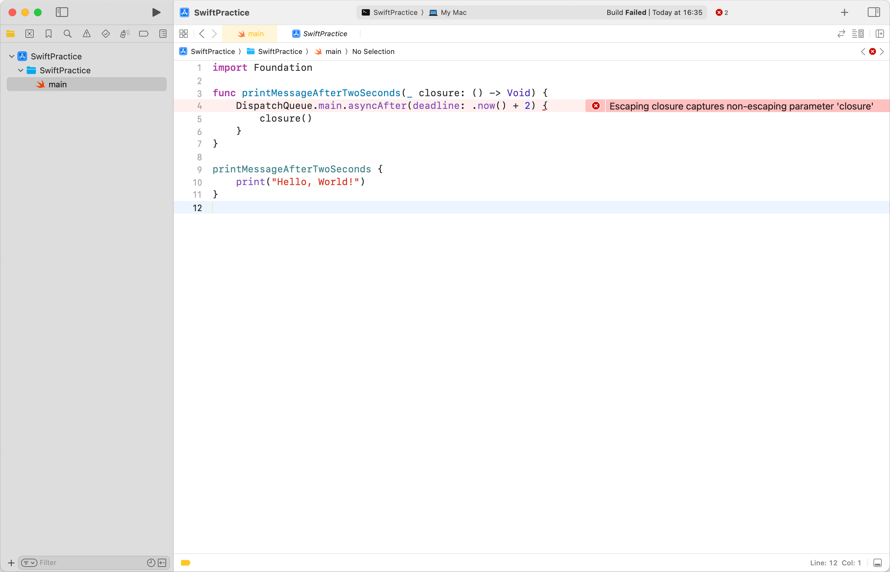
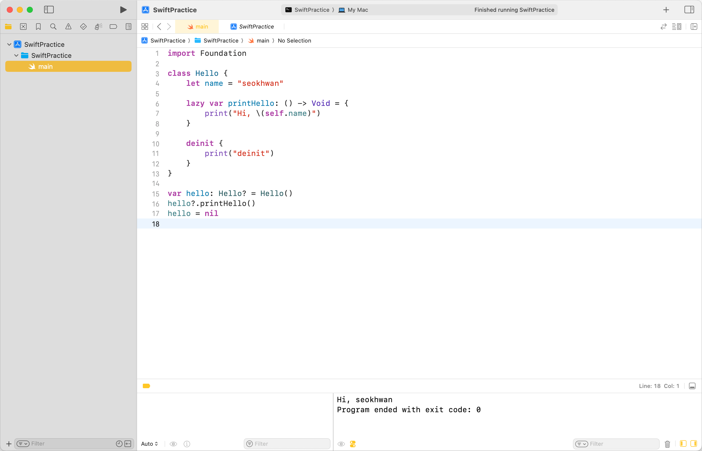
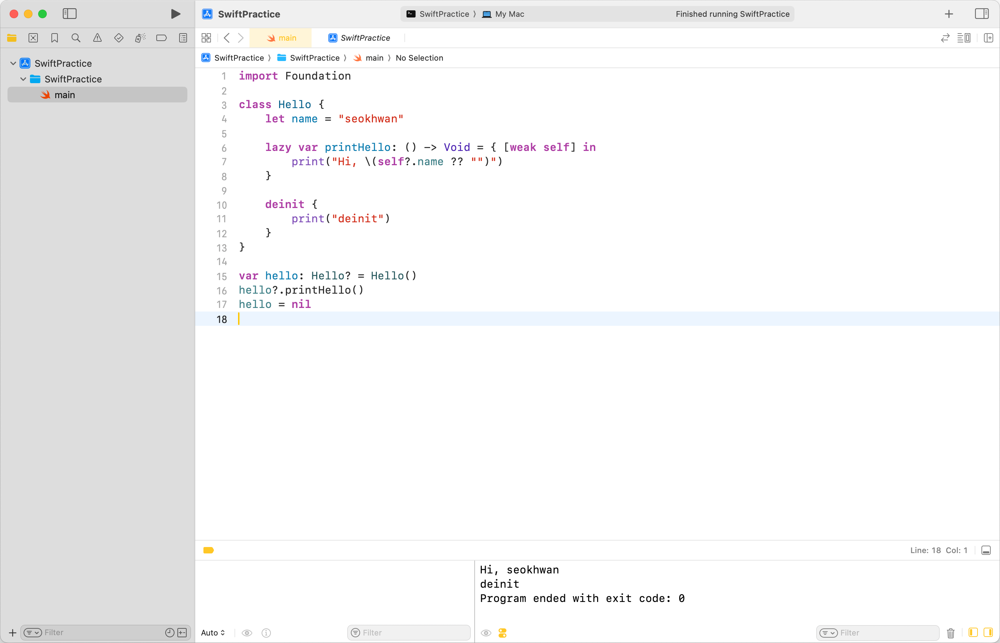

## 비탈출 클로저

Swift에서 클로저는 기본적으로 비탈출 클로저다.<br>
클로저가 함수의 매개변수로 쓰일 경우, 함수의 실행이 끝나면 밖으로 탈출하지 않고 같이 메모리에서 해제된다.

```swift
import Foundation

func printMessage(_ closure: () -> Void) {
    closure()
}

printMessage {
    print("Hello, World!")
}
```

그러나 클로저는 네트워크 같은 비동기 작업에 자주 쓰인다.<br>
이때, 함수가 종료되어도 클로저가 유지되도록 해야 하는데, 그냥 사용하면 컴파일 에러가 발생한다.

```swift
import Foundation

func printMessageAfterTwoSeconds(_ closure: () -> Void) {
    DispatchQueue.main.asyncAfter(deadline: .now() + 2) { // error
        closure()
    }
}

printMessageAfterTwoSeconds {
    print("Hello, World!")
}
```



## 탈출 클로저로 만들기

함수가 종료되어도 클로저가 '탈출'하여 작업을 이어 나가려면, 클로저 타입 앞에 `@escaping`을 붙이면 된다.

```swift
import Foundation

func printMessageAfterTwoSeconds(_ closure: @escaping () -> Void) {
    DispatchQueue.main.asyncAfter(deadline: .now() + 2) {
        closure()
    }
}

printMessageAfterTwoSeconds {
    print("Hello, World!")
}
```

## 어떤 차이가 있는가?

비탈출 클로저의 경우, Stack Memory에 저장되어 함수가 종료되면 같이 해제된다.<br>
반면 탈출 클로저의 경우, Heap Memory에 저장되어 함수가 종료되어도 참조가 유지된다.

## Heap에 저장하면서 생기는 유의 사항

프로그래밍에선 이점이 있으면 사소하더라도 cost나 risk가 있다.<br>
탈출 클로저를 사용하면서 유의할 점에 대해 알아보자.

### 성능 하락

일반적으로 Stack Memory의 성능이 Heap Memory보다 우월하다.<br>
체감하기 어려울 수 있으나, Heap에 할당할 경우 이론상 메모리 할당, 해제 속도가 느리다.

### 순환 참조 문제

탈출 클로저가 Heap에서 관리됨에 따라 ARC가 관여하게 되고, 이 말은 순환 참조 문제가 생길 수 있다는 뜻이 된다.<br>
아래는 순환 참조가 발생하는 탈출 클로저의 잘못된 사용 예시이다.

```swift
import Foundation

class Hello {
    let name = "seokhwan"

    lazy var printHello: () -> Void = {
        print("Hi, \(self.name)")
    }

    deinit {
        print("deinit")
    }
}

var hello: Hello? = Hello()
hello?.printHello()
hello = nil
```



`printHello`는 `@escaping` 키워드는 없지만, `lazy var`의 특성상 외부로 탈출할 가능성이 있기 때문에, 탈출 클로저로 취급된다.

line 16: `printHello`를 호출하면, 인스턴스는 클로저를, 클로저는 `self`를 강하게 참조한다.<br>
line 17:  `nil`을 할당했지만, `deinit`이 호출되지 않는 것을 확인할 수 있다.

### 순환 참조 해결법

이 Retain Cycle은 `weak` 혹은 `unowned` 키워드를 통해 약한 참조를 하면 된다.<br>

```swift
import Foundation

class Hello {
    let name = "seokhwan"

    lazy var printHello: () -> Void = { [weak self] in
        print("Hi, \(self?.name ?? "")")
    }

    deinit {
        print("deinit")
    }
}

var hello: Hello? = Hello()
hello?.printHello()
hello = nil
```



참조 카운트를 증가시키지 않기 때문에, 정상적으로 `deinit`이 호출되는 것을 확인할 수 있다.<br>
대신 `self`가 `nil`인 경우를 대비해야 한다.

---

### 참고

- https://docs.swift.org/swift-book/documentation/the-swift-programming-language/closures
- https://velog.io/@wannabe_eung/strongreferencecycleinClosure
- https://ios-development.tistory.com/1243
