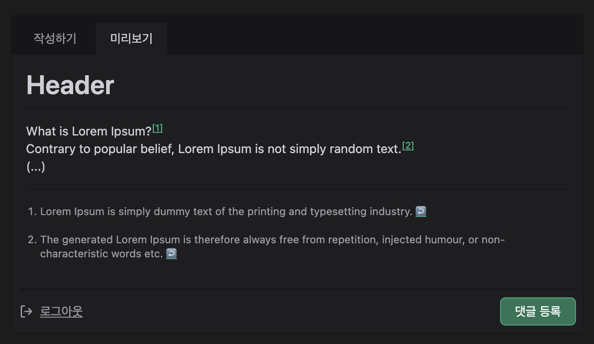

## 각주

각주(footnote)는 출처나 부가 설명을 본문과는 별도로 페이지 하단에 표시한 글이다.

> Good code should be its own best documentation.[^1]

각주는 독자가 본문을 읽는 흐름을 방해하지 않으면서, 필요한 정보를 제공하는 역할을 한다.<br>
마크다운에서도 각주를 잘 활용하면 가독성이 좋은 문서를 작성할 수 있다.

## GitHub 기반

GFM(GitHub Flavored Markdown)은 GitHub에서 확장한 Markdown 문법이다.<br>
README, Issue, PR, Wiki 등 GitHub 관련 문서와 jekyll 등에서 사용된다.<br>
Gatsby의 경우, 플러그인을 사용하면 비슷한 문법을 사용할 수 있다.<br>
`[^1]` 형태로 작성한다.

```markdown
# Header

What is Lorem Ipsum?[^1]
Contrary to popular belief, Lorem Ipsum is not simply random text.[^2]

(...)

[^1]: Lorem Ipsum is simply dummy text of the printing and typesetting industry.
[^2]: The generated Lorem Ipsum is therefore always free from repetition, injected humour, or non-characteristic words etc.
```



## HTML 태그가 지원되는 경우

HTML 태그 사용이 가능한 경우, `<sup>`와 `<a>` 태그를 이용해 각주를 표현할 수 있다.

```markdown
# Header

What is Lorem Ipsum?<sup><a name="fn1" href="#rfn1">[1]</a></sup>
Contrary to popular belief, Lorem Ipsum is not simply random text.<sup><a name="fn2" href="#rfn2">[2]</a></sup>

(...)

<a name="rfn1" href="#fn1">[1]</a>: Lorem Ipsum is simply dummy text of the printing and typesetting industry.
<a name="rfn2" href="#fn2">[2]</a>: The generated Lorem Ipsum is therefore always free from repetition, injected humour, or non-characteristic words etc.
```


---

### 참고

- https://github.github.com/gfm/
- https://www.gatsbyjs.com/plugins/gatsby-transformer-remark/
- https://www.gatsbyjs.com/plugins/gatsby-remark-footnotes/

[^1]: Robert C.Martin, Clean Code, 2008.

