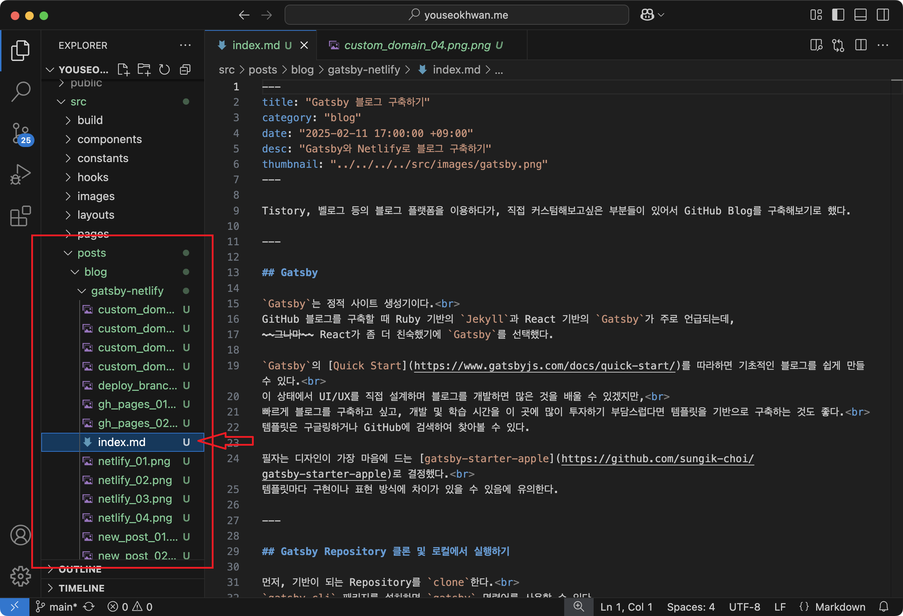
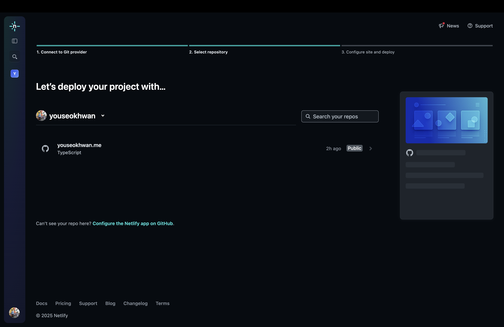
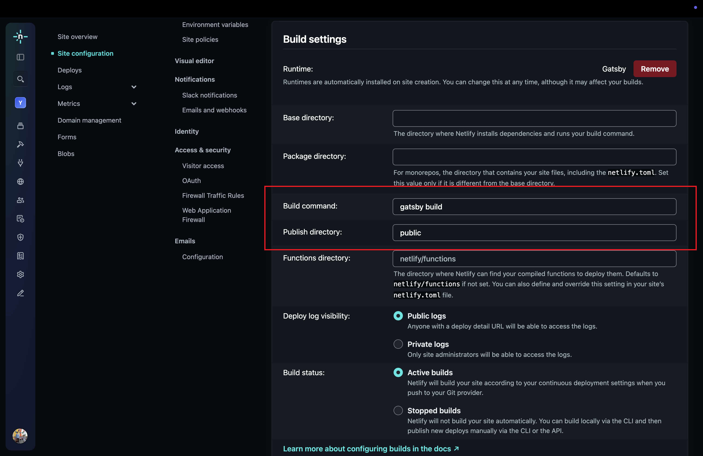
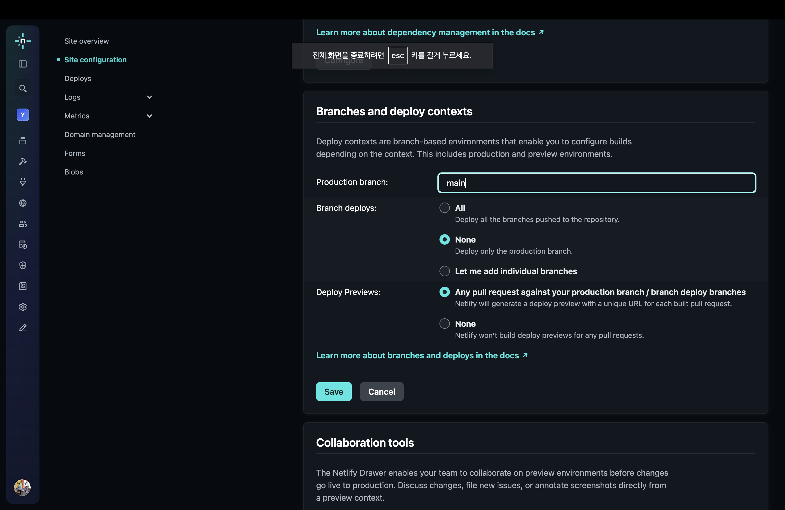
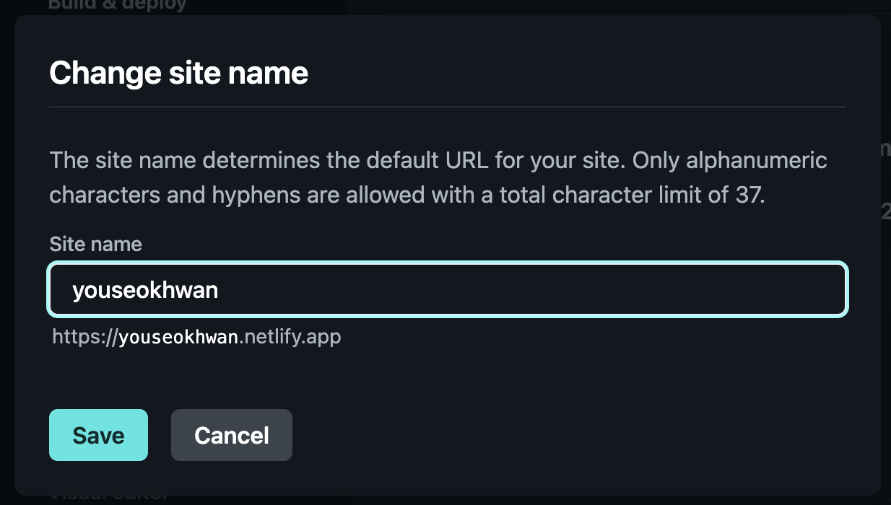
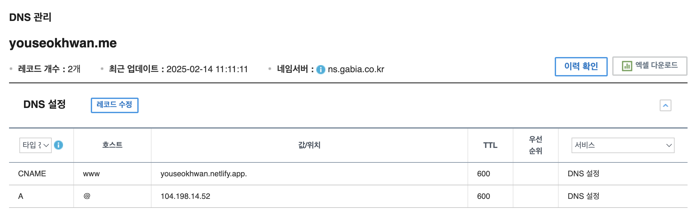
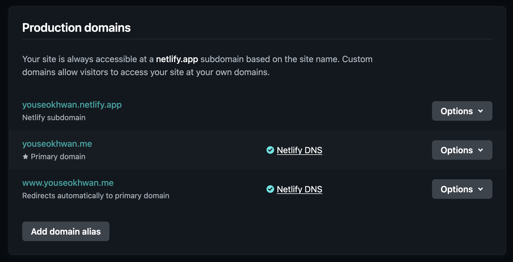
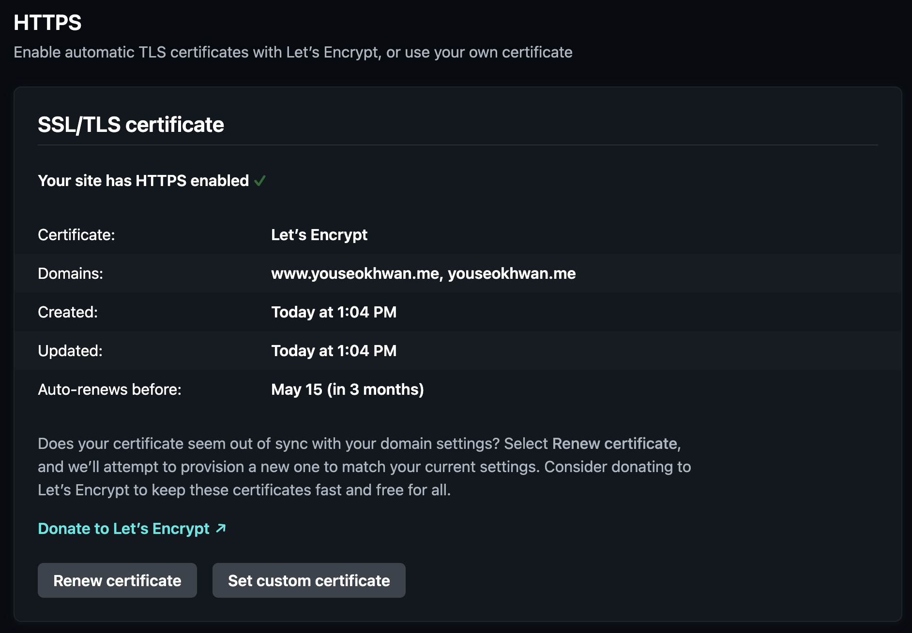
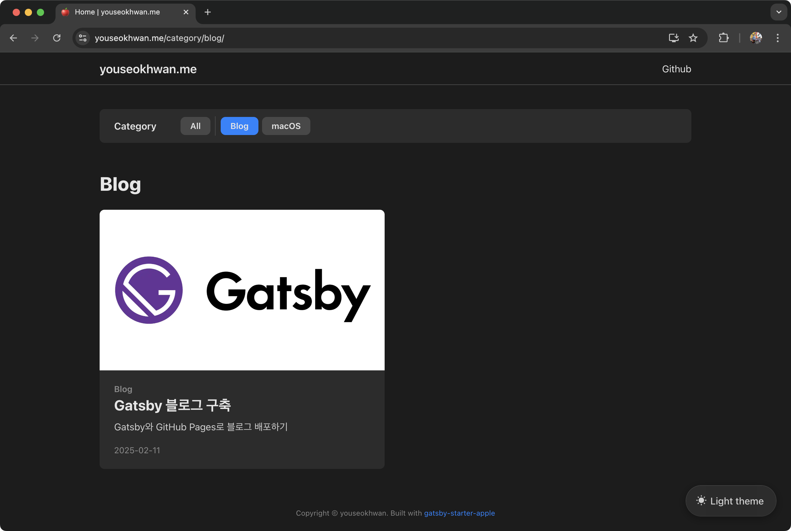

Tistory, 벨로그 등의 블로그 플랫폼을 이용하다가, 직접 커스텀 해보고 싶은 부분들이 있어서 GitHub Blog를 구축해 보기로 했다.

## Gatsby

`Gatsby`는 정적 사이트 생성기이다.<br>
GitHub 블로그를 구축할 때 Ruby 기반의 `Jekyll`과 React 기반의 `Gatsby`가 주로 언급되는데,
~~그나마~~ React가 좀 더 친숙했기에 `Gatsby`를 선택했다.

`Gatsby`의 [Quick Start](https://www.gatsbyjs.com/docs/quick-start/)를 따라 하면 기초적인 블로그를 쉽게 만들 수 있다.<br>
이 상태에서 UI/UX를 직접 설계하며 블로그를 개발하면 많은 것을 배울 수 있겠지만,<br>
빠르게 블로그를 구축하고 싶고, 개발 및 학습 시간을 많이 투자하기에 부담스럽다면 템플릿을 기반으로 구축하는 것도 좋다.<br>
템플릿은 구글링하거나 GitHub에 검색하여 찾아볼 수 있다.

필자는 디자인이 가장 마음에 드는 [gatsby-starter-apple](https://github.com/sungik-choi/gatsby-starter-apple)로 결정했다.<br>
템플릿마다 구현이나 표현 방식에 차이가 있을 수 있음에 유의한다.

## Gatsby Repository 클론 및 로컬에서 실행하기

먼저, 기반이 되는 Repository를 `clone`한다.<br>
`gatsby-cli` 패키지를 설치하면 `gatsby` 명령어를 사용할 수 있다.

```bash
npm install -g gatsby-cli
gatsby new youseokhwan.me https://github.com/sungik-choi/gatsby-starter-apple
```

`youseokhwan.me`는 로컬 디렉터리 이름, Github 주소는 `clone`할 Repository의 주소이다.<br>
로컬 디렉터리 이름은 자유롭게 지어도 된다.<br>

필요한 모듈을 설치하면, 로컬에서 실행해 볼 수 있다.

```bash
cd youseokhwan.me
yarn install
gatsby develop
```

브라우저에 [http://localhost:8000/](http://localhost:8000/)을 입력하여 접속할 수 있고,<br>
UI를 변경하거나, 포스트를 작성하면서 중간중간 결과물을 확인할 수 있다.

## GitHub Repository 생성 및 remote 연결

GitHub에서 `youseokhwan.me` Repository를 생성한다.<br>
이후, 로컬 디렉터리 `youseokhwan.me`와 이 Repository를 연결한다.

```bash
rm -rf .git
git init
git add .
git commit -m "clone gatsby-starter-apple"
git remote add origin https://github.com/youseokhwan/youseokhwan.me
git push -u origin main
```

## 포스트 작성

포스트는 `src/posts/blog/` 경로에 마크다운 파일을 추가하는 방식으로 작성할 수 있다.



## Netlify로 블로그 배포하기

현재는 로컬에서만 접속할 수 있고, 외부에서는 접속할 수 없는 상태이다.<br>
외부에서 접속하려면 이 블로그를 배포(deploy)해야 한다.

정적 사이트를 쉽고 빠르게 배포해 주는 [Netlify](https://www.netlify.com/)를 통해 블로그를 배포할 것이다.<br>
회원 가입을 하고 `youseokhwan.me` Repository를 등록한다.



Build settings은 다음과 같이 입력했다.

- Build command: `gatsby build`
- Publish directory: `public`
- 나머지는 빈칸으로 두거나 그대로 유지



브랜치는 우선 `main`으로 설정했다.<br>
`main`을 배포 브랜치로 바로 사용하는 것에 대한 거부감이 있지만, CI/CD 개선은 다음에 하기로 하고 우선 진행했다.



도메인은 `{사이트 이름}.netlify.app`으로 결정된다.<br>
필자의 경우 [youseokhwan.netlify.app](https://youseokhwan.netlify.app)이 된다.
`Site configuration`에서 변경할 수 있다.



이제 Repository의 변경 사항이 감지되면 Netlify가 자동으로 배포한다.<br>
배포 과정이나 로그는 `Deploys` 탭에서 확인할 수 있다.

## 커스텀 도메인 연결

가지고 있는 도메인이 있다면 연결할 수 있다.<br>
가비아에서 구매한 `youseokhwan.me`라는 도메인을 이 블로그와 연결하였다.

먼저, 가비아에서 DNS를 다음과 같이 설정했다.



`104.198.14.52`는 Netlify에서 제공하는 A 레코드 IP주소이다.<br>
CNAME 설정은 `www.youseokhwan.me`를 `youseokhwan.netlify.app`으로 리다이렉트하는 역할을 한다.

이후, Netlify 설정의 Domain management 탭에서 구매한 도메인을 추가해 준다.



바로 밑 HTTPS 항목의 `Verify DNS Configuration`을 클릭하면 Netlify가 설정된 DNS 레코드를 검사한다.<br>
DNS가 올바르게 설정되었다면 자동으로 `Let's Encrypt SSL` 인증서를 발급하여 HTTPS를 활성화해 준다.



잠시 기다려주면 [https://youseokhwan.me](https://youseokhwan.me)로 잘 접속되는 것을 확인할 수 있다.



---

### 참고

- https://www.gatsbyjs.com/docs/quick-start/
- https://github.com/sungik-choi/gatsby-starter-apple
