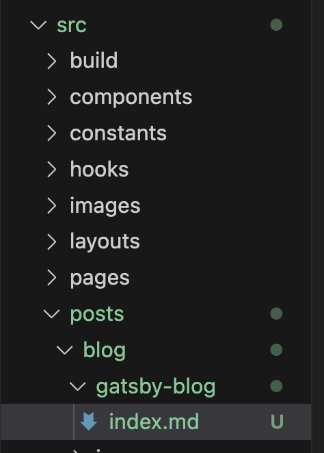
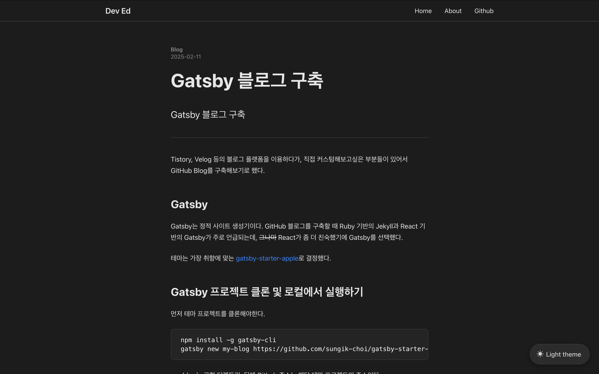
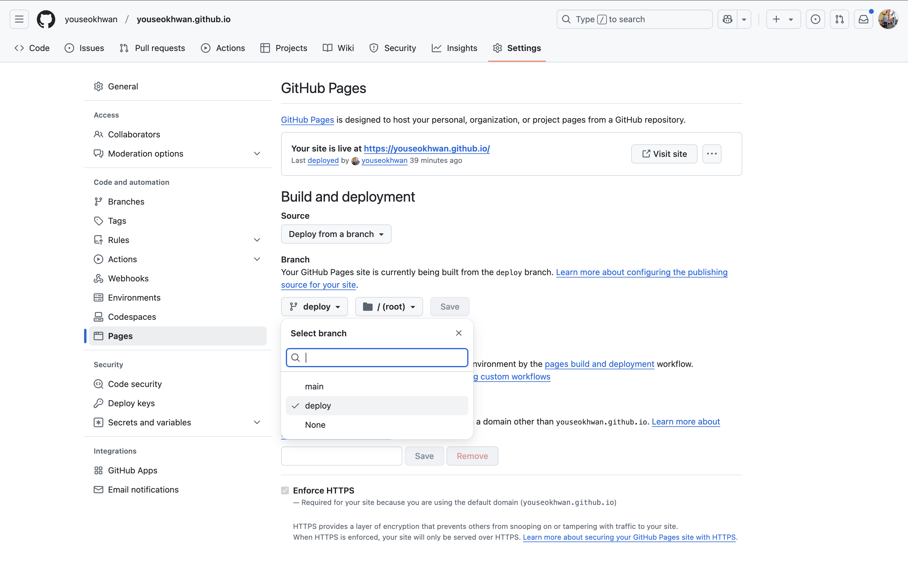
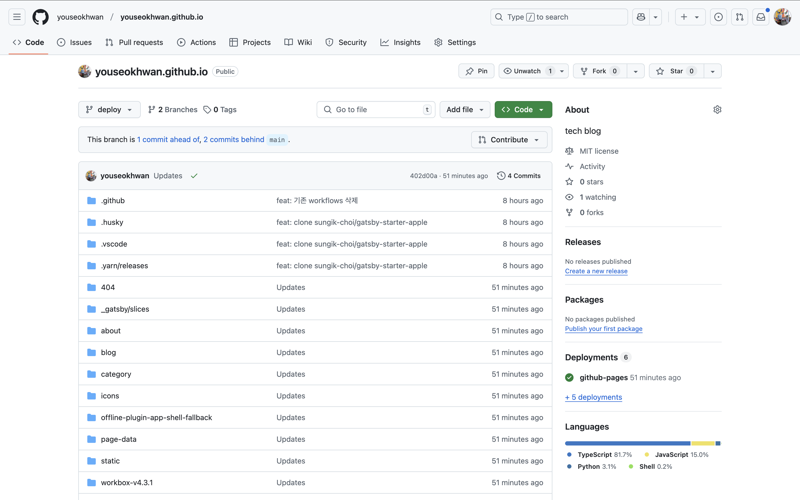
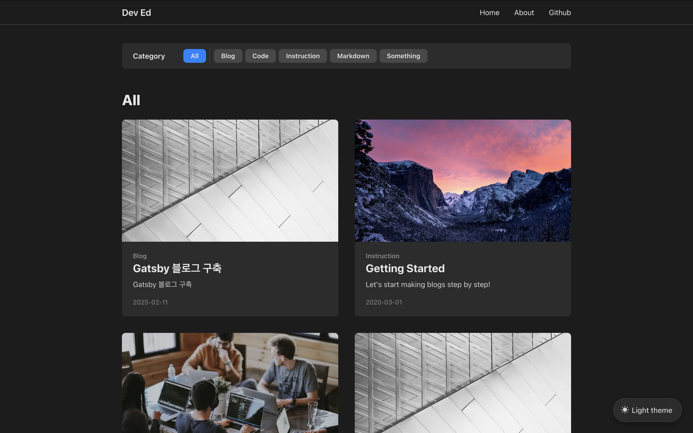
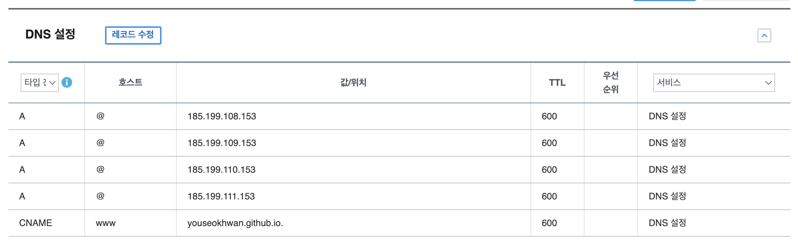
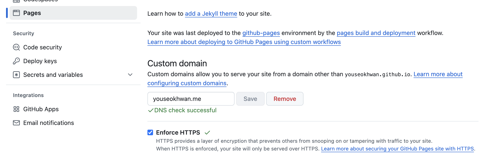
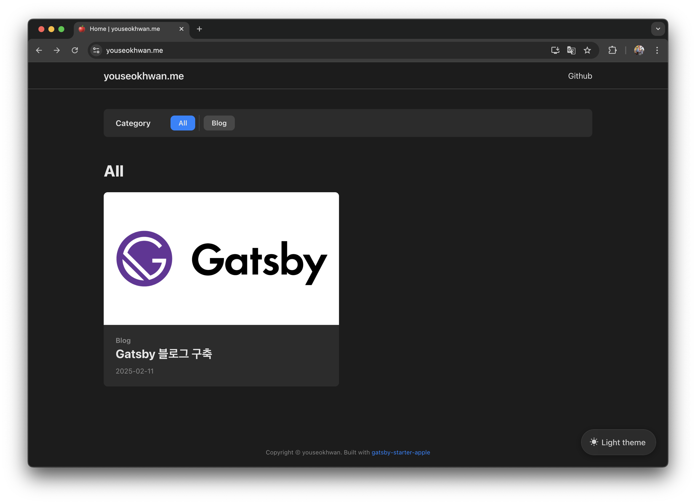

Tistory, 벨로그 등의 블로그 플랫폼을 이용하다가, 직접 커스텀해보고싶은 부분들이 있어서 GitHub Blog를 구축해보기로 했다.

---

## Gatsby란?

`Gatsby`는 정적 사이트 생성기이다.<br>
GitHub 블로그를 구축할 때 Ruby 기반의 `Jekyll`과 React 기반의 `Gatsby`가 주로 언급되는데,
~~그나마~~ React가 좀 더 친숙했기에 `Gatsby`를 선택했다.

테마는 디자인이 가장 마음에 드는 [gatsby-starter-apple](https://github.com/sungik-choi/gatsby-starter-apple)로 결정했다.

---

## Gatsby Repository 클론 및 로컬에서 실행하기

먼저 기반이 되는 Repository를 `clone`한다.<br>
`gatsby-cli` 패키지를 설치하면 `gatsby` 명령어를 사용할 수 있다.

```bash
npm install -g gatsby-cli
gatsby new my-blog https://github.com/sungik-choi/gatsby-starter-apple
```

`my-blog`는 로컬 디렉토리, 뒤에 Github 주소는 `clone`할 Repository의 주소이다.<br>
추후 `Github Pages`와 연계하기 위해 `youseokhwan.github.io`로 네이밍했더니,<br>
빌드에 오류가 발생하여 `.`이 없는 이름으로 바꾸었다.

이후 필요한 모듈을 설치하면, 로컬에서 실행해볼 수 있다.

```bash
npm install
gatsby develop
```

브라우저에 [http://localhost:8000/](http://localhost:8000/)을 입력하여 접속할 수 있고,<br>
UI를 변경하거나, 포스트를 작성하면서 중간중간 결과물을 확인할 수 있다.

---

## Repository 생성 및 remote 연결

`GitHub Pages` 연동을 위해 이름이 `youseokhwan.github.io`인 Repository를 생성한다.<br>
로컬 디렉토리인 `my-blog`와 이 Repository를 연결한다.

```bash
rm -rf .git
git init
git add .
git commit -m "clone gatsby-starter-apple"
git remote add origin https://github.com/youseokhwan/youseokhwan.github.io
git push -u origin main
```

---

## 포스트 작성

포스트는 `src/posts/blog/` 경로에 마크다운 파일을 추가하는 방식으로 작성할 수 있다.






---

## 배포 전용 브랜치 설정

빌드된 파일들을 관리하기 위한 `deploy` 브랜치를 만들어준다.

```bash
git switch -c deploy
git push -u origin deploy
```

Repository의 `Settings` > `Pages`에서 publish의 대상이 될 브랜치를 `deploy`로 설정하고 save 버튼을 눌러준다.



---

## gh-pages 패키지 설치 및 배포 스크립트 작성

`GitHub Pages` 배포를 도와주는 `gh-pages` 패키지를 설치한다.

```bash
npm install -g gh-pages
```

이후 `package.json`에 `deploy` 명령어에 대한 스크립트를 추가한다.<br>
프로젝트를 빌드한 후, `/public` 디렉토리를 `deploy` 브랜치에 push하는 작업이다.<br>
(`deploy` 브랜치에 직접 push하지 않는다.)

```json
"scripts": {
    "deploy": "gatsby build && gh-pages -d public -b deploy",
    // ...
}
```

`deploy` 명령어를 실행해주면, 자동으로 push된 것을 확인할 수 있다.

```bash
npm run deploy
```



잠시 기다리면 [https://youseokhwan.github.io](https://youseokhwan.github.io)에 정상적으로 배포된 것을 확인할 수 있다.



---

## 커스텀 도메인 연결

가지고 있는 도메인이 있다면 연결할 수 있다.<br>
가비아에서 구매한 `youseokhwan.me`라는 도메인을 이 블로그와 연결하였다.

먼저, 가비아에서 DNS를 다음과 같이 설정한다.



4개의 IP주소는 GitHub Pages에서 제공하는 공식 A 레코드 IP주소이다.<br>
CNAME 설정은 `www.youseokhwan.me`를 `youseokhwan.github.io`로 리다이렉트하는 역할을 한다.

이후, Repository의 `Settings` > `Pages`에서 Custom Domain에 `youseokhwan.me`를 입력하고 save 버튼을 눌러준다.<br>
그 밑에 `Enforce HTTPS`도 체크하여 HTTPS도 설정해준다.



잠시 기다리면 [youseokhwan.me](https://youseokhwan.me)로 잘 접속되는 것을 확인할 수 있다.



GitHub Actions로 자동 배포하고 있다면 설정한 커스텀 도메인이 풀리는 현상이 있을 수 있다.<br>
[이 글](https://velog.io/@developer_khj/Portfolio-GitHub-Pages-Custom-Domain-with-Gabia)의 도움을 받아 `deploy` script를 수정하여 해결했다. 🙏

```json
"scripts": {
    "deploy": "gatsby build && echo 'youseokhwan.me' > ./public/CNAME && gh-pages -d public -b deploy",
    // ...
}
```

---

### 참고

* https://github.com/sungik-choi/gatsby-starter-apple
* https://velog.io/@gparkkii/build-gatsby-blog
* https://devfoxstar.github.io/web/github-pages-gatsby/
* https://velog.io/@developer_khj/Portfolio-GitHub-Pages-Custom-Domain-with-Gabia
