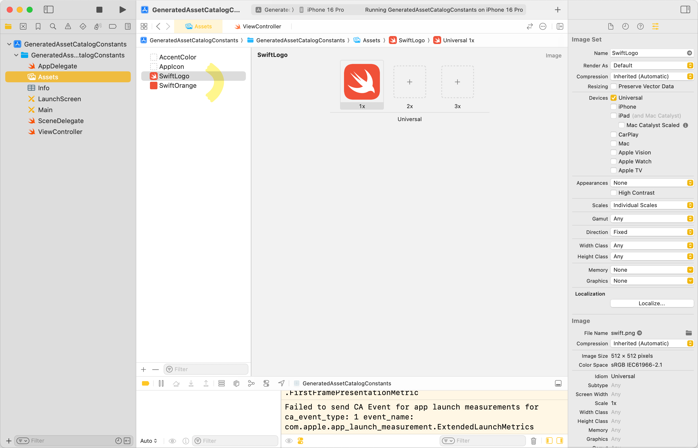
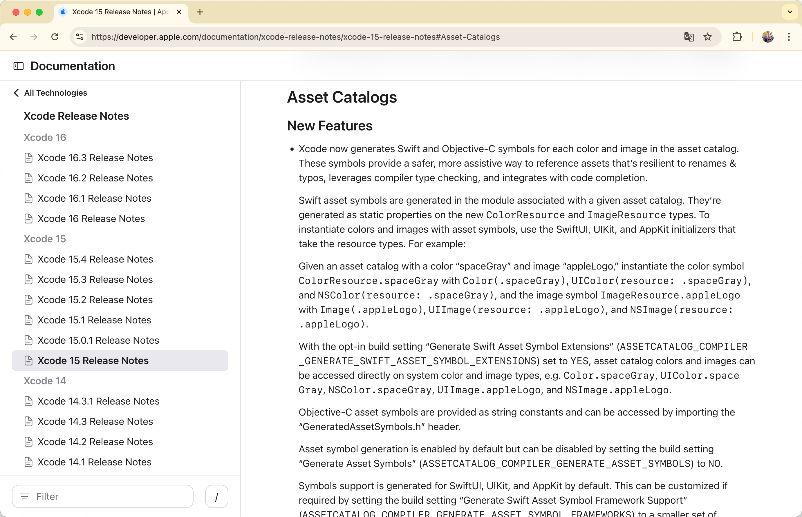
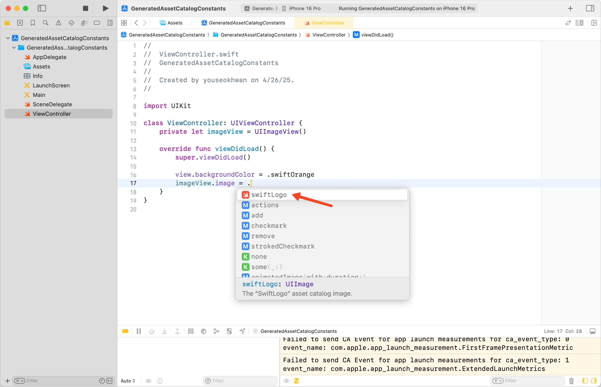
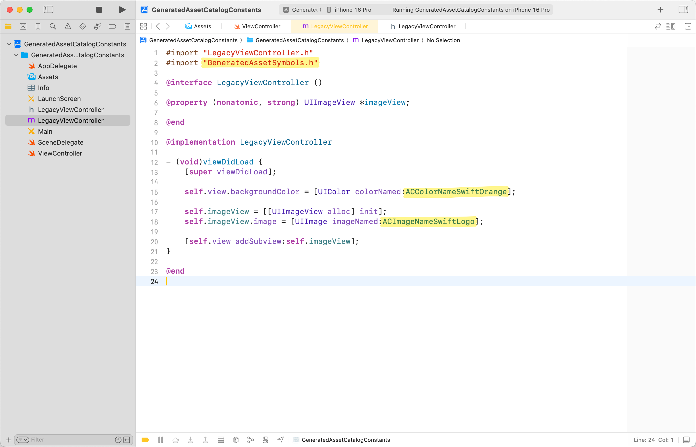
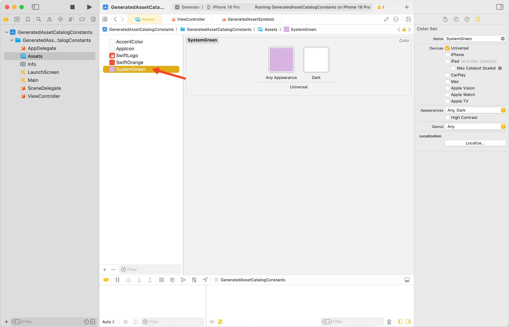
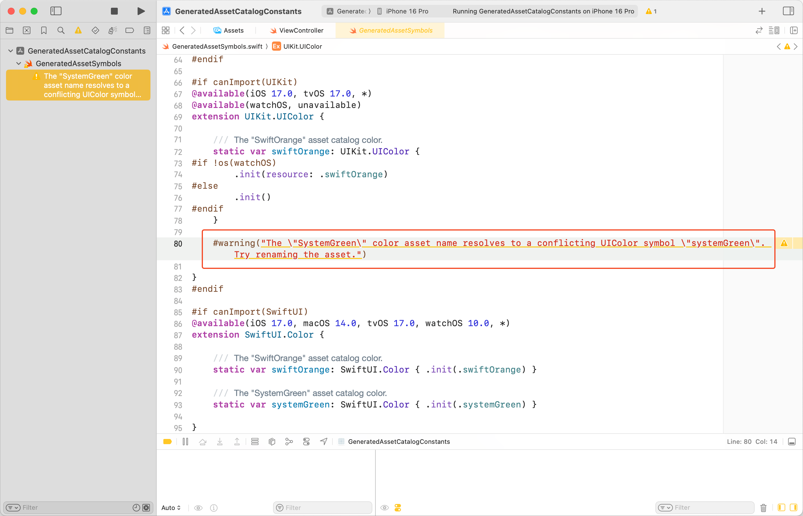
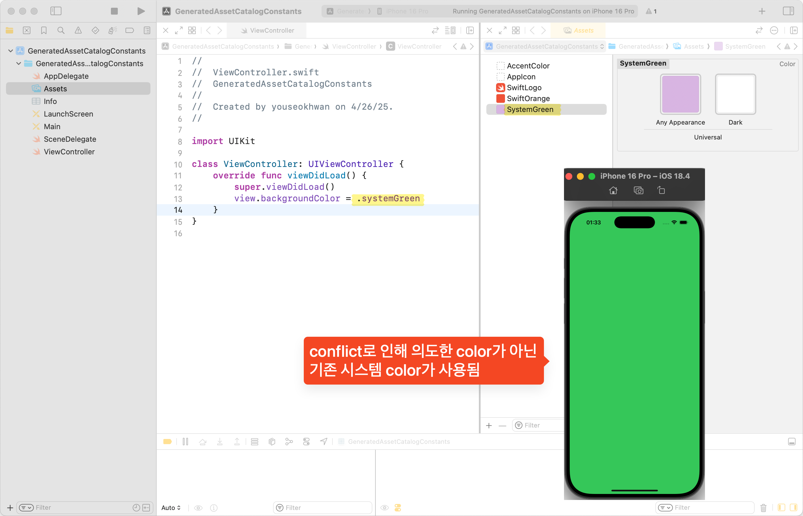
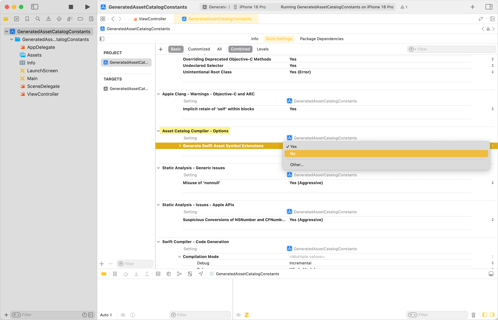

Xcode 15 이전에는 Asset Catalog에 있는 color와 image를 `.init(named:)`를 통해 호출했다.



```swift
view.backgroundColor = UIColor(named: "SwiftOrange")
imageView.image = UIImage(named: "SwiftLogo")
```

이때, 오타 위험을 방지하고 유지 보수를 쉽게 하기 위해, 상수화[^1]하여 사용하기도 한다.

```swift
import UIKit

class ViewController: UIViewController {
    private let imageView = UIImageView()

    override func viewDidLoad() {
        super.viewDidLoad()

        view.backgroundColor = .swiftOrange
        imageView.image = .swiftLogo
    }
}

extension UIColor {
    static var swiftOrange: UIColor? {
        .init(named: "SwiftOrange")
    }
}

extension UIImage {
    static var swiftLogo: UIImage? {
        .init(named: "SwiftLogo")
    }
}
```

### Xcode 15 이후

Xcode 15에서 자동으로 Asset을 상수화해 주는 기능이 추가됐다.



직접 상수화하지 않아도, 위와 똑같이 사용할 수 있다.



```swift
import UIKit

class ViewController: UIViewController {
    private let imageView = UIImageView()

    override func viewDidLoad() {
        super.viewDidLoad()

        view.backgroundColor = .swiftOrange
        imageView.image = .swiftLogo
    }
}
```

여담으로 Objective-C에서도 이 기능이 추가됐는데, Apple이 Objective-C도 지속적으로 개선하고 있다는 걸 체감했다.



### 🚨 주의할 점

`SystemGreen`처럼 기존 system name이나 예약어를 사용하면 conflict가 발생한다.





warning이 발생하며, 컴파일 에러가 나지는 않지만, 의도와 다르게 동작할 수 있다.



### ColorResource, ImageResource

warning을 통해 볼 수 있었던 `GeneartedAssetSymbols.swift`에서 `ColorResource`, `ImageResource` 타입을 확인할 수 있다.


직접 상수화했을 때는 아래처럼 `UIColor(named:)`를 이용하여 `UIColor`를 만들었었는데,

```swift
extension UIColor {
    static var swiftOrange: UIColor? {
        .init(named: "SwiftOrange")
    }
}
```

여기선, `UIColor(resource:)` 이니셜라이저를 사용하고 있다.

```swift
extension UIKit.UIColor {
    static var swiftOrange: UIKit.UIColor {
        .init(resource: .swiftOrange)
    }
}
```

파라미터로 던지는 자동 생성된 `.swiftOrange`는 위에서 본 `ColorResource`의 타입 프로퍼티다.

```swift
extension ColorResource {
    static let swiftOrange = ColorResource(name: "SwiftOrange", bundle: resourceBundle)
}
```

[공식 문서](https://developer.apple.com/documentation/developertoolssupport/colorresource)와 [WWDC 영상](https://developer.apple.com/kr/videos/play/wwdc2023/10165/?time=223)에서는 이것에 대해 자세히 언급하지 않아서, 정확하게 이 타입을 왜 쓰는지는 알 수 없었지만, 일단 Lazy Loading을 하는 것으로 추측해 보았다.

### Build Settings에서 설정 가능

자동 상수화를 원하지 않는다면, `Build Settings`에서 `Generate Swift Asset Symbol Extensions`를 `no`로 설정하여 기능을 off 할 수 있다.



---

### 참고

- https://developer.apple.com/documentation/xcode-release-notes/xcode-15-release-notes#Asset-Catalogs
- https://developer.apple.com/kr/videos/play/wwdc2023/10165/?time=223
- https://www.swiftjectivec.com/generated-asset-symbols-objective-c/
- https://developer.apple.com/documentation/developertoolssupport/colorresource
- https://developer.apple.com/documentation/developertoolssupport/imageresource

[^1]: Rswift, SwiftGen 등의 도구를 쓰기도 한다.
