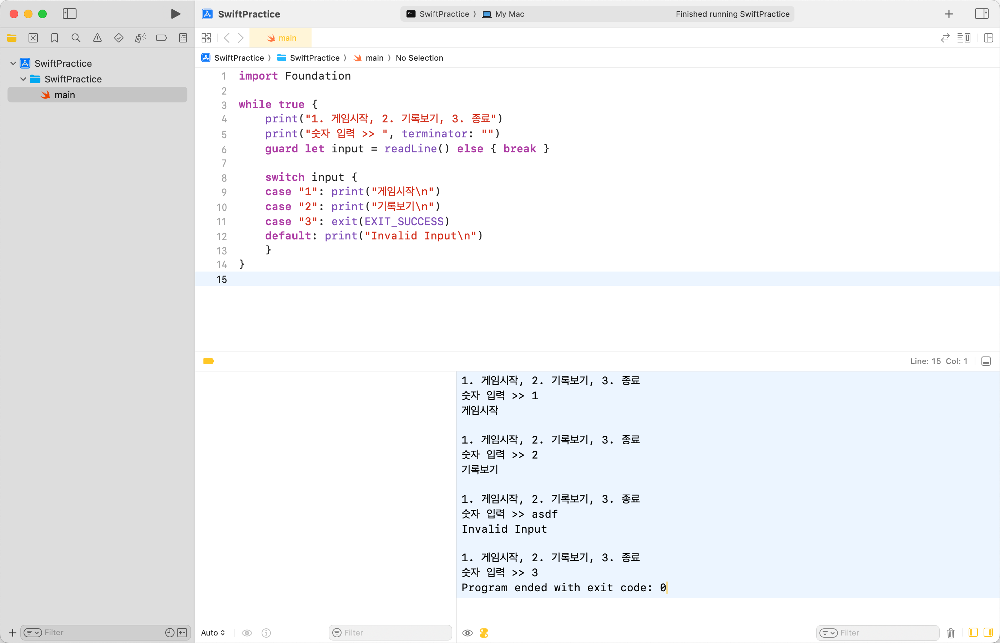
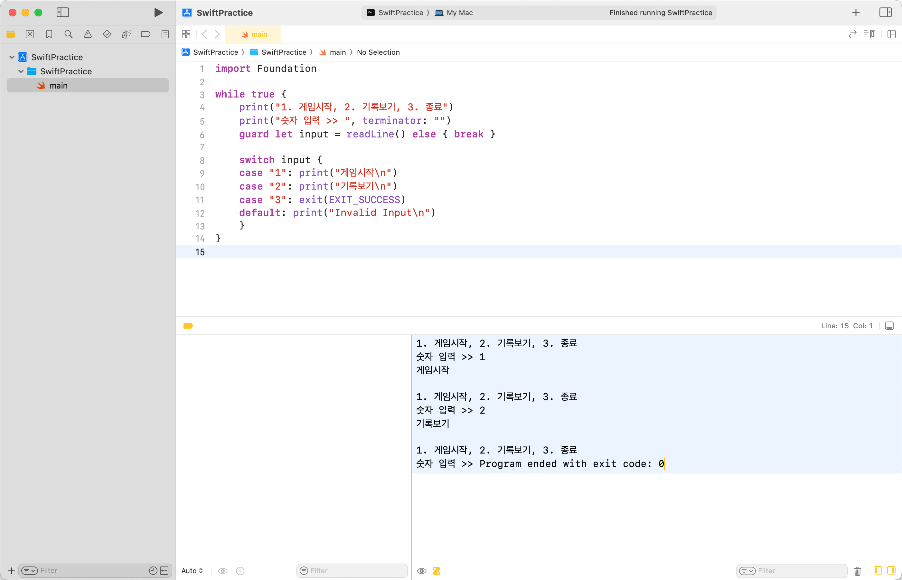
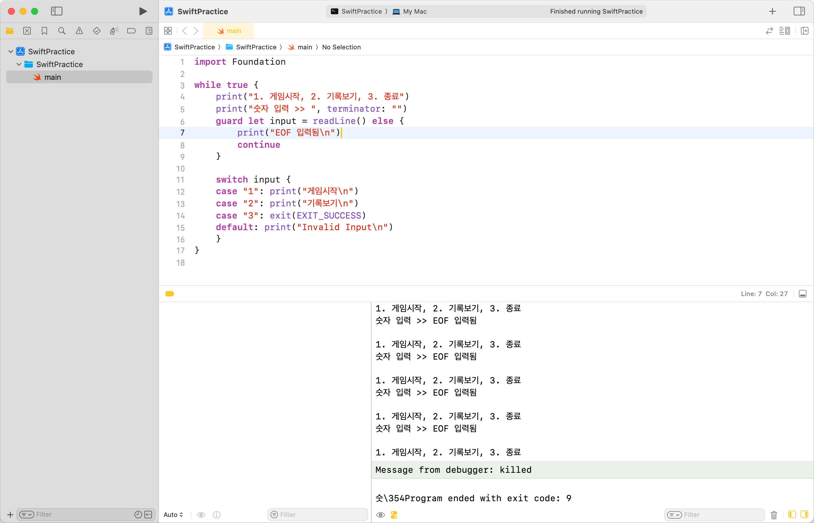

## EOF란?

EOF(End Of File)는 파일이나 데이터 스트림에서 더 이상 읽을 데이터가 없음을 나타내는 신호이다.
프로그래밍에서는 일반적으로 파일을 읽는 루프를 종료하는데 사용된다.

Unix 기반 시스템에서는 `⌃ + D`로, Windows에서는 `Ctrl + Z`로 EOF를 입력할 수 있다.

## CLI 환경에서 readLine() 사용

Swift CLI 환경에서 사용자 입력을 받기 위해서는 보통 readLine()을 사용한다.
예를 들어, 다음과 같이 게임 메뉴를 구현했다.

```swift
while true {
    print("1. 게임시작, 2. 기록보기, 3. 종료")
    print("숫자 입력 >> ", terminator: "")
    guard let input = readLine() else { break }

    switch input {
    case "1": print("게임시작\n")
    case "2": print("기록보기\n")
    case "3": exit(0)
    default: print("Invalid Input\n")
    }
}
```

1이나 2가 입력되면 각각 게임을 시작하거나 기록을 보는 로직을 실행한다.
3은 게임을 종료하고, 그 외에는 잘못된 입력에 대한 예외처리를 한다.



## EOF를 만나면?

이때, `⌃ + D`를 눌러 EOF를 입력하면 readLine()은 nil을 반환한다.
현재 코드에서는 EOF를 만나면 guard 구문을 통해 break되어 프로그램이 종료된다.



그런데 EOF를 만나면 꼭 프로세스를 종료해야할까?
그냥 '올바르지 않은 입력입니다!' 정도를 출력하고 다시 입력을 받으면 되지 않을까?
break를 continue로 바꾸고, print를 호출하도록 바꿔보았다.

```swift
import Foundation

while true {
    print("1. 게임시작, 2. 기록보기, 3. 종료")
    print("숫자 입력 >> ", terminator: "")
    guard let input = readLine() else {
        print("EOF 입력됨\n")
        continue
    }

    switch input {
    case "1": print("게임시작\n")
    case "2": print("기록보기\n")
    case "3": exit(EXIT_SUCCESS)
    default: print("Invalid Input\n")
    }
}
```



의도한 바와 다르게 사용자의 입력을 기다리지도 않고, `EOF 입력됨`이 무한으로 출력되는 루프에 빠진 것을 확인할 수 있다.
`⌘ + .`을 눌러 프로세스를 종료하면 된다.

[공식 문서](https://developer.apple.com/documentation/swift/readline(strippingnewline:))에서 이것에 대한 이유를 찾을 수 있는데,
EOF를 만나면 nil을 반환하고, 이미 EOF에 도달했다면 readLine()은 nil을 반환한다.

## FileHandle 사용해보기

readLine() 외에 다른 방법을 찾아보던 중, FileHandle에 대해 학습했다.

FileHandle은 ~하는 ~이다.
(구현부에 대한 설명)

```swift
import Foundation

while true {
    print("1. 게임시작, 2. 기록보기, 3. 종료")
    print("숫자 입력 >> ", terminator: "")
    let data = FileHandle.standardInput.availableData

    guard !data.isEmpty else {
        print("\nEOF 입력됨\n")
        continue
    }
    guard var selected = String(data: data, encoding: .utf8) else {
        print("utf8 변환 실패\n")
        continue
    }
    selected = selected.trimmingCharacters(in: .newlines)

    switch selected {
    case "1": print("게임시작\n")
    case "2": print("기록보기\n")
    case "3": exit(EXIT_SUCCESS)
    default: print("Invalid Input\n")
    }
}
```

## 장단점 비교

~~

---

### 참고

- https://ddd-a.tistory.com/47
- https://developer.apple.com/documentation/swift/readline(strippingnewline:)
- https://developer.apple.com/documentation/foundation/filehandle
