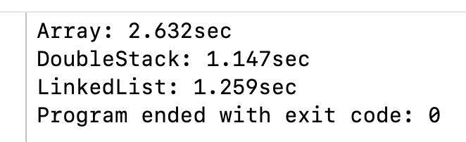

## Queue

Queue는 FIFO(First In First Out) 방식의 자료구조이며, 먼저 들어온 데이터가 먼저 나가는 특징이 있다.

### 기본적인 연산

* `enqueue`: Queue의 뒤에 데이터를 추가
* `dequeue`: Queue의 앞에서 데이터를 삭제하고 반환
* `peek`: Queue의 앞에 있는 데이터를 삭제하지 않고 조회
* `isEmpty`: Queue가 비어 있는지 여부

## Swift로 구현

### 1️⃣ Array

가장 직관적인 방법은 `Array`를 사용하는 것이다.

```swift
import Foundation

struct Queue<T> {
    private var elements = [T]()

    var isEmpty: Bool {
        elements.isEmpty
    }

    var peek: T? {
        elements.first
    }

    mutating func enqueue(_ element: T) {
        elements.append(element)
    }

    mutating func dequeue() -> T? {
        guard !isEmpty else { return nil }
        return elements.removeFirst()
    }
}
```

구현이 쉽고 간단하지만, `dequeue`의 `removeFirst()`의 시간 복잡도가 O(n)이라는 단점이 있다.

### 2️⃣ Double Stack

Double Stack 방식은 `inBox`, `outBox` 두 개의 Stack을 이용하여 Queue를 구현하는 것이다.

* `enqueue`할 땐, `inBox`에 `push`한다.
* `dequeue`할 땐, `outBox`에서 `pop`한다.
* 중간중간 `inBox`를 뒤집어서 `outBox`로 데이터를 옮긴다.

```swift
import Foundation

struct Queue<T> {
    private var inBox = [T]()
    private var outBox = [T]()

    var isEmpty: Bool {
        inBox.isEmpty && outBox.isEmpty
    }

    var peek: T? {
        !outBox.isEmpty ? outBox.last : inBox.first
    }

    mutating func enqueue(_ element: T) {
        inBox.append(element)
    }

    mutating func dequeue() -> T? {
        if outBox.isEmpty {
            outBox = inBox.reversed()
            inBox.removeAll()
        }
        return outBox.popLast()
    }
}
```

`removeFirst()`는 O(n)이지만, `popLast()`는 O(1)[^1]이다.<br>
`inBox.reversed()`가 호출되는 최악의 경우엔 O(n)이지만, 매번 수행하는 것이 아니므로 평균적으로 O(1)[^2]이다.

`removeAll()` 호출 시, capacity를 유지하여 메모리 재할당을 방지하면 성능을 더 최적화할 수 있다.

```swift
inBox.removeAll(keepingCapacity: true)
```

### 3️⃣ Linked List

알고리즘의 단골손님인 연결 리스트로도 Queue를 구현할 수 있다.

* `Node`는 `element`와 다음 `element`의 참조인 `next`를 가진다.
* `head`는 맨 앞 노드의 참조를, `tail`은 맨 뒤 노드의 참조를 가진다.
* `enqueue`할 땐, 기존 `tail`의 `next`는 새 `element`의 참조를 가지고, 새 `element`가 `tail`이 된다.
* `dequeue`할 땐, 기존 `head`의 값을 반환하고, `head`의 다음 `element`가 새로운 `head`가 된다.

```swift
import Foundation

class Queue<T> {
    class Node {
        var element: T
        var next: Node?

        init(_ element: T) {
            self.element = element
        }
    }

    private var head: Node?
    private var tail: Node?

    var isEmpty: Bool {
        head == nil
    }

    var peek: T? {
        head?.element
    }

    func enqueue(_ element: T) {
        let newNode = Node(element)

        if isEmpty {
            head = newNode
        } else {
            tail?.next = newNode
        }
        tail = newNode
    }

    func dequeue() -> T? {
        guard let result = head?.element else { return nil }

        head = head?.next
        if head == nil {
            tail = nil
        }

        return result
    }
}
```

코드양이 많지만, 이론상 모든 기본 연산에서 O(1)이 보장된다.

## Double Stack 방식 vs Linked List 방식

그렇다면 항상 O(1)이 보장되는 Linked List 방식이 항상 정답일까?<br>
최소한 Swift에서는 그렇지 않다.

1. Swift의 `Array`는 메모리 캐시 최적화가 잘돼있다.
2. Linked List는 노드마다 포인터를 추가로 저장해야 한다.
3. Linked List는 참조를 다루기 때문에, 레퍼런스 카운팅을 신경 써야 한다.

## 검증?

측정 방법에 대한 확신은 없지만, 나름대로 실행 속도를 측정해 보았다.<br>
천만번의 랜덤한 `enqueue`, `dequeue` 연산을 생성하여, 각 실행 시간을 측정했다.

```swift
enum Operation {
    case enqueue
    case dequeue
}

let iteration = 10_000_000
var operations = [Operation]()
(0..<iteration).forEach { _ in
    operations.append(Bool.random() ? .enqueue : .dequeue)
}

var arrayQueue = ArrayQueue<Int>()
var startTime = CFAbsoluteTimeGetCurrent()
operations.forEach { operation in
    switch operation {
    case .enqueue:
        arrayQueue.enqueue(0)
    case .dequeue:
        _ = arrayQueue.dequeue()
    }
}
var difference = String(format: "%.3f", CFAbsoluteTimeGetCurrent() - startTime)
print("Array: \(difference)sec")

var doubleStackQueue = DoubleStackQueue<Int>()
startTime = CFAbsoluteTimeGetCurrent()
operations.forEach { operation in
    switch operation {
    case .enqueue:
        doubleStackQueue.enqueue(0)
    case .dequeue:
        _ = doubleStackQueue.dequeue()
    }
}
difference = String(format: "%.3f", CFAbsoluteTimeGetCurrent() - startTime)
print("DoubleStack: \(difference)sec")

let linkedListQueue = LinkedListQueue<Int>()
startTime = CFAbsoluteTimeGetCurrent()
operations.forEach { operation in
    switch operation {
    case .enqueue:
        linkedListQueue.enqueue(0)
    case .dequeue:
        _ = linkedListQueue.dequeue()
    }
}
difference = String(format: "%.3f", CFAbsoluteTimeGetCurrent() - startTime)
print("LinkedList: \(difference)sec")
```



의외로 Double Stack 방식이 Linked List 방식보다 더 빠른 것을 확인할 수 있었다.<br>
상황에 따라 다를 수 있지만, `Array` 최적화 효율 혹은 참조 타입의 메모리 관리 비용 등을 유추해 볼 수 있다.

더구나 코드 자동완성이 지원되지 않고, 시간이 촉박한 코딩 테스트 환경이라면, 구현 난이도가 낮고 코드양이 적은 Double Stack 방식이 더 매력적인 선택지일 것 같다.

---

### 참고

- https://en.wikipedia.org/wiki/Queue_(abstract_data_type)
- [https://velog.io/@gundy/Swift-Swift에서-Queue는-뭘로-구현해야-할까](https://velog.io/@gundy/Swift-Swift%EC%97%90%EC%84%9C-Queue%EB%8A%94-%EB%AD%98%EB%A1%9C-%EA%B5%AC%ED%98%84%ED%95%B4%EC%95%BC-%ED%95%A0%EA%B9%8C)
- https://zeddios.tistory.com/60
- [https://sujinnaljin.medium.com/swift-array-의-capacity-9c3a99d2c31f](https://sujinnaljin.medium.com/swift-array-%EC%9D%98-capacity-9c3a99d2c31f)

[^1]: removeFirst()도 O(1)이다.
[^2]: 정확한 용어는 Amortized O(1)
