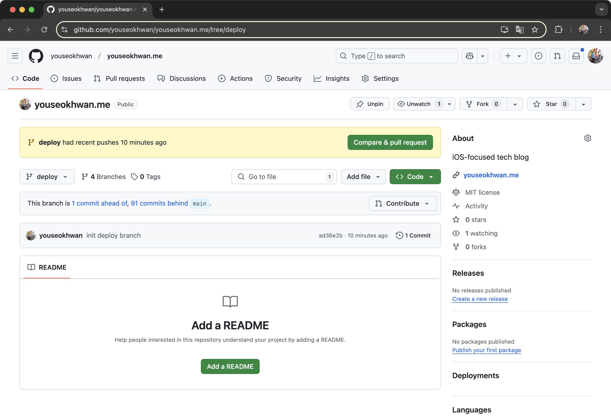

현재 이 블로그의 배포 프로세스는 다음과 같다.

1. 포스트를 작성 및 수정하거나, React 파일 변경(UI 업데이트 등) 후 push
2. Netlify에서 변경을 감지하면, 서버에서 gatsby build 명령어 실행
3. 서버에서 진행한 빌드의 결과물인 public/을 호스팅

배포 프로세스에 문제는 없으나, 반영되는 속도가 아쉬웠다.
로컬에서 gatsby build를 실행하면 약 10초 정도 걸리는데, Netlify에선 2분 넘게 소요된다.
UI 업데이트같은 큰 변경은 간헐적으로 배포하니 괜찮지만,
오타 수정같은 경우는 commit마다 변경 사항이 적고, push 주기가 짧기때문에 꽤 답답했다.

시간 단축에 비하면 CPU 사용량이 부담되는 상황은 아니였기에 로컬 빌드 방식으로 변경해보았다.

---

## Git Subtree를 이용하여 deploy branch 분리

git subtree를 이용하면 여러 repository를 한 repository에서 관리할 수 있다.
여기서는 public/을 하위 repository로 두고, 별도의 branch로 관리하는 목적으로 사용했다.

### empty branch 만들기

--orphan 명령어를 이용해 기존 커밋 내역을 계승하지 않는 deploy라는 empty branch를 만든다.
~~orphan 단어 뜻이 너무 직접적이여서 당황스러웠다.~~

```bash
git checkout --orphan deploy
```

deploy의 내용을 모두 지워준다.
추적되던 파일이 모두 삭제되나, main branch로 돌아오면 복구된다.

```bash
git rm -rf .
```

commit, push하여 remote에 반영한다.
--allow-empty는 변경 사항이 없더라도 commit 할 수 있게 해준다.

```bash
git commit --empty-allow -m "init deploy branch"
git push origin deploy
```

empty branch가 만들어진 것을 확인할 수 있다.



---

## 로컬 빌드 방식으로 변경하기

### deploy branch로 빌드하기

현재, public/이 .gitignore에 추가돼있어 추적되지 않는 상태이다.
public/을 추적할 수 있도록 임시로 remote에 push한다.

```bash
gatsby build
git add public/ -f
git commit -m "public/ 임시 추가"
git push origin main
```

### Netlify 설정 변경

---

## Git Hooks을 이용하여 자동화

---

### 참고

- https://log4day.tistory.com/64
- https://bum0w0.tistory.com/16
