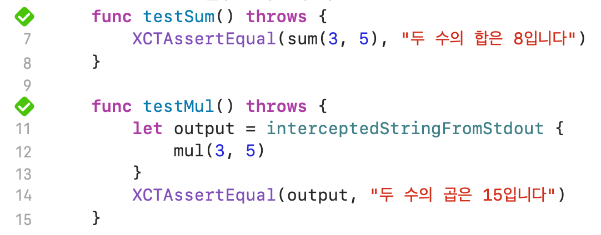

## 개요

클로저를 학습하던 중, 아래와 같은 2가지 형태의 구문을 작성하게 되었다.<br>
`Int` 2개를 파라미터로 받아, 연산 결과를 출력하는 간단한 클로저이다.

**값을 반환하고, 외부에서 print하는 클로저**

```swift
let sum: (Int, Int) -> String = { a, b in
    return "두 수의 합은 \(a + b)입니다"
}
print(sum(3, 5)) // 두 수의 합은 8입니다
```

**값을 반환하지 않고, 안에서 print하는 클로저**

```swift
let mul: (Int, Int) -> Void = { a, b in
    print("두 수의 곱은 \(a * b)입니다")
}
mul(3, 5) // 두 수의 곱은 15입니다
```

## 트러블 발생

그리고 이 둘에 대한 테스트 케이스를 작성하려했다.<br>
전자의 경우는 무난하게 작성할 수 있었다.

```swift
func testSum() throws {
    XCTAssertEqual(sum(3, 5), "두 수의 합은 8입니다")
}
```

문제는 후자의 경우, 어떻게 테스트해야 할지 직관적으로 떠오르지 않았다.<br>
제공되는 `XCTAssert` 메서드 중에서도 적절해보이는 메서드가 없었다.

## 해결 시나리오

`print()`를 테스트하기 위해서 다음과 같은 시나리오로 해결했다.

1. `pipe`를 만들어 표준 출력인 `stdout`과 연결한다.
2. 내부에서 `print()`하는 클로저를 호출한다.
3. `stdout`으로 전달되는 `String`을 `pipe`가 가로챈다.
4. `pipe`에서 가로챈 값을 추출한 뒤, `XCTAssert` 메서드로 테스트한다.

## 완성 코드

```swift
func testMul() throws {
    let output = interceptedStringFromStdout {
        mul(3, 5)
    }
    XCTAssertEqual(output, "두 수의 곱은 15입니다")
}

private func interceptedStringFromStdout(_ closure: () -> Void) -> String? {
    let pipe = Pipe()
    let originalStdout = dup(fileno(stdout))
    dup2(pipe.fileHandleForWriting.fileDescriptor, fileno(stdout))

    closure()

    fflush(stdout)
    try? pipe.fileHandleForWriting.close()
    dup2(originalStdout, fileno(stdout))

    let data = pipe.fileHandleForReading.readDataToEndOfFile()
    let result = String(data: data, encoding: .utf8)?.trimmingCharacters(in: .whitespacesAndNewlines)

    return result
}
```

`dup`, `dup2`, `fileno` 등은 C에서 관습적으로 쓰던 네이밍을 그대로 채택한 듯 하다.<br>
코드를 한 줄씩 분석해보자.

**line 9**: `let pipe = Pipe()`

`pipe`는 한 프로세스의 출력을 다른 프로세스의 입력으로 연결하는 단방향 통신 매커니즘이다.<br>
`stdout`으로 전달되는 출력을 `pipe`를 이용해 `data` 상수로 가로챌 것이다.

**line 10**: `let originalStdout = dup(fileno(stdout))`

`fileno`는 파일 디스크립터[^1]를 얻는 함수이다.<br>
`dup`은 duplicate의 줄임말로, `stdout`의 디스크립터를 복사해서 `originalStdout`에 백업하는 과정이다.

**line 11**: `dup2(pipe.fileHandleForWriting.fileDescriptor, fileno(stdout))`

`dup2` 역시 복사인데, `dup2(a, b)`는 `b`를 `a`로 덮어쓰는 것이다.<br>
`stdout`을 `pipe`의 쓰기 디스크립터로 덮어써서, 이제 `pipe`가 데이터를 받게된다.

**line 13**: `closure()`

파라미터로 전달받은 클로저를 호출한다.<br>
여기선 `mul(3, 5)`가 호출되고, 클로저 내부에서 `print("두 수의 곱은 \(a * b)입니다")`가 호출된다.

**line 15**: `fflush(stdout)`

`fflush`를 호출해 버퍼를 강제로 비워준다.<br>
버퍼를 강제로 비워주지 않으면, `pipe`에 내용이 모두 전달되지 않고 버퍼에 남아있을 가능성이 있다.

**line 16**: `try? pipe.fileHandleForWriting.close()`

`pipe`의 쓰기 디스크립터를 닫고, `EOF`를 입력해준다.<br>
닫지 않으면 `EOF`를 무한히 기다리는 blocking 상태가 되어 테스트가 끝나지 않는다.

**line 17**: `dup2(originalStdout, fileno(stdout))`

백업해놨던 `originalStdout`을 다시 `stdout`에 연결해준다.<br>
이 작업을 하지 않으면, 이후에 콘솔에 출력되야할 내용들을 계속해서 `pipe`가 가로채어 화면에 아무것도 출력되지 않게된다.

**line 19**: `let data = pipe.fileHandleForReading.readDataToEndOfFile()`

가로챈 값을 `pipe`의 읽기 디스크립터를 통해 `Data` 타입으로 가져온다.

**line 20**: `let result = String(data: data, encoding: .utf8)?.trimmingCharacters(in: .whitespacesAndNewlines)`

`Data`를 `String`으로 인코딩한다.<br>
이때, 마지막에 개행 문자(`\n`)가 붙게되므로 trimming 해준다.

### 테스트 결과



## 실용성

사실 이 방법의 실용성은 거의 없다.<br>
`LLDB`를 사용하거나 `os_log()` 등 `print()`보다 더 좋은 방법이 많기 때문이다.<br>
또한, `print()`가 호출된 후의 '상태'를 테스트하는 것보다, `print()`의 대상이 될 '값'을 테스트하는 것이 더 바람직하다.

호기심만 해결하려고 가볍게 찾아보기 시작했는데, 예상치 못한 방법이여서 학습하다보니 정리까지 하게되었다.<br>
이 내용들은 테스트의 관점보다는 표준 입출력과 `pipe`에 대해 학습한 것에 의의를 두자.

---

### 참고

- https://developer.apple.com/documentation/foundation/pipe
- https://developer.apple.com/library/archive/documentation/System/Conceptual/ManPages_iPhoneOS/man2/dup2.2.html
- https://ddd-a.tistory.com/45

[^1]: 표준 입력(stdin): 0, 표준 출력(stdout): 1, 표준 에러(stderr): 2
