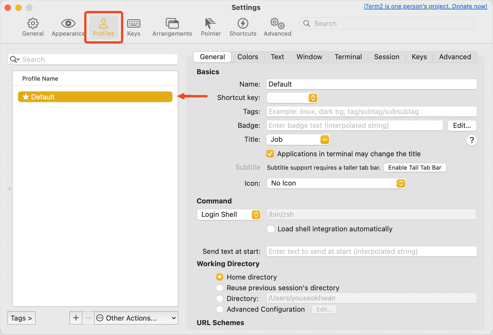
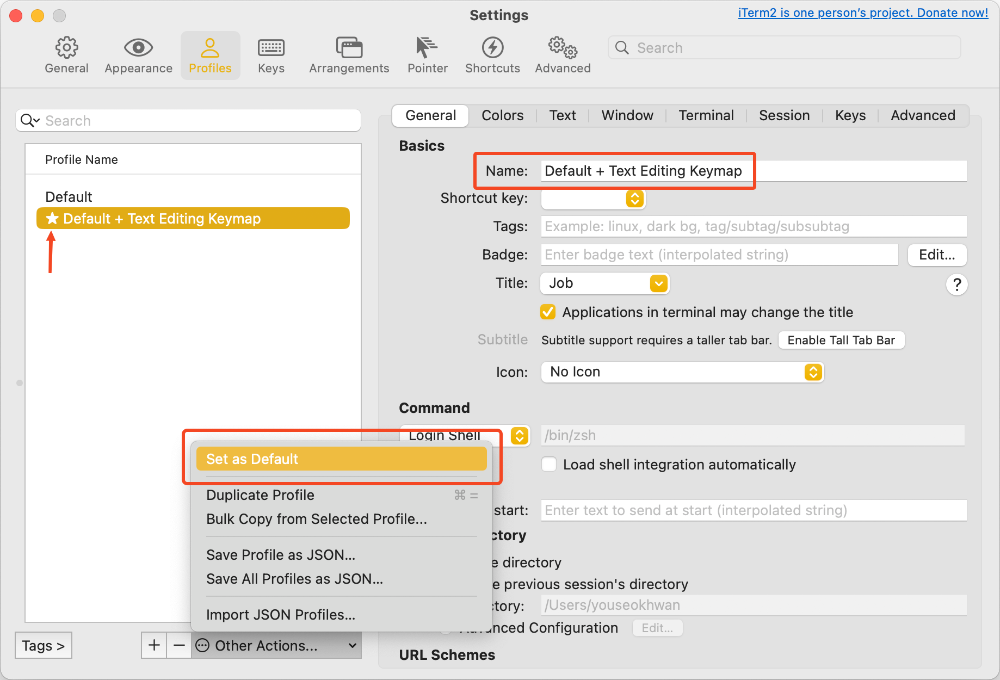
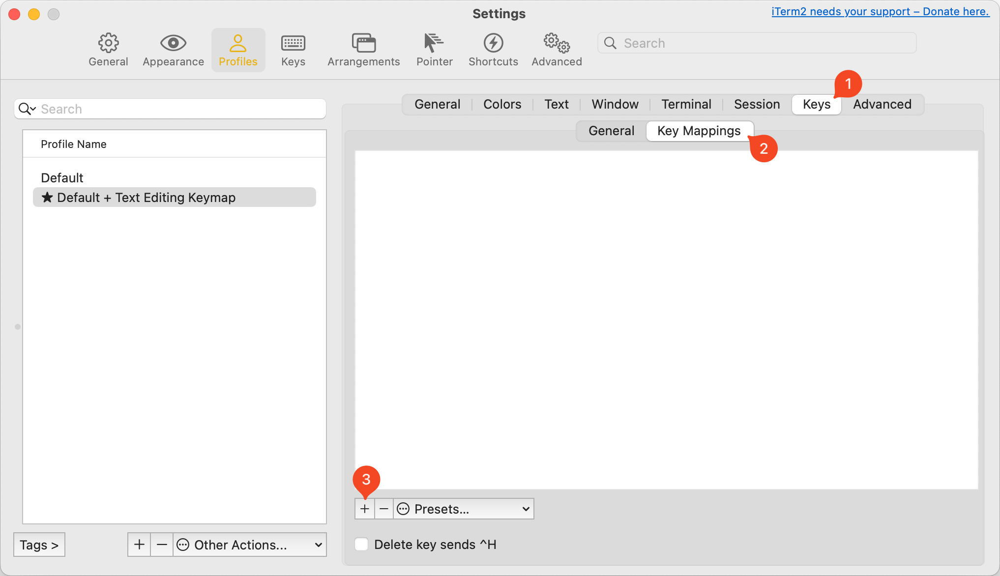
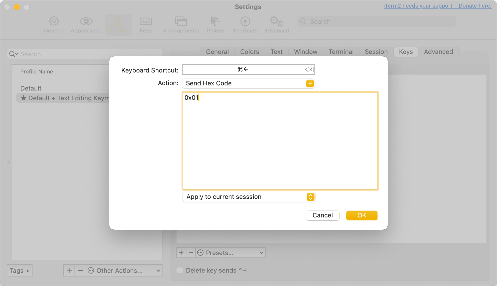
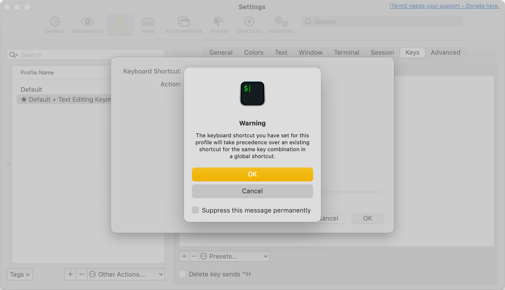
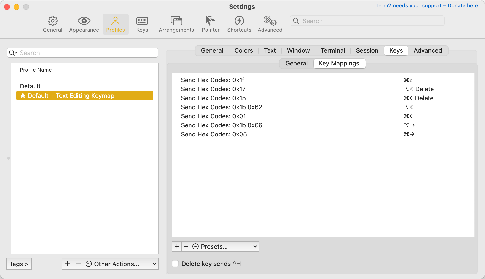

## 텍스트 편집 단축키란?

텍스트 편집 단축키란, 라인이나 단어 단위로 커서 이동, 드래그, 스크롤 할 수 있는 단축키이다. 
Apple은 Text Editing Shortcuts라고 칭하며, 범용적으로는 Navigation Shortcuts라고도 표현한다.

## 단축키 세팅

웹 브라우저나 Xcode 같은 환경에서는 Modifier Key[^1]와 방향키를 조합해 사용한다. 
그러나 터미널 환경에서는 다른 단축키 세팅을 가지고 있는데, 일관된 키 세팅으로 작업하고 싶다면 단축키를 변경해야 한다. 
Unix 기반의 표준 단축키를 학습하지 못한다는 단점이 있지만, 생산성을 높일 수 있다.

macOS 기본 터미널과 iTerm2도 단축키 세팅이 조금 다른데, 자주 사용하는 iTerm2을 기준으로 작성하였다.

### 단축키 목록

| 일반 단축키 | 기본 iTerm2 단축키 | Hex Code | 동작 |
| --- | --- | --- | --- |
| ⌘ ← | ⌃ A | 0x01 | 라인 앞으로 이동 |
| ⌘ → | ⌃ E | 0x05 | 라인 뒤로 이동 |
| ⌘ ⌫ | ^ U[^2] | 0x15 | 맨 앞까지 삭제 |
| ⌥ ← | esc B | 0x1b 0x62 | 단어 앞으로 이동 |
| ⌥ → | esc F | 0x1b 0x66 | 단어 뒤로 이동 |
| ⌥ ⌫ | ⌃ W | 0x17 | 단어 앞까지 삭제 |
| ⌘ Z[^3] | ⌃ _ | 0x1f | 실행 취소(Undo) |

## iTerm2 단축키 변경하기

`⌘ + ,`를 눌러 `Settings` 창을 띄운다. 
이후 `Profiles` 탭에서 본인이 사용하고 있는 프로필을 선택하고, `⌘ + =`를 눌러 복사한다.

복사된 프로필 이름을 원하는 이름으로 변경하고, `Set as Default`를 눌러 기본값으로 설정한다.

`Keys` 탭 > `Key Mappings` 탭으로 이동하여 하단의 `+` 버튼을 클릭한다.

각 항목을 입력한다. 
`Action`을 `Send Hex Code`로 선택하면, 하단에 `Hex Code`를 입력할 수 있는 창이 나타난다. 
위에 '단축키 목록' 표에 있는 `Hex Code`를 입력해 주면 된다.

설정한 단축키가 글로벌 단축키와 겹치는 경우, `Warning` 팝업이 뜬다. 
방금 설정한 단축키가 우선순위가 더 높으므로, 그냥 `OK` 버튼을 클릭한다.

표에 있는 7개 항목을 모두 설정하면 아래와 같은 상태가 된다. 
`⌫`의 경우 `←Delete`로 표기되지만, 정상 작동한다.

## 해결하지 못한 부분

`Send Hex Code` 기능은 입력한 macOS 키 조합을 터미널의 단축키로 매핑하는 것일 뿐이다. 
따라서 원래 그 기능에 대한 단축키가 없는 경우, 원하는 대로 설정하지 못했다.

1. `⌘ + ⌫`는 텍스트 에디터에선 커서를 기준으로 줄의 맨 앞까지 삭제하지만, 터미널에선 커서의 위치와 관계없이 줄 전체를 삭제한다.
2. `⌘ + ⇧ + ←`와 같은 Selection 기능을 설정하지 못했다. 
    `Move Start of Selection Back`과 같은 기능도 있었으나, 연속 선택이 안 되거나 프롬프트까지 같이 선택되는 문제가 있었다.
3. `⌘ + z`는 정상 작동하나, `⌘ + ㅋ`의 경우 의도대로 원활하게 작동하지 않는다. 
    `⌘ + ㅋ`을 따로 추가하더라도 한글 입력을 원활하게 처리하지는 못했다.

---

### 참고

- https://support.apple.com/en-us/102650#text
- https://minny27.tistory.com/49
- https://kkang-joo.tistory.com/23

[^1]: command(⌘), option(⌥), control(⌃)
[^2]: 터미널에서는 커서의 위치와 상관없이 줄 전체를 삭제한다.
[^3]: ⌘ + Z가 아니라 ⌘ + ㅋ을 입력할 경우 의도대로 동작하지 않을 수 있다.
