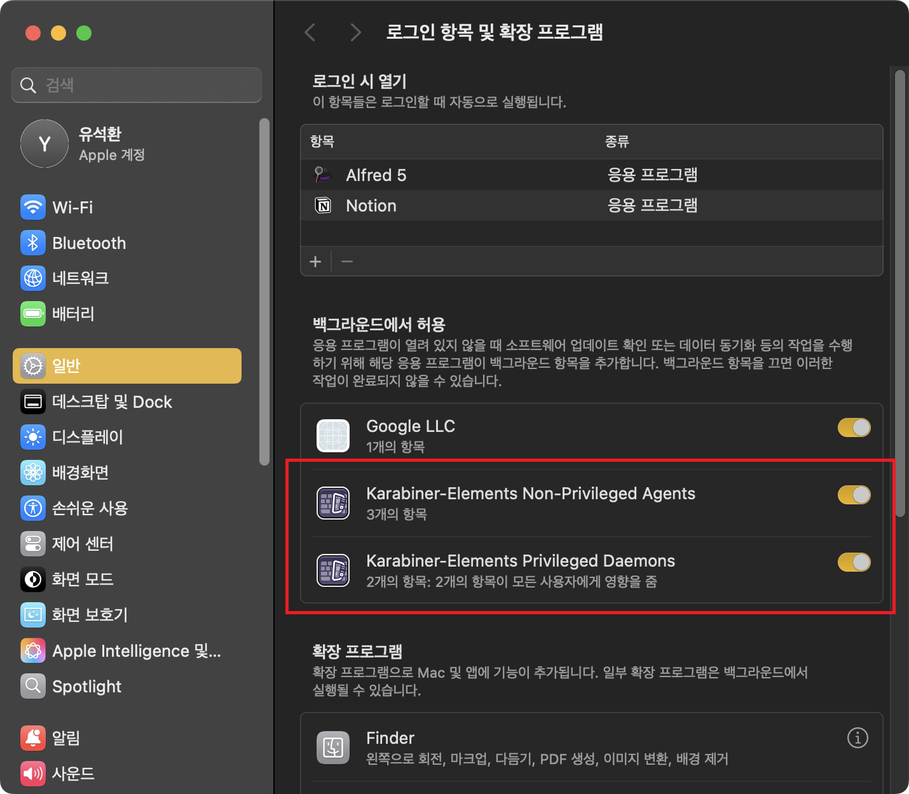
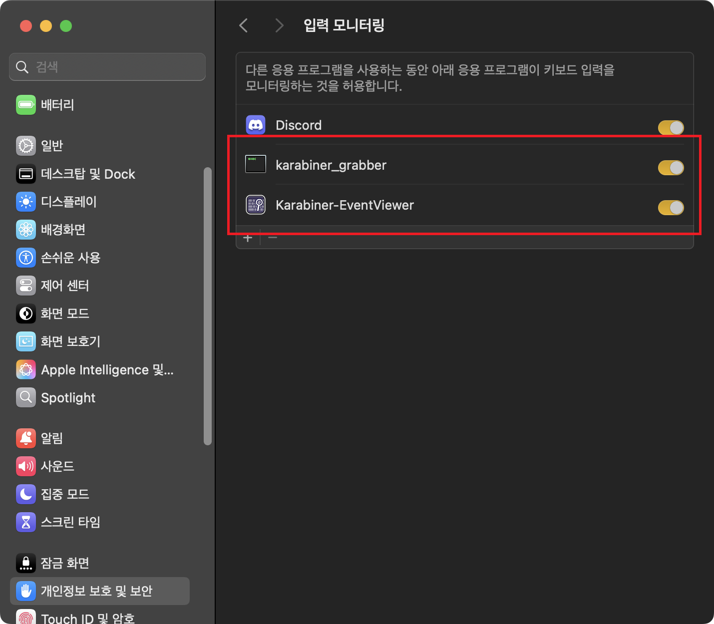
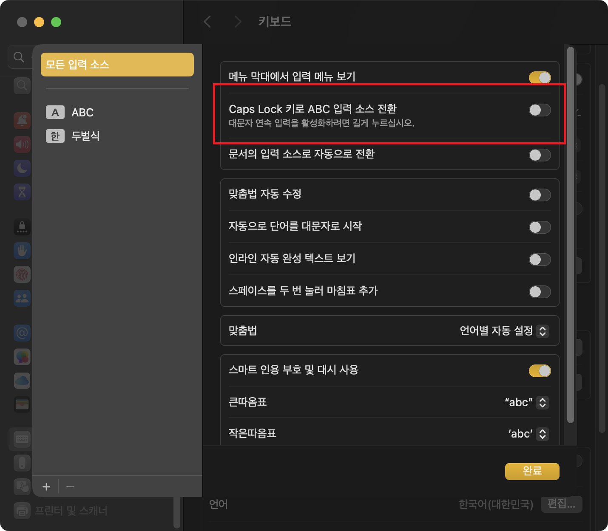

mac은 보조키(`cmd`, `opt` 등)에 대한 키 매핑을 기본적으로 지원한다. 
`시스템 설정` > `키보드` > `키보드 단축키...` > `보조 키`에서 확인할 수 있다.

그러나 좌우 보조키를 따로 설정하거나, 외장 키보드의 부가적인 키를 매핑하진 못한다. 
그래서 외부 프로그램인 Karabiner를 통해 매핑하는 방법을 소개한다.

## Karabiner 설치

Karabiner는 [공식 홈페이지](https://karabiner-elements.pqrs.org/)에서 설치할 수 있다.

설치를 완료하면 Karabiner-Elements와 Karabiner-EventViewer가 설치된다. 
Elements에서는 키를 매핑할 수 있고, EventViewer에서는 입력한 키가 무엇인지 확인할 수 있다.

키보드 입력을 제어하는 프로그램이기 때문에 백그라운드 실행, 입력 모니터링 등 퍼미션을 요구하면 허용해 준다.

## Karabiner-EventViewer

Karabiner-EventViewer에서는 입력한 키가 무엇인지 확인할 수 있다. 
이전에 매핑했던 경우 현재 어떻게 입력되고 있는지 확인하거나, 외장 키보드의 부가적인 키들이 macOS에서 어떻게 인식되고 있는지 확인하는 용도로 사용한다.

예를 들면 필자가 쓰는 외장 키보드의 'Super'라는 키는 Windows 11에서는 `context menu`로 쓰이고, macOS에서는 `Application`키로 쓰인다. 
또한 외장 키보드의 'Fn'키는 LED를 설정하거나 연결된 블루투스 기기를 바꾸는 조합키로 사용되는데, 이건 macOS에서는 아예 인식되지 않는 걸 확인할 수 있었다.

## Karabiner-Elements

Karabiner-Elements로는 키를 매핑할 수 있다. 
사용 방법은 직관적인데, 적용할 키보드를 선택하고 특정 키를 어떻게 인식되게 할 것인지 선택하면 끝이다.

예를 들어, 이 상태는 무선 외장 키보드의 왼쪽 `cmd`와 `opt`을 swap하는 세팅이다.

### 한영 전환 키 변경

리눅스 등의 환경에 익숙하여 `ctrl + space`로 한영 전환을 하는 사람들은 큰 문제가 없을 수 있으나,
`caps lock`으로 한영 전환을 하는 사용자의 경우 두 가지 문제가 있다.

- 기존 `caps lock` 기능(대문자 연속 입력)을 토글하려면 꾹 눌러야 한다.
- Windows를 같이 쓰는 사용자는 오른손 엄지(`한영키`)로 전환하는 게 익숙할 수 있다.

Karabiner-Elements를 사용하여 한영 전환 키를 변경할 수 있다. 
오른쪽 `cmd`를 비어 있는 기능키(`F13`, `F16`~`F18` 등)로 할당하고, 그 키로 입력 소스 전환을 하는 방식이다. 
`F14`, `F15` 등은 화면 밝기 조절이 할당돼 있을 수 있으니 유의한다.

먼저, 사용할 키가 `F16`이 입력되도록 설정한다. 
필자의 경우, 외장 키보드 기준으로 사용할 키가 오른쪽 `opt`이었는데, 어떤 키인지 모르겠으면 EventViewer를 통해 확인하면 된다.

`시스템 설정` > `키보드` > `키보드 단축키...` > `입력 소스`에서 '이전 입력 소스 선택'을 F16으로 변경한다. 
아마 정상적으로 할당이 됐다면, 그냥 해당 키를 누르면 `F16`이 입력될 것이다. 
완료 버튼을 누르면 한영 전환 키가 변경된다.

추가로 `키보드 단축키...` 밑에 있는 `편집...` 버튼을 눌러 'Caps Lock 키로 ABC 입력 소스 전환'을 체크 해제하면, 기존 `caps lock` 기능 그대로 사용할 수 있다.

---

### 참고

- https://karabiner-elements.pqrs.org/
