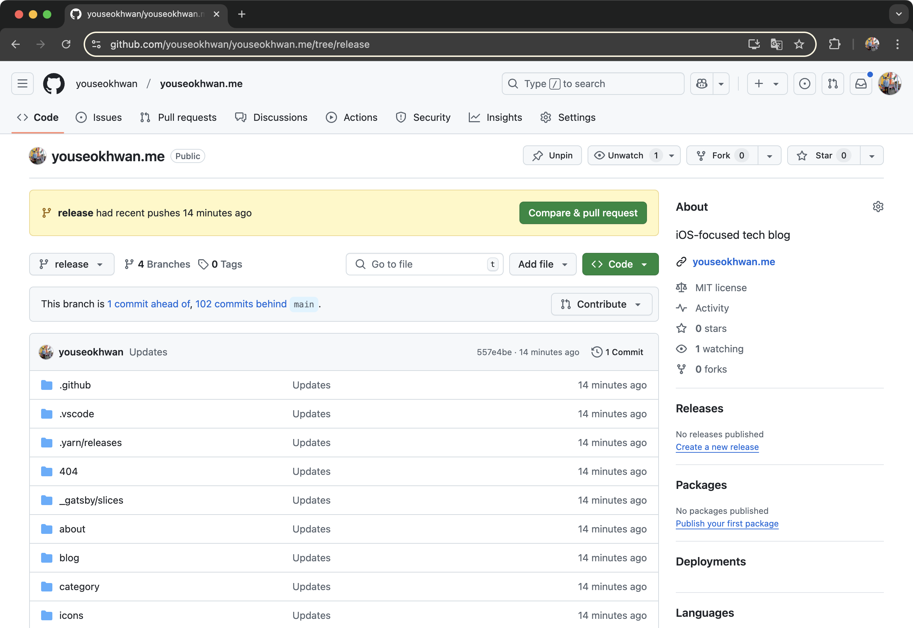
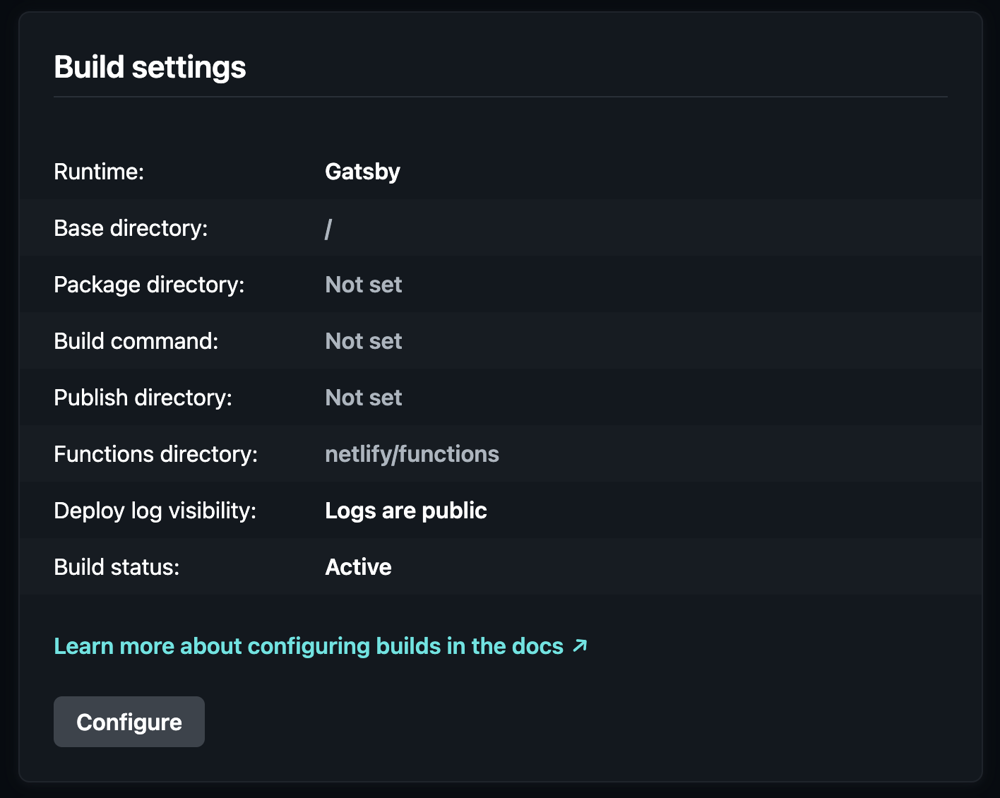
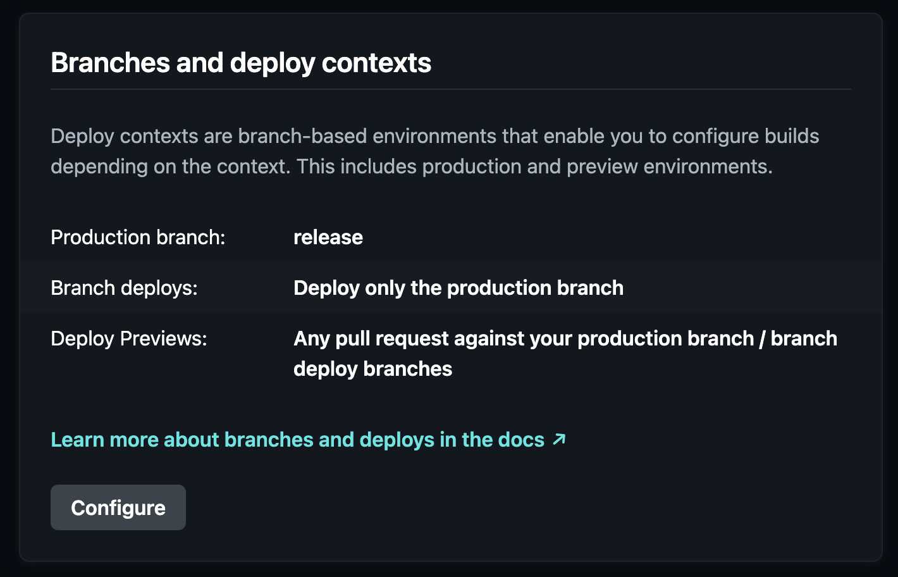

현재 이 블로그의 배포 프로세스는 다음과 같다.

1. 포스트를 작성 및 수정하거나, React 파일 변경(UI 업데이트 등) 후 push
2. Netlify에서 변경을 감지하면, 서버에서 gatsby build 명령어 실행
3. 서버에서 진행한 빌드의 결과물인 public 디렉토리를 호스팅

배포 프로세스에 문제는 없으나, 반영되는 속도가 아쉬웠다.
로컬에서 gatsby build를 실행하면 약 10초 정도 걸리는데, Netlify에선 2분 넘게 소요된다.
UI 업데이트같은 큰 변경은 간헐적으로 배포하니 괜찮지만,
오타 수정같은 경우는 commit마다 변경 사항이 적고, push 주기가 짧기때문에 꽤 답답했다.

시간 단축에 비하면 CPU 사용량이 부담되는 상황은 아니였기에 로컬 빌드 방식으로 변경해보았다.

---

## 배포 전용 branch 만들기

배포 전용으로 release라는 이름의 branch를 사용할 예정이다.
git subtree 등으로 직접 setup해도 좋지만, gh-pages 패키지를 사용하면 편하게 관리할 수 있다.
gh-pages는 GitHub Pages를 구성하는데 쓰이지만, 지금처럼 그냥 branch를 컨트롤 하기에도 아주 유용했다.

### gh-pages 패키지 설치

gh-pages 명령어를 사용하기 위해 패키지를 설치한다.

```bash
yarn install gh-pages
```

### release 브랜치로 public 디렉토리 push

빌드한 후, 생성된 public 디렉토리를 release branch로 push한다.
remote에 release branch가 없다면 자동으로 생성해준다.

```bash
gatsby build
gh-pages -d public -b release
```

public 디렉토리에 포함된 파일들만 release branch에 push된 것을 확인할 수 있다.



### Netlify 설정 변경

Netlify의 배포 설정을 변경해야 한다.
Site configuration > Build & deploy > Build settings를 다음과 같이 설정한다.



Build command와 Publish directory를 비워두고 Save하면 Not set 상태가 된다.
Netlify가 직접 빌드하지 않도록 Build command를 비워둔다.

또한, Site configuration > Build & deploy > Branches and deploy contexts에서 Production branch를 release로 설정한다.



이제 release branch가 변경되면 사이트에 반영한다.

---

## Git Hooks을 이용하여 자동화

배포테스트배포테스트배포테스트배포테스트
배포테스트배포테스트배포테스트배포테스트2
배포테스트배포테스트배포테스트배포테스트3

---

### 참고

- https://log4day.tistory.com/64
- https://bum0w0.tistory.com/16
