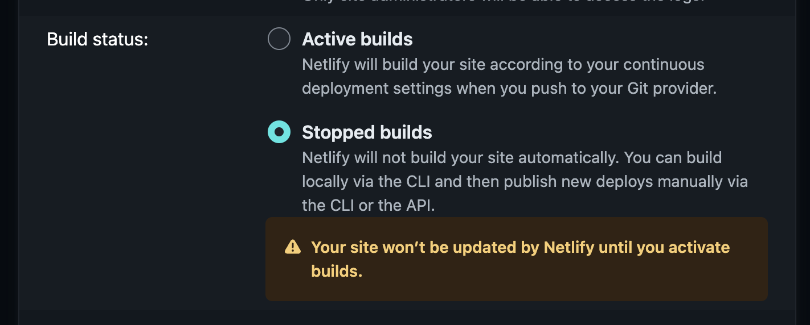
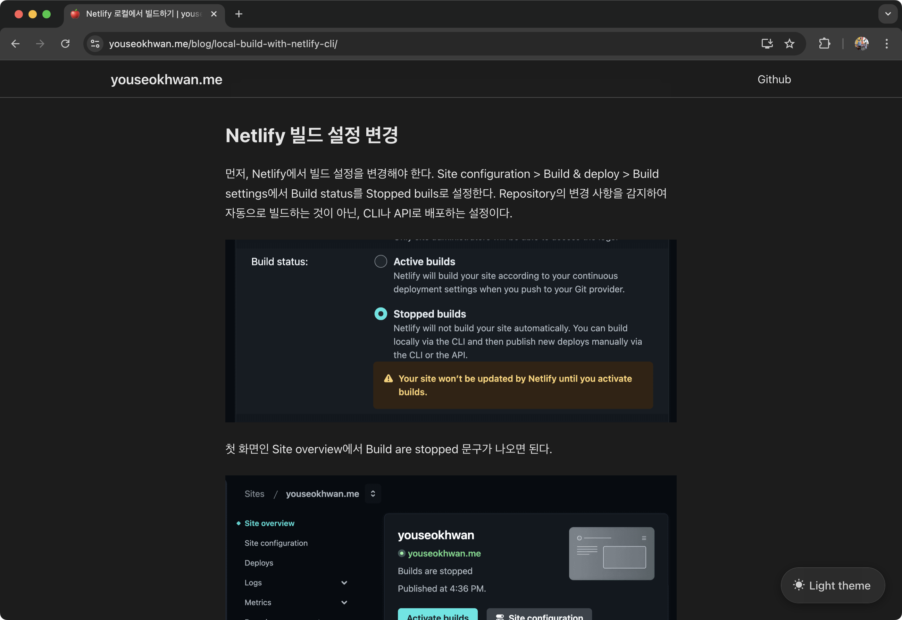
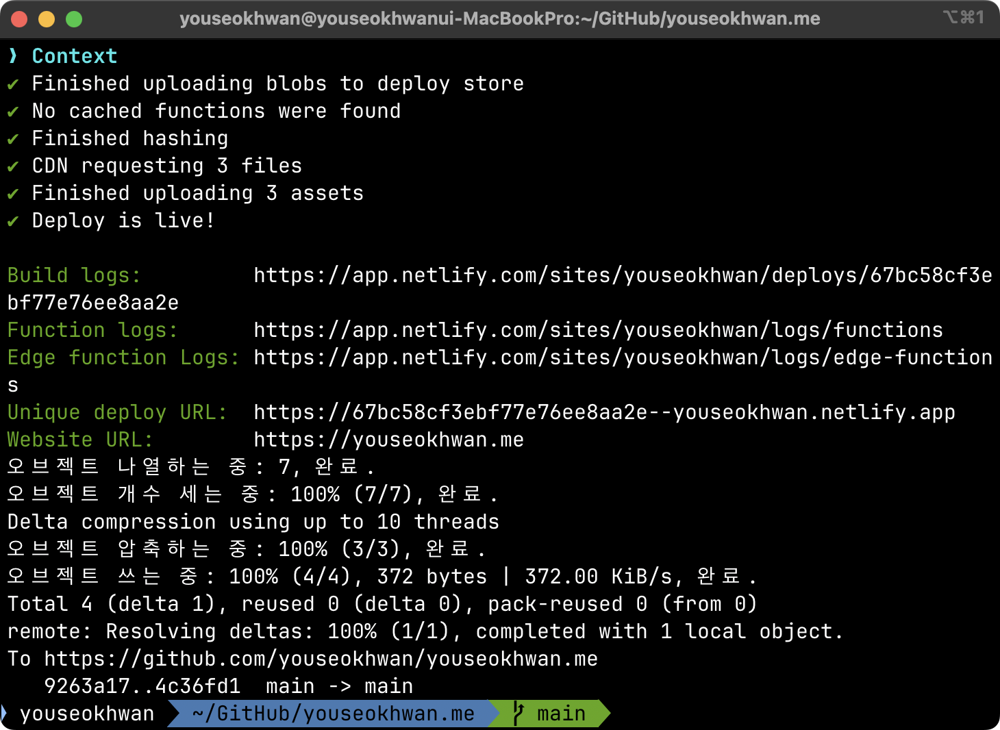
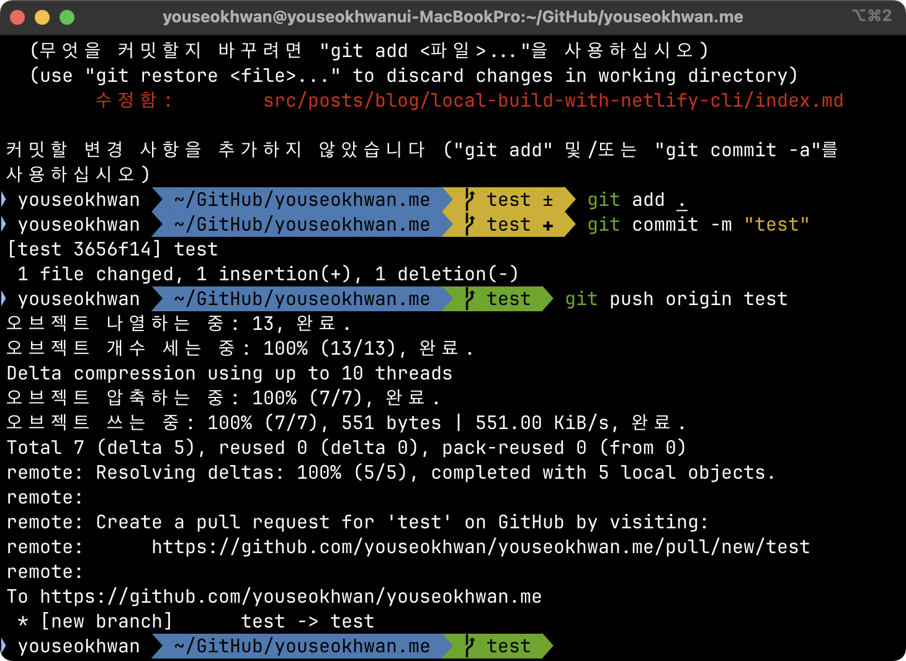

현재 Gatsby와 Netlify로 구축한 이 블로그의 배포 프로세스는 다음과 같다.

1. 포스트를 작성 및 수정하거나, React 파일 변경(UI 업데이트 등) 후 push
2. Netlify에서 변경을 감지하면, 서버에서 `gatsby build` 명령어 실행
3. 빌드 결과물인 `public` 디렉터리를 기준으로 서버에서 `netlify deploy` 명령어 실행
4. 최종 결과물 호스팅

배포 프로세스에 문제는 없으나, 변경 사항이 반영되는 속도가 아쉬웠다.<br>
UI 업데이트같은 큰 변경은 간헐적으로 배포하니 괜찮지만, 오타 수정같은 경우는 commit마다 변경 사항이 적고, push 주기가 짧기때문에 꽤 답답했다.

`gatsby build`와 `netlify deploy` 명령어를 서버에서 실행할 때는 2분 남짓한 시간이 걸리지만, 로컬에서 실행하면 15초만에 완료됐다.<br>
시간 단축에 비하면 CPU 사용량이 부담되는 상황은 아니였기에 로컬 빌드 방식으로 변경해보았다.

## Netlify 빌드 설정 변경

먼저, Netlify에서 빌드 설정을 변경해야 한다.<br>
`Site configuration` > `Build & deploy` > `Build settings`에서 `Build status`를 `Stopped builds`로 설정한다.<br>
Repository의 변경 사항을 감지하여 자동으로 빌드하는 것이 아닌, CLI 명령어나 API를 통해 수동으로 배포하는 설정이다.



첫 화면인 `Site overview`에서 `Build are stopped` 문구가 나오면 된다.


## netlify-cli 설정

### netlify-cli 패키지 설치

netlify 명령어를 CLI 환경에서 사용할 수 있도록 `netlify-cli` 패키지를 설치한다.

```bash
npm install -g netlify-cli
netlify --version
```

### 터미널에서 Netlify 로그인

```bash
netlify login
```

브라우저가 실행되고 `Netlify Authorize` 화면이 뜨면, `Authorize`를 눌러 로그인한다.


### Repository와 Netlify Site 연결

Repository의 루트 디렉터리로 이동한 후 `netlify init`을 입력한다.

```bash
cd ~/Github/youseokhwan.me # 개인 설정에 따라 다름
netlify init
```

이미 만들어진 Netlify Site에 연결해야 하므로 첫 번째 항목을 선택한다.


마찬가지로, 존재하는 GitHub Repository에 연결해야 하므로 첫 번째 항목을 선택한다.


`.netlify` 디렉터리가 생기면서 설정이 완료된다.<br>
만약 Netlify 연결을 해제하고 싶으면 `.netlify` 디렉터리를 지우면 된다.

### 로컬 빌드

이제 로컬에서 직접 빌드하여 사이트에 적용해보자.<br>
`gatsby build`는 정적 사이트를 생성하는 빌드 명령어이다.

```bash
gatsby build
```

`public` 디렉터리에서 결과물을 확인할 수 있다.


이 빌드 결과물을 `netlify-cli`를 통해 수동으로 배포할 수 있다.<br>
만약 `--prod` 옵션을 생략하면 중간 결과를 한번 확인하고 배포할 수 있다.

```bash
netlify deploy --dir=public --prod
```


빠른 속도로 잘 배포된 것을 확인할 수 있다.



## Git Hooks을 이용하여 자동화

배포할 때마다 위 명령어를 입력하는 것은 번거로우니, Git Hooks를 이용해 자동화해보자.

### Git Hooks란?

Git Hook은 Git과 관련된 이벤트가 발생했을 경우, 특정 shell script를 실행해주는 기능이다.<br>
지금은 `pre-push`라는 클라이언트 hook을 만들어, push할 때마다 배포가 자동으로 진행되도록 설정할 것이다.

### husky 패키지 설치

git hook은 기본적으로 `.git/hooks`에 저장되는데, `.git/`은 버전 관리 대상이 아니여서 remote에 올라가지 않는다.<br>
husky를 이용하면 버전 관리를 비롯해 hook들을 편하게 관리할 수 있다.

husky 패키지를 설치하고 활성화한다.<br>
`init` 명령어는 repository의 루트 디렉터리에서 실행해야 한다.

```bash
yarn add husky
yarn husky init
```

### pre-push 추가

push할 때 배포를 같이 진행하도록 `pre-push` 파일[^1]을 추가한다.<br>
repository의 루트 디렉터리에서 명령어를 실행한다.

```bash
echo "gatsby build && netlify deploy --dir=public --prod" > .husky/pre-push
```

`git push` 명령어를 입력할 경우, 배포가 먼저 진행된 후 push가 진행되는 것을 확인할 수 있다.



### main branch가 아니면 배포하지 않도록 설정

`pre-push`의 내용을 수정하고 싶은 경우, `.husky/pre-push`를 텍스트 편집기로 수정하면 된다.<br>
`main` branch가 아니라면 배포하지 않도록 다음과 같이 내용을 추가했다.

```
# .husky/pre-push 파일

#!/bin/sh
BRANCH_NAME=$(git rev-parse --abbrev-ref @{upstream} 2>/dev/null | awk -F'/' '{print $2}')

if [ "$BRANCH_NAME" = "main" ]; then
  sh -c 'gatsby build && netlify deploy --dir=public --prod'
fi
```

* `#!/bin/sh`: 넣지 않아도 문제는 없었으나, 안정적인 실행을 보장하기 위하여 인터프리터 지정
* `git rev-parse ~` 구문: 현재 작업중인 branch의 이름을 가져옴

`test` branch에서 push는 정상적으로 진행하지만, 배포는 진행되지 않는 것을 확인할 수 있다.



---

### 참고

- https://git-scm.com/book/ko/v2/Git%EB%A7%9E%EC%B6%A4-Git-Hooks
- https://typicode.github.io/husky/
- https://velog.io/@rookieand/Git-Hook%EC%9D%80-%EB%AC%B4%EC%97%87%EC%9D%B4%EA%B3%A0-Husky%EB%8A%94-%EC%99%9C-%EC%93%B0%EB%8A%94%EA%B1%B8%EA%B9%8C

[^1]: 확장자가 없는 파일이다.