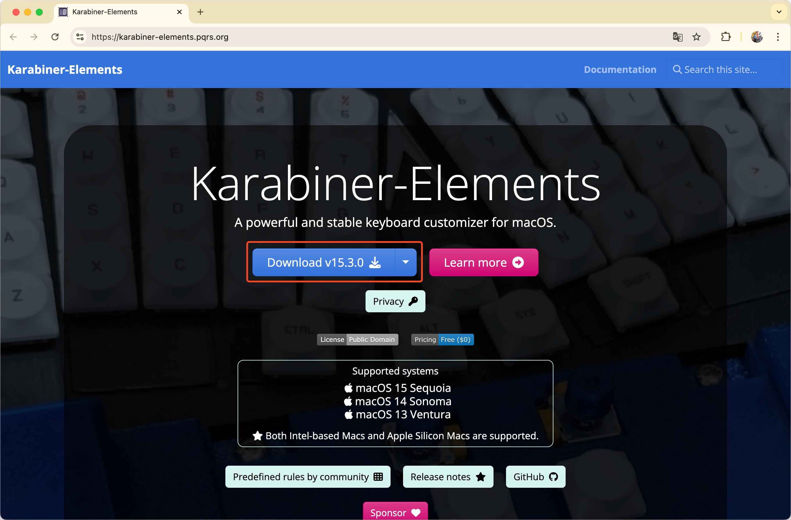
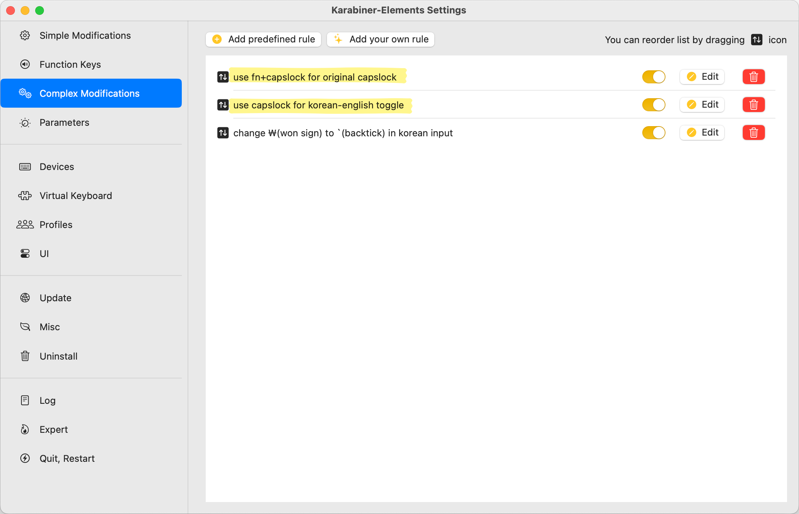

macOS에서 한영 전환[^1]을 할 때, key up 시점을 기준으로 전환된다.<br>
한영 전환을 `caps lock` 키로 하고있다면, `caps lock`을 누르는 순간이 아닌, 떼는 순간에 입력 소스가 바뀐다.

key up 시점으로 정해진 이유가 있겠지만, 반응 속도가 느리고 씹힘 현상이 자주 발생한다.
완벽하진 않지만 Karabiner를 통해 key down 시점으로 바꾸어 사용감을 조금이나마 개선해보자.

## Karabiner 설치

Karabiner-Elements는 macOS에서 키보드 입력을 커스터마이징해주는 앱이다.<br>
[공식 홈페이지](https://karabiner-elements.pqrs.org/)에서 다운받을 수 있다.



## 키보드 입력 커스터마이징

Karabiner-Elements를 실행하고, `Complex Modifications` 탭의 `Add your own rule`을 클릭한다.


아래와 같이 json 예시가 제공된다.


해당 예시를 모두 지우고 원하는 json을 입력한 뒤, `save`를 누르면 적용된다.

### 1. 오른쪽 Command의 key down 시점에 한영 전환

```json
{
    "description": "use right command for korean-english toggle",
    "manipulators": [
        {
            "conditions": [
                {
                    "input_sources": [{ "input_source_id": "^com\\.apple\\.keylayout\\.ABC$" }],
                    "type": "input_source_if"
                }
            ],
            "from": {
                "key_code": "right_command",
                "modifiers": { "optional": ["any"] }
            },
            "to": [{ "select_input_source": { "input_source_id": "^com\\.apple\\.inputmethod\\.Korean\\.2SetKorean$" } }],
            "type": "basic"
        },
        {
            "conditions": [
                {
                    "input_sources": [{ "input_source_id": "^com\\.apple\\.inputmethod\\.Korean\\.2SetKorean$" }],
                    "type": "input_source_if"
                }
            ],
            "from": {
                "key_code": "right_command",
                "modifiers": { "optional": ["any"] }
            },
            "to": [{ "select_input_source": { "input_source_id": "^com\\.apple\\.keylayout\\.ABC$" } }],
            "type": "basic"
        }
    ]
}
```

### 2. Caps Lock의 key down 시점에 한영 전환

```json
{
    "description": "use capslock for korean-english toggle",
    "manipulators": [
        {
            "conditions": [
                {
                    "input_sources": [{ "input_source_id": "^com\\.apple\\.keylayout\\.ABC$" }],
                    "type": "input_source_if"
                }
            ],
            "from": {
                "key_code": "caps_lock",
                "modifiers": { "optional": ["any"] }
            },
            "to": [{ "select_input_source": { "input_source_id": "^com\\.apple\\.inputmethod\\.Korean\\.2SetKorean$" } }],
            "type": "basic"
        },
        {
            "conditions": [
                {
                    "input_sources": [{ "input_source_id": "^com\\.apple\\.inputmethod\\.Korean\\.2SetKorean$" }],
                    "type": "input_source_if"
                }
            ],
            "from": {
                "key_code": "caps_lock",
                "modifiers": { "optional": ["any"] }
            },
            "to": [{ "select_input_source": { "input_source_id": "^com\\.apple\\.keylayout\\.ABC$" } }],
            "type": "basic"
        }
    ]
}
```

### 2-1. Fn + Caps Lock을 기존 Caps Lock으로 설정

위의 `caps lock` json을 활성화할 경우, 기존 `caps lock` 기능[^2]은 더이상 작동하지 않는다.<br>
필자의 경우 `caps lock` 기능을 안써서 상관없었지만, 혹시나 필요한 경우를 대비해 `fn + caps lock`에 기존 `caps lock` 기능을 매핑했다.

```json
{
    "description": "use fn+capslock for original capslock",
    "manipulators": [
        {
            "from": {
                "key_code": "caps_lock",
                "modifiers": { "mandatory": ["fn"] }
            },
            "to": [{ "key_code": "caps_lock" }],
            "type": "basic"
        }
    ]
}
```



## 이슈

macOS를 재로그인하거나 재시동하면 적용된 매핑 설정이 풀릴 수 있다.<br>
Karabiner-Elements를 실행해 추가한 rule들을 껐다 켜주면 다시 정상적으로 동작한다.

---

### 참고

- https://karabiner-elements.pqrs.org/
- https://ke-complex-modifications.pqrs.org/

[^1]: 공식적으로는 '입력 소스 전환'
[^2]: 영어 대문자 연속입력 기능
