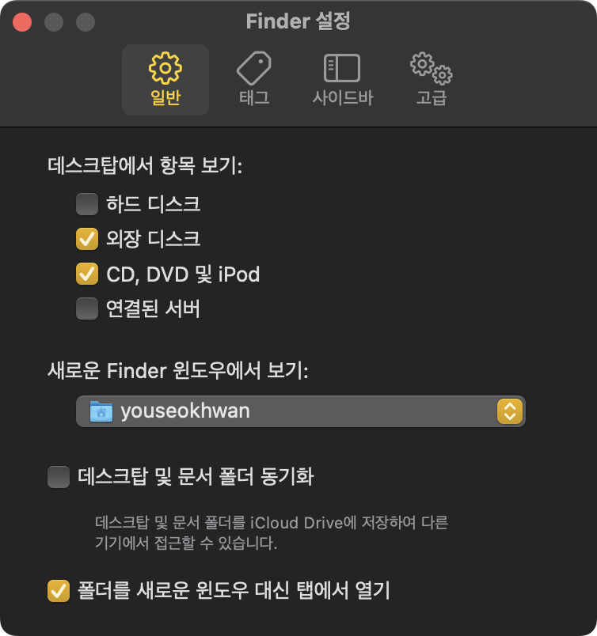
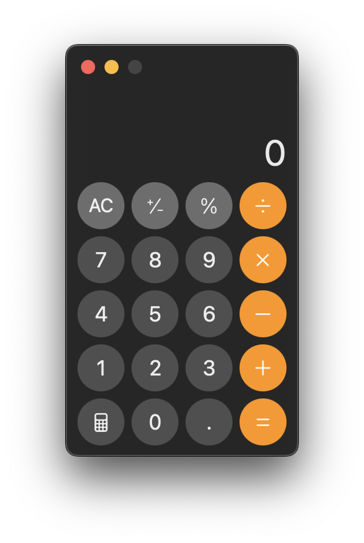
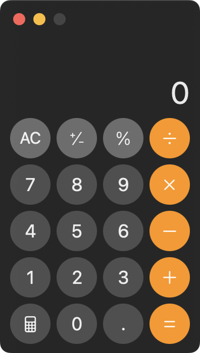

이번에 M4 맥북프로를 새로 구입하면서 사용 및 개발 환경을 셋업했다.<br>
이전에 쓰던 맥북을 세팅할 때 마음에 들었던 앱이나 설정 등이 있었는데, 따로 기록해놓지 않아서 기억해내느라 애를 먹었다.<br>
그래서 이번에는 개인 저장용으로 어떤 셋업을 했는지 기록해보았다.

## 패키지 설치

다른 중요한 패키지들이 많지만, 가장 먼저 설치해야된다고 생각하는 2개의 패키지이다.

### homebrew

`homebrew`는 macOS의 패키지 관리자로, 다양한 패키지를 쉽게 설치하고 관리할 수 있다.<br>
터미널을 열고 다음 명령어를 실행하면 된다.

```bash
/bin/bash -c "$(curl -fsSL https://raw.githubusercontent.com/Homebrew/install/HEAD/install.sh)"
```

### git

`git`은 개발에 꼭 필요한 버전 관리 시스템이다.<br>
앞서 설치한 `homebrew`로 편하게 설치할 수 있다.

```bash
brew install git
```

## macOS 시스템 설정

### Finder 첫 화면 설정

Finder를 열면 `최근 항목`이 첫 화면으로 나오는데, 개인적으로 잘 안쓰는 디렉토리다.<br>
설정(`cmd + ,`)에서 `새로운 Finder 윈도우에서 보기` 항목을 자주 사용하는 `~`(home directory)로 설정했다.



### 스크린샷 그림자 없애기

`cmd + shift + 4` 혹은 `cmd + control + shift + 4`로 선택 영역 캡처를 할 수 있는데,<br>
이 상태에서 `space`를 누르면 창 캡처를 편하게 할 수 있다.

이때 디폴트로 그림자가 포함되어 캡처가 된다.



보기에는 좋으나, 공간 활용에 아쉬움이 있어 그림자를 끄는 설정을 선호한다.<br>
마찬가지로 터미널에 입력한다. 다시 키려면 `false`로 설정한다.

```bash
defaults write com.apple.screencapture disable-shadow -bool true
```



## 응용 프로그램 설치


---

### 참고

* 