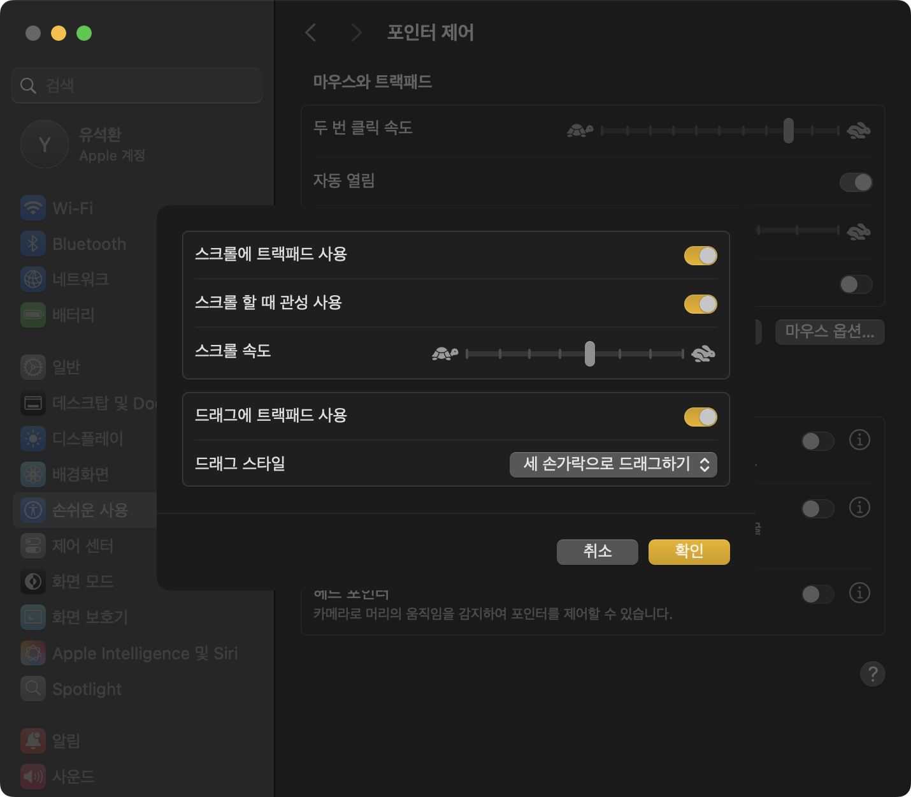
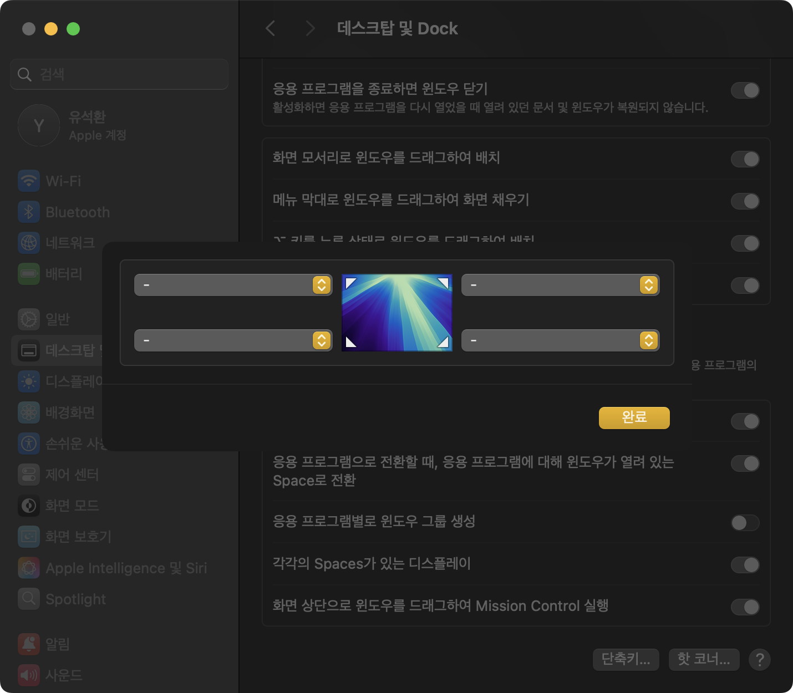
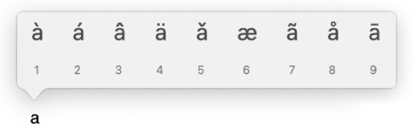
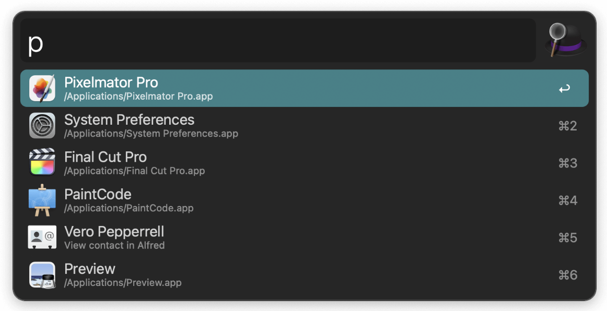
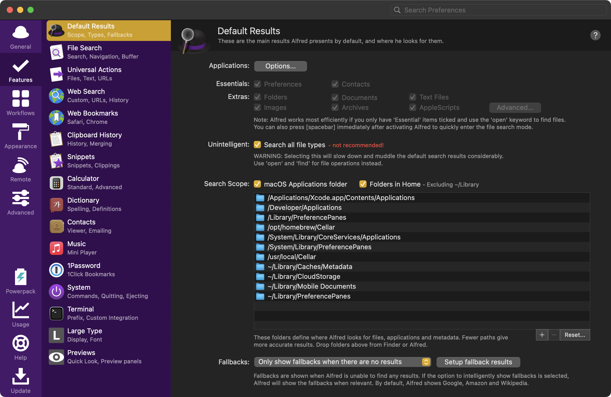

이번에 M4 맥북프로를 새로 구입하면서 사용 및 개발 환경을 셋업했다.<br>
이전에 쓰던 맥북을 세팅할 때 마음에 들었던 앱이나 설정 등이 있었는데, 따로 기록해놓지 않아서 기억해내느라 애를 먹었다.<br>
그래서 이번에는 개인 저장용으로 어떤 셋업을 했는지 기록해보았다.

---

## 패키지 설치

다른 중요한 패키지들이 많지만, 가장 먼저 설치해야된다고 생각하는 2개의 패키지이다.

### homebrew

`homebrew`는 macOS의 패키지 관리자로, 다양한 패키지를 쉽게 설치하고 관리할 수 있다.<br>
터미널에 다음 명령어를 입력하면 된다.

```bash
/bin/bash -c "$(curl -fsSL https://raw.githubusercontent.com/Homebrew/install/HEAD/install.sh)"
```

### git

`git`은 개발에 꼭 필요한 버전 관리 시스템이다.<br>
앞서 설치한 `homebrew`로 편하게 설치할 수 있다.

```bash
brew install git
```

---

## macOS 시스템 설정

### Finder 첫 화면 설정

Finder를 열면 `최근 항목`이 첫 화면으로 나오는데, 개인적으로 잘 안쓰는 디렉토리다.<br>
설정(`cmd + ,`)에서 `새로운 Finder 윈도우에서 보기` 항목을 자주 사용하는 `~`(home directory)로 설정했다.


### 스크린샷 그림자 없애기

`cmd + shift + 4` 혹은 `cmd + ctrl + shift + 4`로 선택 영역 캡쳐를 할 수 있는데,<br>
이 상태에서 `space`를 누르면 창 캡쳐를 편하게 할 수 있다.

이때 디폴트로 그림자가 포함되어 캡쳐가 된다.


보기에는 좋으나, 공간 활용에 아쉬움이 있어 그림자를 끄는 설정을 선호한다.<br>
터미널에 다음 명령어를 입력한다. 다시 키려면 `false`로 설정한다.

```bash
defaults write com.apple.screencapture disable-shadow -bool true
```


### 세 손가락 드래그

`시스템 설정` > `손쉬운 사용` > `포인터 제어` > `트랙패드 옵션...` > `드래그 스타일`을 `세 손가락으로 드래그하기`로 설정한다.<br>
드래그할 때 피로도를 상당히 줄여주기 때문에 꼭 추천하는 설정이다.



주의할 점은, 기존에 세 손가락으로 제스처하는 기능들은 네 손가락으로 해야한다.<br>
적응하는 데 큰 불편함은 없었다. (Mission Control, Launchpad, 데스크톱 전환 등)

### 빠른 메모 기능 해제

우하단으로 마우스를 가져가면 빠른 메모 기능을 쓸 수 있지만,<br>
원치 않게 실행되는 경우가 많아서 `시스템 설정` > `데스크탑 및 Dock` > `핫 코너...`에서 `빠른 메모`를 `-`로 바꾸어 해제했다.



### Diacritics 선택 팝업 비활성화

다이어크리틱은 알파벳 위에 있는 악센트(예시: à, á, â) 기호이다.<br>
[Mac 사용 설명서](https://support.apple.com/ko-kr/guide/mac-help/mh27474/mac)에 이에 대한 내용이 있다.<br>



영어 자판을 길게 누르면 다이어크리틱을 선택할 수 있는 팝업이 나오는데,<br>
이 팝업을 사용할 일이 별로 없기 때문에, 기존처럼 연속 입력이 되도록 변경했다.<br>
터미널에 다음 명령을 입력한다. 다시 키려면 `true`로 설정한다.<br>
(한번 로그아웃해야 적용된다.)

```bash
defaults write -g ApplePressAndHoldEnabled -bool false
```

---

## 응용 프로그램 추천

### Alfred 5



Alfred 5는 macOS에서 사용할 수 있는 강력한 생산성 도구인데,<br>
스포트라이트보다 훨씬 더 기능이 많고, 속도가 더 빠른 상위호환 도구라고 이해하면 편하다.

Alfred 5를 사용하면 스포트라이트가 거의 필요없기 때문에 스포트라이트 단축키를 `opt + cmd + space`로, Alfred 5 단축키를 `cmd + space`로 변경했다.

`Features` > `Default Results`에서 `Search all file types`를 체크하면 모든 파일에 대한 결과를 보여주기 때문에 검색이 매우 편해진다.<br>
성능 저하에 대한 경고 문구가 있지만, 인텔 맥을 사용할 때에도 버벅거림을 느껴본 적은 거의 없어서 그냥 사용하고 있다.



이 외에도 웹이나 사전 검색을 커스텀할 수 있고, 유료 기능을 이용하면 workflows 자동화, 클립보드 관리 등 강력한 기능을 이용할 수 있다.

### BTT

(작성중)

### Karabainer

### iTerm2

### RapidAPI

---

### 참고

* https://brew.sh/
* https://git-scm.com/
* https://discussions.apple.com/thread/253709417
* https://support.apple.com/ko-kr/guide/mac-help/mh27474/mac
* https://www.alfredapp.com/