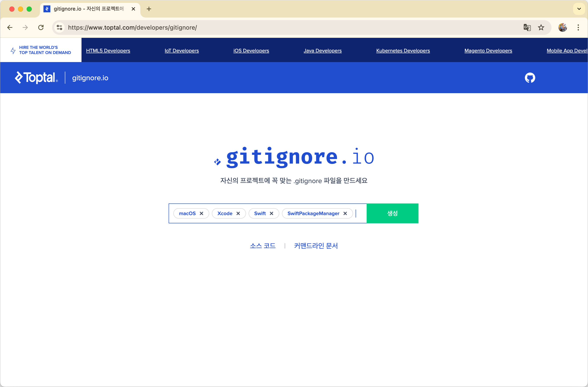
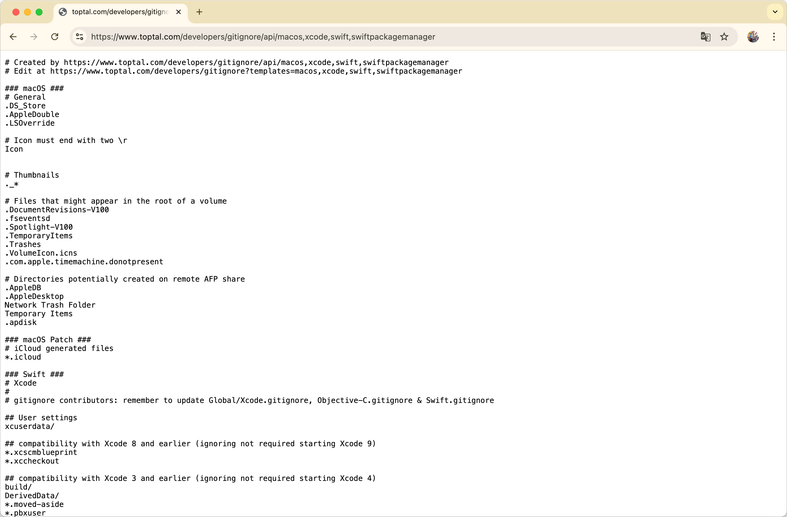
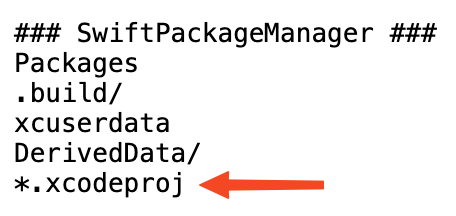
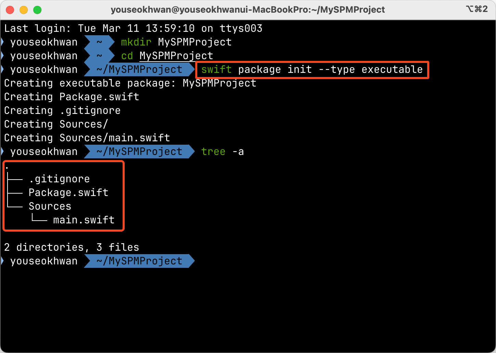
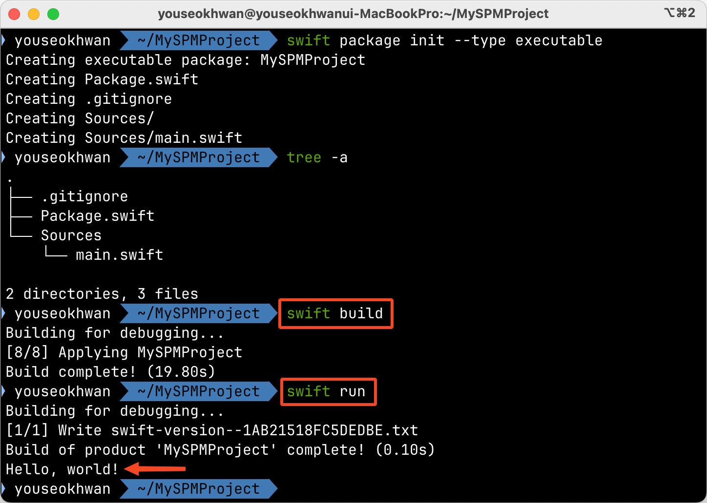
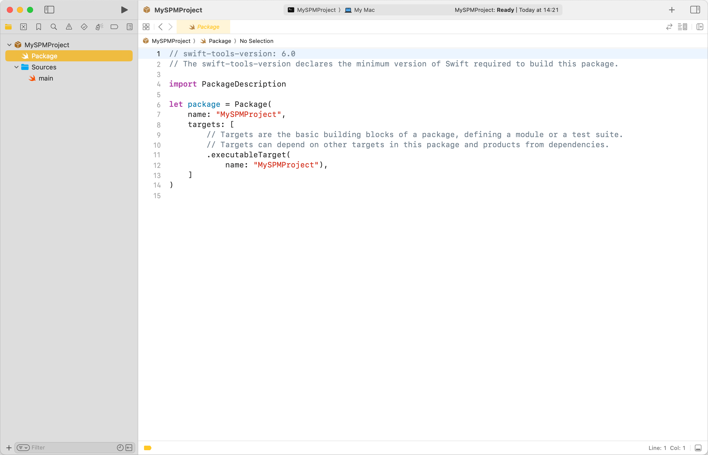
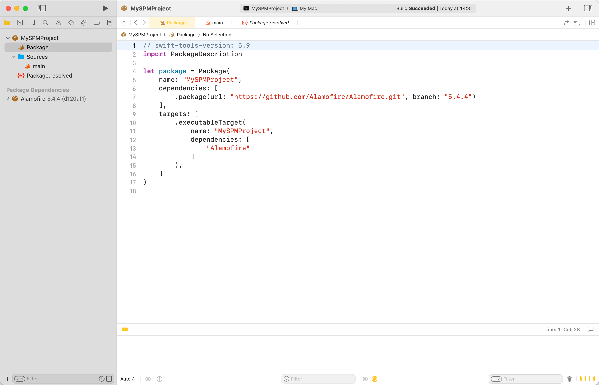
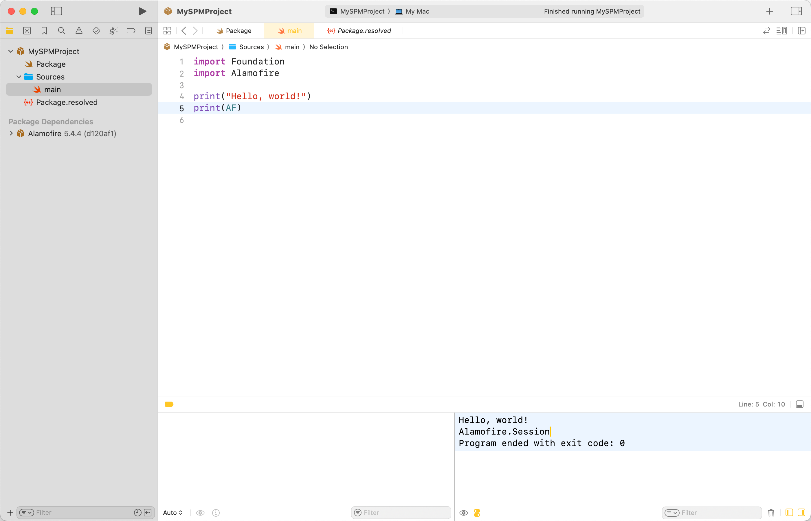

새로운 Repository의 `.gitignore` 파일을 설정하면서 궁금증이 생겼고, SPM에 대해 새로 알게 된 사실에 대해 정리해 보았다.

## .gitignore란?

`.gitignore`는 git이 추적하지 않을 파일 및 디렉터리 목록을 정의하는 파일이다.<br>
예를 들어, 다음 `.gitignore` 설정은 `dummyDirectory/`와 `log` 확장자를 가진 파일을 추적하지 않는다.

```
dummyDirectory/
*.log
```

## gitignore.io

[gitignore.io](https://gitignore.io)는 키워드를 입력하면 그에 맞는 `.gitignore` 파일을 만들어주는 서비스다.<br>
주로 OS, IDE, Language, Framework에 대한 키워드를 입력한다.

이번 프로젝트에서는 `macOS`, `Xcode`, `Swift`, `SwiftPackageManager`를 키워드로 넣었다.





## Issue 발생

여기서 `SwiftPackageManager` 키워드로 인해 내가 의도하지 않은 파일이 ignore되는 이슈가 생겼다.

SPM을 단순히 CocoaPods와 같은 기능[^1]을 제공하는 first party로 생각했다.<br>
CocoaPods의 `Pods/`, npm의 `node_modules/`를 remote에 올리지 않는 것과 비슷한 맥락으로 `SwiftPackageManager` 키워드를 추가했다.

문제는 `SwiftPackageManager`의 ignore 목록에 `.xcodeproj`가 있다는 것이다.



`xcodeproj` 파일은 프로젝트의 핵심 파일로, 프로젝트 구성이나 빌드 설정, 의존성 등의 정보가 담겨있다.<br>
물론 그 내부에 있는 `xcuserdata/` 같은 내용은 제외하면 좋지만, 분명 제공된 템플릿에서는 `xcodeproj` 패키지 파일 전체를 ignore하고 있었다.

`xcodeproj`를 remote에 같이 올리지 않으면 clone했을 때 프로젝트로 열어볼 수 없다.<br>
또한, 프로젝트의 설정이 다를 수 있어, 사이드 이펙트가 생길 가능성이 커진다.

혹시 [gitignore.io](https://gitignore.io) 서비스의 SPM 템플릿이 잘못된 것일까?<br>
아니면 Swift의 버전, Deployment Target 등의 정보를 remote에서 관리하지 않아도 되는 걸까?

## SPM은 모듈화 기능도 지원한다.

두 질문에 대해 학습하였고, 결론은 둘 다 No이다.

SPM은 패키지 관리와 더불어 모듈화 기능도 지원한다.<br>
`swift package init` 명령어로 프로젝트를 생성하면 `xcodeproj` 파일이 아닌 `Package.swift`로 프로젝트를 관리한다.<br>
`Package.swift` 파일에는 프로젝트 구성, 빌드 설정, 의존성 등의 내용을 담고 있다.

즉, SPM으로 프로젝트를 구성하면 `xcodeproj` 파일을 사용하지 않기 때문에 ignore하는 것이고, 필요한 내용은 `Package.swift`에 담아 remote에서 공유한다.<br>
아마도 [gitignore.io](https://gitignore.io)가 제공하는 템플릿은 모듈화 기능을 사용한다는 전제로 작성된 것 같다.

## xcodeproj는 remote에서 관리하지 않는 게 좋다?

> 레퍼런스로 삼을만한 명확한 문서를 찾지 못해서 주변의 조언과 약간의 추측으로 작성한 문단입니다.

`xcodeproj` 파일을 remote에서 관리하면 다음과 같은 단점이 있다.

* `xcodeproj`, `pbxproj` 파일은 xml이어서 conflict가 잦다.
* 자동 생성되는 파일이어서 불필요한 변경[^2]이 많다.
* 보안상 문제가 되는 내용(API Key, Developer Team ID 등)이 포함될 수 있다.

SPM이나 Tuist를 이용하여 이러한 단점들을 상쇄하고[^3] remote를 깔끔하게 유지할 수 있다.<br>
`Package.swift`는 말 그대로 Swift 코드기 때문에 문법이 더 친숙하다는 장점도 있다.

## SPM Init 간단한 실습

SPM을 통해 `xcodeproj`가 없는 간단한 macOS CLI 프로젝트를 만들어보자.<br>
적당한 디렉터리에서 명령어를 실행한다.

```bash
cd ~/MySPMProject # 디렉터리 이름이 프로젝트 이름이 된다.
swift package init --type executable
```

파일 구조가 매우 간결한 프로젝트가 생성된다.



`swift build`, `swift run` 등의 명령어로 바로 실행할 수 있다.



Xcode로 프로젝트를 열고 싶다면, `Package.swift`를 더블 클릭하여 실행하면 된다.<br>
(혹은 터미널에서 `open Package.swift` 명령어 실행)



프로젝트에 Swift 버전을 5.9로 설정하고, 시험 삼아 Alamofire 패키지 의존성을 추가해 보자.<br>
`Package.swift` 파일을 다음과 같이 수정한다.<br>
저장(`⌘ + S`)하면 바로 적용된다.





## Readme.md Usage를 작성하자

`xcodeproj` 파일이 없으므로, `Readme.md`에 Usage 항목을 명시해 주자.

```markdown
## Usage(마크다운 작성 예시)

git clone https://github.com/youseokhwan/spm-practice.git
cd spm-practice
open Package.swift # 혹은 swift run
```

---

### 참고

- https://kotlinworld.com/269
- https://gitignore.io
- https://asong-study-record.tistory.com/200
- https://www.swift.org/documentation/package-manager/
- https://sohyeonkim-dev.tistory.com/137

[^1]: SnapKit, Alamofire 추가, 삭제 등 단순한 패키지 관리 기능만 생각했다
[^2]: 굳이 remote에 올리지 않아도 되는 변경
[^3]: xcconfig, fastlane 등의 채택은 xcodeproj여도 가능하다