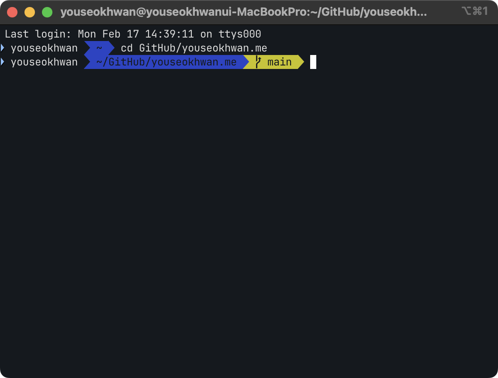
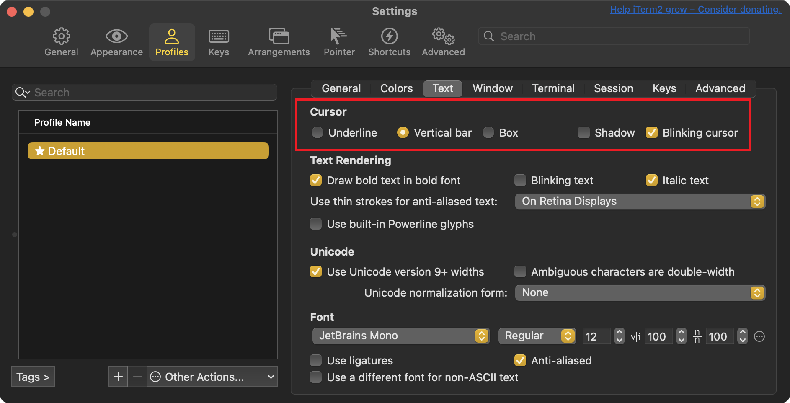

mac에서 터미널을 사용할 때, 내장 터미널보다는 iTerm2를 주로 사용한다.<br>
이 iTerm2 세팅 과정을 기록해보았다.

---

## iTerm2

iTerm2는 macOS의 무료 오픈소스 터미널 앱이다.<br>
기존 터미널(Terminal.app)에 비해 화면 분할, 검색, 자동 완성 등 다양한 기능을 제공한다.

[공식 홈페이지](https://iterm2.com/index.html)에서 다운받을 수 있다.


---

## oh-my-zsh

oh-my-zsh는 zsh의 설정을 도와주는 오픈소스 프레임워크다.
테마를 변경하거나 확장 기능을 쉽게 적용할 수 있다.

[공식 홈페이지](https://ohmyz.sh/)에 적혀있는 대로 curl로 설치했다.

```bash
sh -c "$(curl -fsSL https://raw.githubusercontent.com/ohmyzsh/ohmyzsh/master/tools/install.sh)"
```


---

## 터미널 꾸미기

테마는 개인 취향이므로 다양한 글을 참고하여 원하는 테마를 설정하면 된다.

홈 디렉토리(`~`)에 `.zshrc` 파일을 수정하여 zsh 설정을 변경할 수 있다.<br>
zshrc(zsh run commands)는 zsh가 실행될 때 자동으로 실행되는 파일이다.<br>
테마 외에도 alias, PATH 설정 등에도 사용된다.

### 테마 설정

oh-my-zsh Repository의 [wiki 문서](https://github.com/ohmyzsh/ohmyzsh/wiki/Themes)에서 테마 목록을 확인할 수 있다.<br>
현재는 [robbyrussell](https://github.com/ohmyzsh/ohmyzsh/wiki/Themes#robbyrussell)이라는 기본 테마가 적용된 상태이다.


테마를 바꾸고싶다면 `.zshrc`의 `ZSH_THEME` 항목을 원하는 테마 이름으로 변경해준다.<br>
vi나 nano로 바꿔도되고, vscode같은 텍스트 에디터로 변경해도 된다.<br>
변경한 후에 iTerm2를 재실행하거나, `.zshrc`를 직접 실행하면 적용된다.

현재 브랜치를 강조해주는 [agnoster](https://github.com/ohmyzsh/ohmyzsh/wiki/Themes#agnoster) 테마로 설정했다.

```
ZSH_THEME="agnoster"
```


### 폰트 변경

기본 폰트로는 깨져 보이기 때문에 [JetBrains Mono](https://www.jetbrains.com/lp/mono/) 폰트로 변경해주었다.<br>
폰트는 `cmd + ,` > `Profiles` > `Text` > `Font`에서 변경할 수 있다.


### 프롬프트 변경

`{$사용자 이름}@{$호스트 이름}`은 너무 길어서 사용자 이름만 표시하도록 수정했다.<br>
`.zshrc`에 다음 내용을 추가한다.

```
prompt_context() {
  prompt_segment black default "$USER"
}
```



### 색상 프리셋 변경

현재 색상은 채도가 높아서, Color Preset을 Tango Dark로 바꿔주었다.<br>
`cmd + ,` > `Profiles` > `Colors` > `Color Presets`에서 변경할 수 있다.


### 커서 변경

커서 모양도 box 형태보다 vertical bar 형태가 편해서 변경했다.<br>
`cmd + ,` > `Profiles` > `Text` > `Cursor`에서 변경할 수 있다.<br>
Blinking cursor 옵션도 체크했다.




---

## 플러그인

### zsh-syntax-highlighting

zsh-syntax-highlighting을 적용하면 실행 가능한 명령어는 초록색, 불가능한 명령어는 빨간색으로 표시해준다.<br>
homebrew를 통해 간편하게 설치할 수 있다.

```bash
brew install zsh-syntax-highlighting
```

사용하는 프로세서에 맞게 `.zshrc`에 다음 구문을 추가한다.

```
# Apple Silicon (M1 이후)
source /opt/homebrew/share/zsh-syntax-highlighting/zsh-syntax-highlighting.zsh

# Intel
source /usr/local/share/zsh-syntax-highlighting/zsh-syntax-highlighting.zsh
```


### zsh-autosuggestions

zsh-autosuggestions을 적용하면 입력했던 명령어을 기반으로 자동 완성을 제안해준다.<br>
역시 homebrew를 통해 간편하게 설치할 수 있다.

```bash
brew install zsh-autosuggestions
```

사용하는 프로세서에 맞게 `.zshrc`에 다음 구문을 추가한다.

```
# Apple Silicon (M1 이후)
source /opt/homebrew/share/zsh-autosuggestions/zsh-autosuggestions.zsh

# Intel
source /usr/local/share/zsh-autosuggestions/zsh-autosuggestions.zsh
```


---

### 참고

- https://iterm2.com/
- https://ohmyz.sh/
- https://github.com/ohmyzsh/ohmyzsh/wiki/Themes
- https://www.jetbrains.com/lp/mono/
- https://kdohyeon.tistory.com/122
- https://velog.io/@yejin25/iTerm-%EC%BB%A4%EC%8A%A4%ED%84%B0%EB%A7%88%EC%9D%B4%EC%A6%88-%ED%95%98%EA%B8%B0
- https://salmonpack.tistory.com/52
