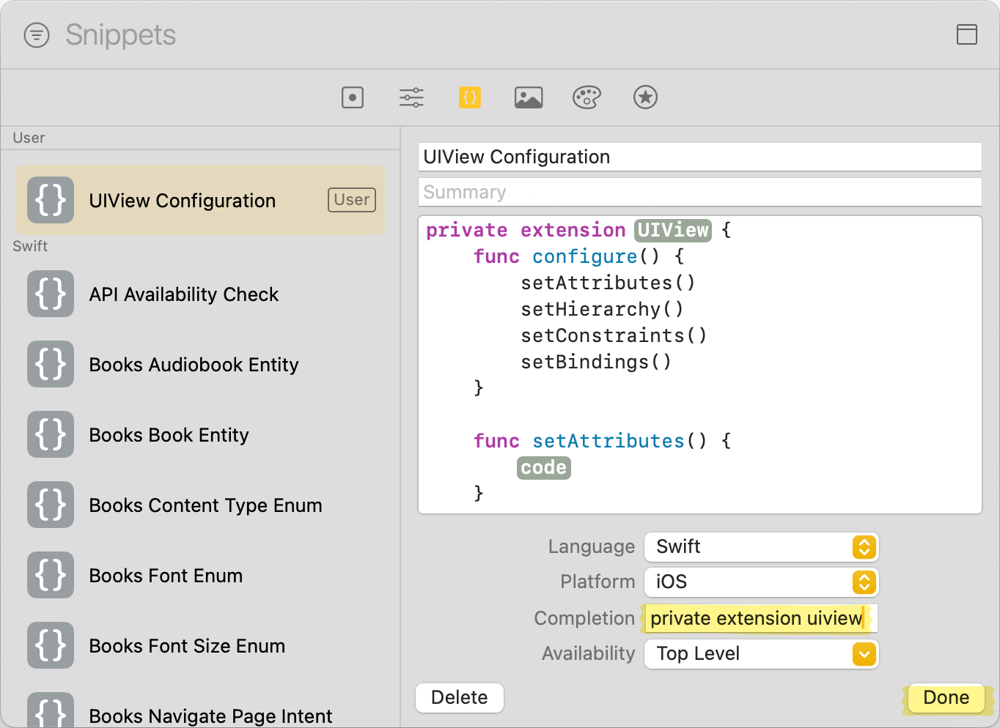

UIKit에서 `UIView` 혹은 `UIView`를 상속받은 View를 programmatic하게[^1] 구현하려면, 꽤 많은 설정 코드가 필요하다.<br>
`addSubview`도 호출해야 하고, 배경색, 폰트도 설정해야 하며, Auto Layout을 사용한다면 제약 조건도 설정해야 한다.<br>
만약 데이터 바인딩을 활용하고 있다면, Publisher를 구독하는 코드도 작성해야 한다.<br>
이 코드들은 보통 별도의 메서드로 분리하여 구현하게 된다.

정답이 있으면 좋겠지만, 사람마다 채택하는 메서드 순서, 네이밍, 분리 방식이 조금씩 다르다.<br>
이번 주제는 **매우 주관적**이지만, 나름대로 가장 적합한 작성법을 고민해 보았다.

## 1️⃣ configure()로 분류

먼저, View를 구성하는 코드를 `init`에 모두 작성한 초기 상태이다.


가독성과 재사용성이 아쉬우므로, `configure()` 메서드로 분리해 주자.<br>
set, setup으로 쓰이는 경우도 많지만, 내 의도에 가장 적합한 단어는 configure라고 판단했다.


## 2️⃣ 기능별로 메서드 분리

`init`은 깔끔해졌지만 `configure()`가 너무 많은 책임을 지고 있어서, 기능별로 메서드를 분리했다.<br>
마찬가지로 setup, update, build 등 다양한 용어가 쓰이는데, 통일성을 고려하여 set을 prefix로 사용했다.


## 3️⃣ 메서드 호출 순서

`setConstraints()`를 `setHierarchy()`보다 먼저 호출하는 건 허용되지 않는다.


View 간의 관계가 정해지지 않은 상태에서 Constraints를 설정하면 런타임 에러가 발생한다.<br>
반드시 Subview로 추가한 이후에, Auto Layout을 설정해야 한다.


메서드 순서는 프로젝트의 상황과 팀 컨벤션에 따라 달라질 수 있지만, 내가 생각하는 자연스러운 흐름은 다음과 같다.

1. `setAttributes()`
2. `setHierarchy()`
3. `setConstraints()`
4. 그 외 - `setBindings()` 등


## ViewCodeProtocol 소개

이러한 파이프라인을 아예 `ViewCodeProtocol`로 분리하는 방법을 제안하는 [포스트](https://medium.com/better-programming/ios-view-codes-handbook-1a08e28b0420)도 있다.

`ViewCodeProtocol`을 정의하고,


View에서 `ViewCodeProtocol`을 채택한 후, 메서드를 구현한 뒤,


`applyViewCode()`를 호출하는 방식이다.


이 방식은 명시적으로 기능을 분리하고, 순서를 보장하여 호출할 수 있다는 점이 장점이다.<br>
그러나 프로토콜의 특성상, 각 메서드를 `private`으로 제한할 수 없어서 캡슐화가 깨지게 된다.


## 4️⃣ private extension으로 분리

아쉽지만 프로토콜 방식은 포기하고, 대신 `private extension` 방법을 선택했다.<br>
기존 `extension`은 기능을 확장하는 의도지만, `private extension`은 기능 확장이 아닌, 코드 블록을 논리적으로 분리하려는 의도를 가진다.<br>
`fileprivate`와 기능상 거의 동일하지만, `private extension`을 이용하면 비슷한 기능들을 묶어 구조화하기에 더 좋다.


필요하지 않을 땐, `private extension` 부분을 fold 해둘 수 있다.


## 5️⃣ Xcode Code Snippet

`private extension` 구문을 스니펫으로 등록해 두면 생산성을 높일 수 있다.<br>
아래 코드를 Xcode에 붙여 넣고 드래그한 뒤, `Create Code Snippet...`을 클릭하여 등록할 수 있다.

```swift
private extension <#UIView#> {
    func configure() {
        setAttributes()
        setHierarchy()
        setConstraints()
        setBindings()
    }

    func setAttributes() {
        <#code#>
    }

    func setHierarchy() {
        <#code#>
    }

    func setConstraints() {
        <#code#>
    }

    func setBindings() {
        <#code#>
    }
}
```




### 스니펫 사용 예시

<video src='video.mp4' controls></video>

---

### 참고

- https://medium.com/better-programming/ios-view-codes-handbook-1a08e28b0420
- https://medium.com/better-programming/ios-view-code-a-solution-to-keep-the-encapsulation-f378dc8b1502
- [https://velog.io/@rbw/TIL코드로-뷰를-짜는-방법에-관해](https://velog.io/@rbw/TIL%EC%BD%94%EB%93%9C%EB%A1%9C-%EB%B7%B0%EB%A5%BC-%EC%A7%9C%EB%8A%94-%EB%B0%A9%EB%B2%95%EC%97%90-%EA%B4%80%ED%95%B4)

[^1]: 코드베이스 방식으로
