원격 데이터베이스를 간편하게 구축할 수 있는 선택지로 Google Firebase의 [Firestore](https://firebase.google.com/docs/firestore?hl=ko)가 있다.<br>
공식 튜토리얼을 따라 하면 Firestore를 쉽게 구축할 수 있는데, 그 과정을 요약하면 다음과 같다.

1️⃣ **Firebase 프로젝트를 만들고,**

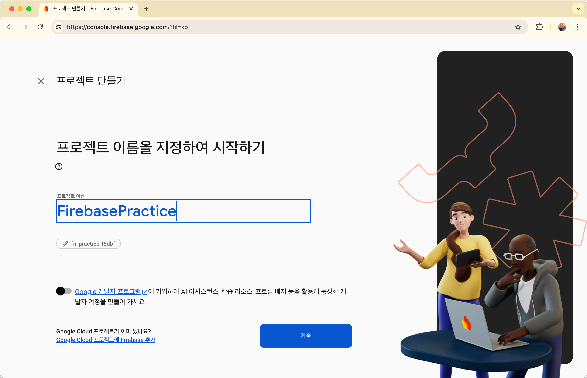

2️⃣ **Firebase 프로젝트와 Xcode 프로젝트를 연결하고,**

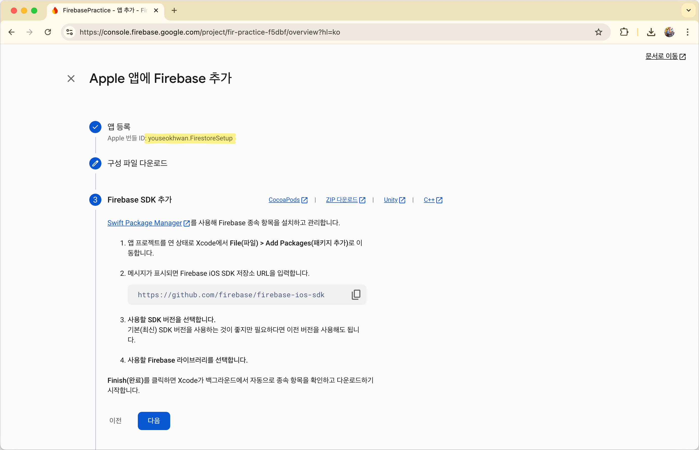

3️⃣ **제공되는 GoogleService-Info.plist와 Package Dependency를 추가한다.**

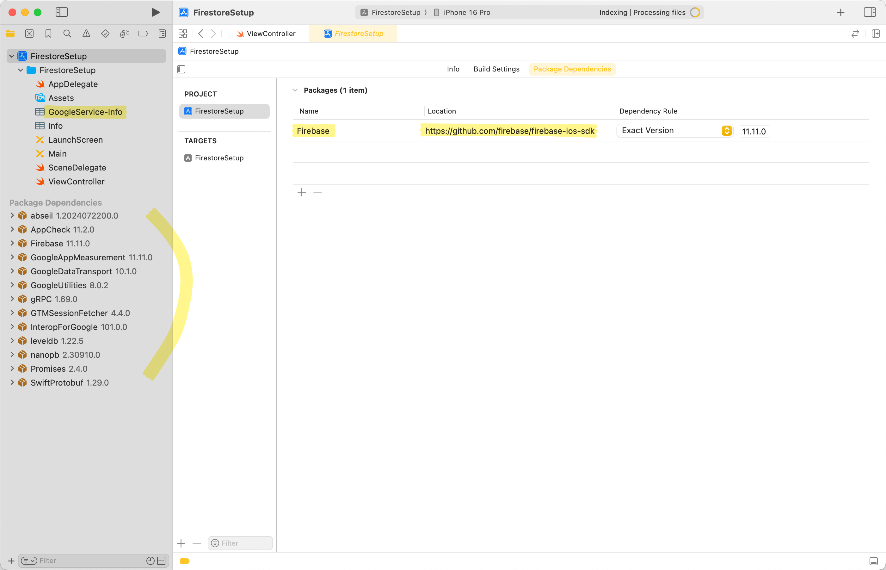

4️⃣ **이후 Firestore 데이터베이스를 만들고,**

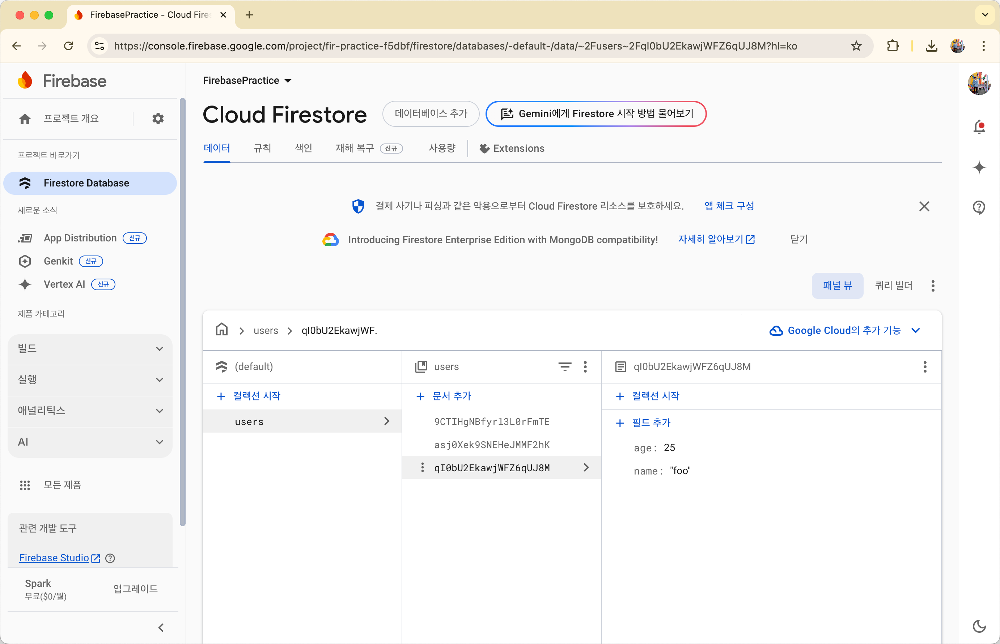

5️⃣ **Xcode 프로젝트에서 사용한다.**

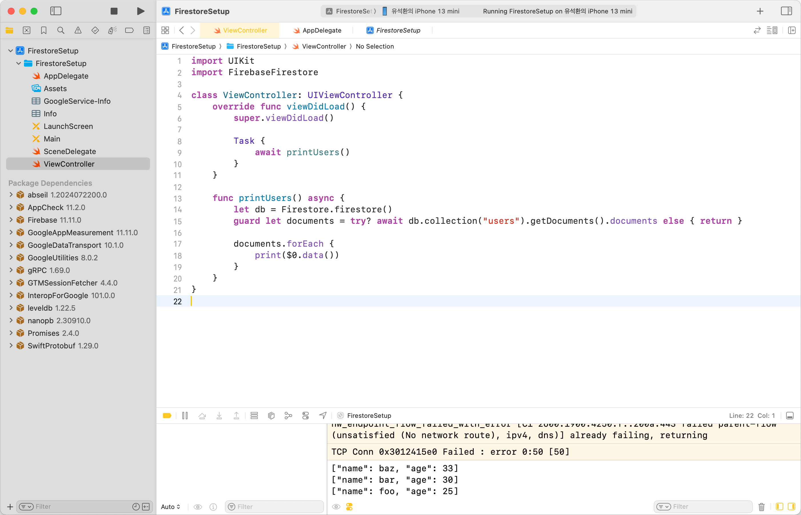

## 고려해야 할 요소

이 방법으로 사용해도 문제는 없지만, 몇 가지 신경 쓰이는 부분들이 있다.

### GoogleService-Info.plist

Xcode 프로젝트에서 Firebase에 접근하려면 `GoogleService-Info.plist` 파일이 필요하다.<br>
이 파일에는 Firebase 프로젝트의 각종 ID 값, Auth 및 Analytics 등 다양한 설정 정보가 포함되어 있으며, 특히 `API_KEY` 항목도 이 파일을 통해 관리한다.

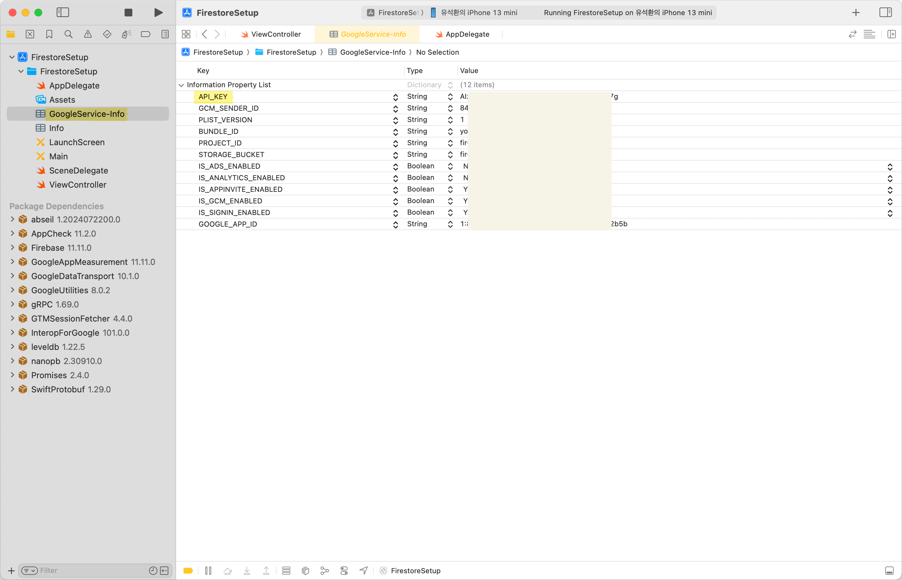

이 파일을 그대로 remote에 올리게 되면 보안 문제가 발생할 여지가 있으므로, 보다 안전한 방법을 모색해야 한다.

### 의존성 증가

Firebase가 다양한 기능과 높은 편의성을 제공하는 만큼, 패키지 자체의 dependency도 크다.

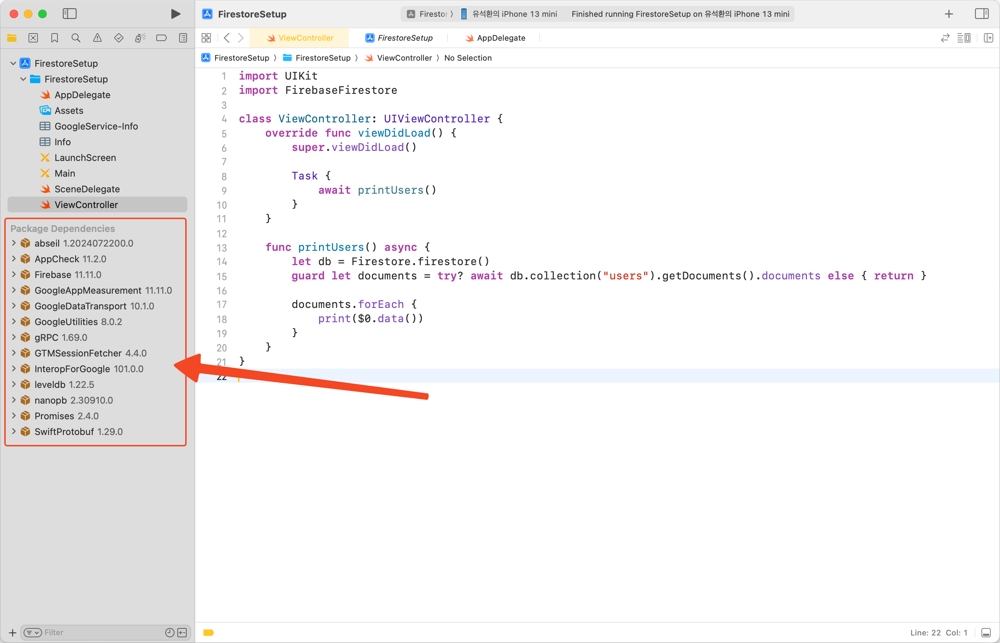

의존성이 높아지면 다음과 같은 문제가 발생한다.

* 프로젝트가 무거워지고, 빌드 및 인덱싱 속도가 느려진다.
* 불필요한 기능까지 포함되어 복잡도가 증가하고, 앱 크기가 커진다.
* 테스트나 다른 대안으로의 교체가 어려워져, 유지보수성이 저하된다.

## REST API 방식으로 마이그레이션

라이브러리를 걷어내고 REST API를 사용하는 방식으로 위 문제를 해결해 볼 수 있다.<br>
REST API 방식으로 마이그레이션 해보자.

### 1️⃣ Dependency 제거

`GoogleService-Info.plist` 파일과 package dependency를 제거한다.

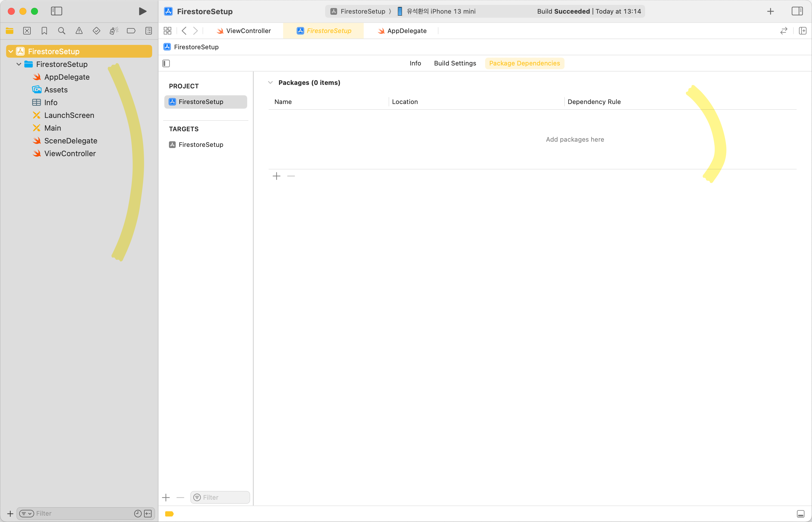

Firebase 프로젝트에 연결했던 Xcode 프로젝트 설정(Apple 앱 항목)도 삭제해도 된다.

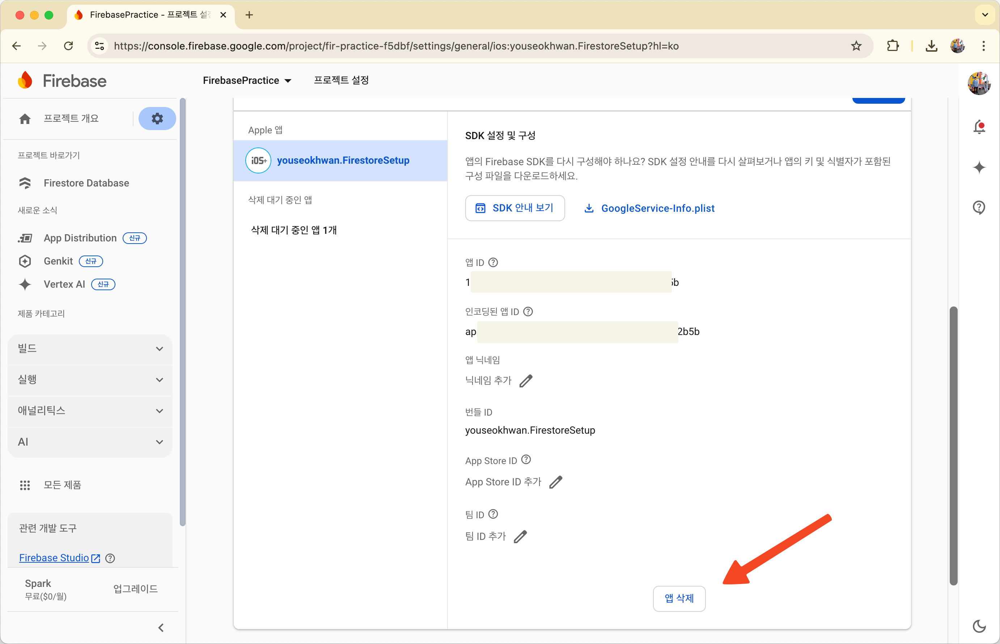

### 2️⃣ Endpoint 확인

HTTP Request를 보낼 endpoint 형식은 다음과 같다.

```
https://firestore.googleapis.com/v1/projects/{Firebase 프로젝트 ID}/databases/{Firestore 데이터베이스 ID}/documents/{컬렉션 ID}/{문서 ID}
```

현재 Firebase 프로젝트 ID는 `fir-practice-f5dbf`이고, Firestore 데이터베이스 ID는 `(default)`[^1]이다.<br>
컬렉션 ID는 `users`이고, 문서 ID를 생략하면 모든 문서를 fetch한다.

지금 사용할 정확한 endpoint는 아래와 같다.

```
https://firestore.googleapis.com/v1/projects/fir-practice-f5dbf/databases/(default)/documents/users
```

### 3️⃣ API 클라이언트를 이용해 Response 구조 확인

API 클라이언트[^2]를 이용해 Response 구조를 확인해 보자.

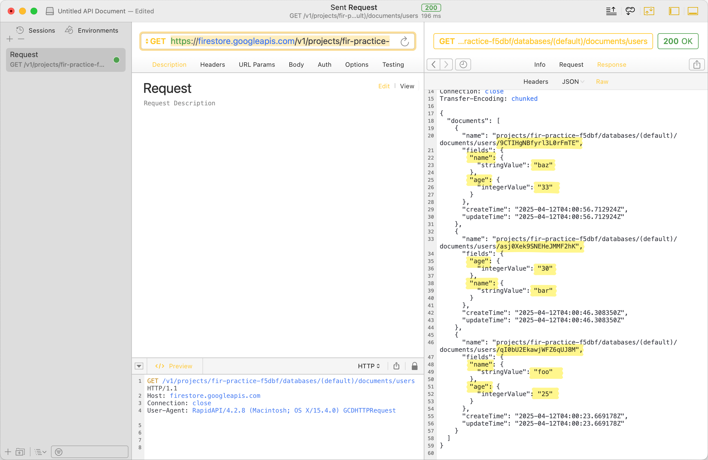

### 4️⃣ Entity, DTO 정의

Entity와 DTO를 정의한다.<br>
구조가 복잡하므로, 타입을 잘 확인해야 한다.

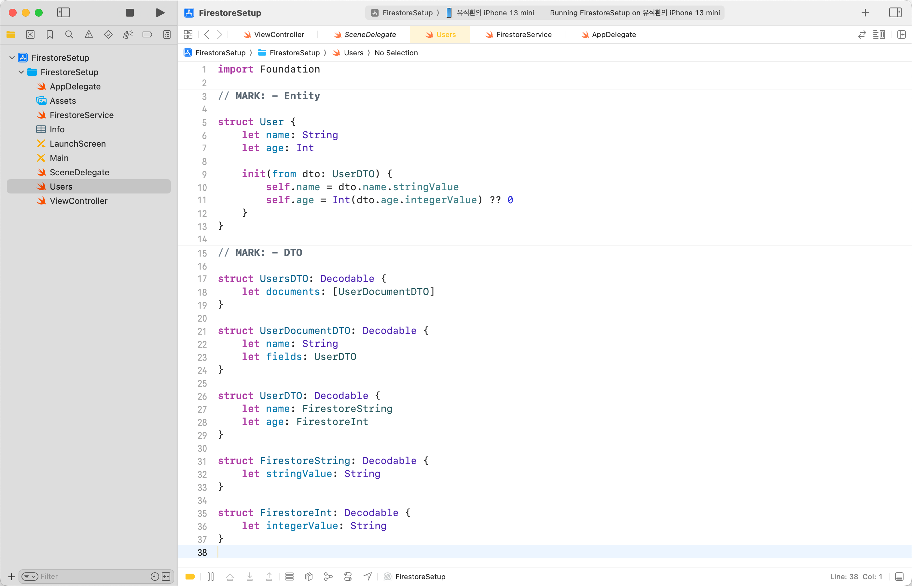

```swift
import Foundation

// MARK: - Entity

struct User {
    let name: String
    let age: Int

    init(from dto: UserDTO) {
        self.name = dto.name.stringValue
        self.age = Int(dto.age.integerValue) ?? 0
    }
}

// MARK: - DTO

struct UsersDTO: Decodable {
    let documents: [UserDocumentDTO]
}

struct UserDocumentDTO: Decodable {
    let name: String
    let fields: UserDTO
}

struct UserDTO: Decodable {
    let name: FirestoreString
    let age: FirestoreInt
}

struct FirestoreString: Decodable {
    let stringValue: String
}

struct FirestoreInt: Decodable {
    let integerValue: String
}
```

### 5️⃣ Service 구현

`URLSession`을 호출할 `FirestoreService`를 구현한다.<br>
`URLSession`과 `JSONDecoder`에 대한 에러 처리 과정은 생략했다.

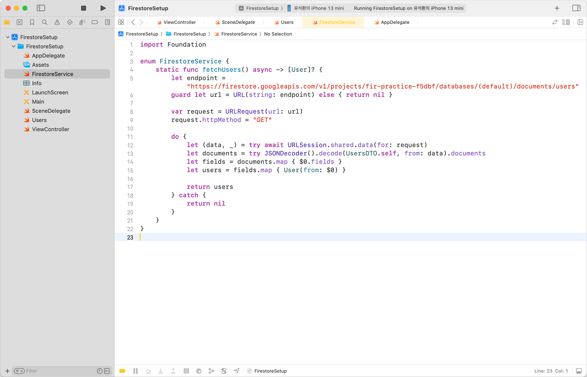

```swift
import Foundation

enum FirestoreService {
    static func fetchUsers() async -> [User]? {
        let endpoint = "https://firestore.googleapis.com/v1/projects/fir-practice-f5dbf/databases/(default)/documents/users"
        guard let url = URL(string: endpoint) else { return nil }

        var request = URLRequest(url: url)
        request.httpMethod = "GET"

        do {
            let (data, _) = try await URLSession.shared.data(for: request)
            let documents = try JSONDecoder().decode(UsersDTO.self, from: data).documents
            let fields = documents.map { $0.fields }
            let users = fields.map { User(from: $0) }

            return users
        } catch {
            return nil
        }
    }
}
```

### 6️⃣ 데이터 Fetch

`FirestoreService`를 이용해 데이터를 fetch하면, 마이그레이션이 완료된다.

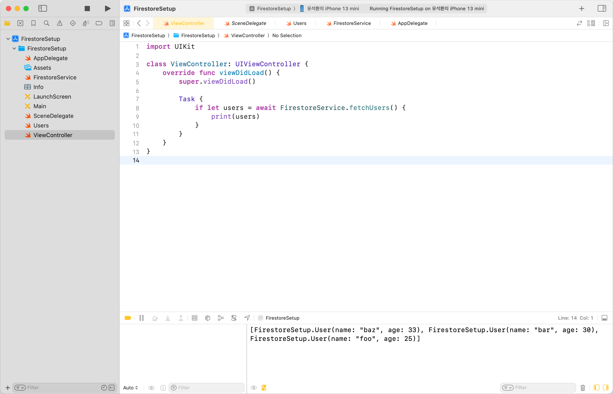

## 결론

REST API 방식으로 마이그레이션 함으로써, 프로젝트를 가볍게 만들고 의존성을 줄였다.

다만, 실시간 데이터를 스트리밍 방식으로 받아올 수 있는 SDK 방식과 달리, REST API 방식은 요청마다 네트워크 호출이 발생한다.<br>
실시간 데이터 수신이 필요한 경우에는 속도나 반응성 측면에서 불리할 수 있다.<br>
또한, DTO 구조가 복잡해지는 단점도 존재한다.

상황에 따라 이러한 장단점을 고려하여, 가장 적합한 방식을 선택하도록 하자.

---

### 참고

- https://firebase.google.com/docs/firestore?hl=ko
- https://firebase.google.com/docs/firestore/use-rest-api?hl=ko
- https://rapidapi.com/

[^1]: 정확히는 설정된 기본 데이터베이스로 리다이렉션한다는 의미인데, Spark 요금제에서는 기본 데이터베이스 외에 사용할 수 없으니 그냥 (default)로 접근하면 된다.
[^2]: 대표적으로 Postman, Insomnia, RapidAPI가 있다. 필자는 RapidAPI를 이용했다.
