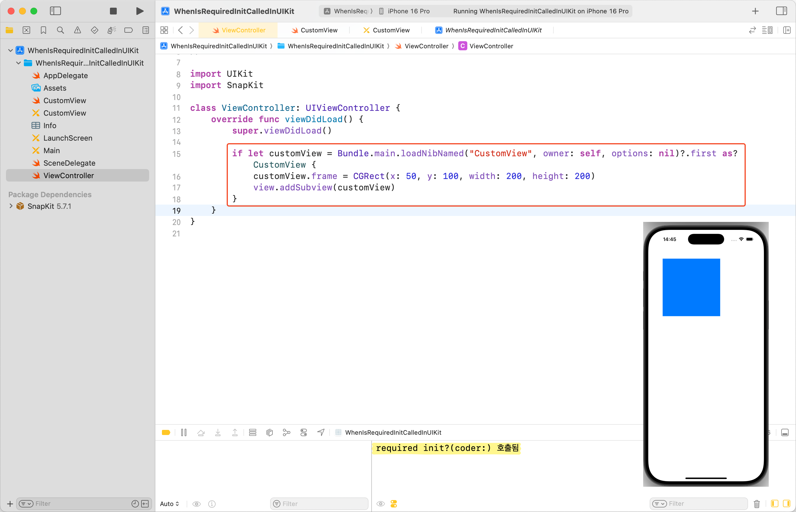

UIKit 컴포넌트를 상속받은 커스텀 뷰를 구현할 때, `required init?(coder:)`를 마주하게 된다.<br>
이것을 정의하지 않으면 컴파일 오류가 발생하기 때문에, 보통은 다음과 같이 처리했다.

```swift
required init?(coder: NSCoder) {
    fatalError("init(coder:) has not been implemented")
}
```

혹은

```swift
required init?(coder: NSCoder) {
    super.init(coder: coder)
    configure()
}
```

관성적으로 써오던 이 initializer가 왜 있는지, 그리고 정확히 어떤 상황에서 호출되는지 학습해 보았다.

## required init이란?

Swift에서 `required init`은 상속받는 모든 서브 클래스가 해당 initializer를 반드시 구현해야 함을 명시한다.

```swift
class SomeClass {
    required init() {
        // initializer implementation goes here
    }
}

class SomeSubclass: SomeClass {
    required init() {
        // subclass implementation of the required initializer goes here
    }
}
```

아쉽게도 UIKit이 Closed Source이기도 하고, Objective-C에 대한 지식이 부족해서 `required`라는 키워드를 직접 찾진 못했다.<br>
하지만 상위 클래스에서 `init?(coder:)`의 구현을 강제한다는 점은 유추해 볼 수 있다.


## 예제 프로젝트 생성

커스텀 뷰를 하나 만들고, Subview로 추가하여 화면에 띄우는 예시 프로젝트를 만들었다.

### CustomView


### ViewController + 시뮬레이터 실행 화면


## 그래서 언제 호출될까?

`required init?(coder:)`는 Storyboard나 Xib[^1] 파일을 통해 인스턴스가 생성될 때 호출된다.

### 강제로 호출해 보자

실제로 이렇게 사용할 것 같진 않지만, 학습 목적으로 강제로 호출해 보았다.

**1️⃣ Storyboard로 호출**

간단히 확인하기 위해, `Main.storyboard`에 등록된 `ViewController` 인스턴스를 만드는 방식으로 확인했다.


**2️⃣ Xib로 호출**

먼저, iOS Target의 `CustomView.xib`를 만들고, `Class` 항목에 `CustomView`를 입력하여 연결한다.


`CustomView`의 `required init?(coder:)`가 호출됐는지 확인하기 위해, `print()` 구문을 추가했다.


`ViewController`에서 xib를 load하면 `required init?(coder:)`가 호출되는 것을 확인할 수 있다.



## Storyboard와 Xib를 쓰지 않는다면

Storyboard와 Xib를 쓰지 않고 Swift 코드 기반으로만 UI를 구성한다면, 다음과 같은 방법들도 고려해 볼 수 있다.

### 1️⃣ convenience init 사용

Required Initializers에 대해 [공식 문서](https://docs.swift.org/swift-book/documentation/the-swift-programming-language/initialization#Required-Initializers)에 아래와 같은 언급이 있다.

> You don’t have to provide an explicit implementation of a required initializer if you can satisfy the requirement with an inherited initializer.

Designated Initializer를 하나도 구현하지 않으면, Required Initializer도 구현하지 않아도 된다.<br>
이 점을 이용하여 Convenience Initializer를 사용하는 방법이 있다.

그러나 유의할 것은,


↑↑ `required init?(coder:)`를 제거하고 깔끔하게 사용할 수 있지만,


↑↑ 기존 `self.init(frame:)`의 호출을 막을 방법이 없다.

명확한 팀 컨벤션이 없다면, 사이드 이펙트가 생길 가능성이 크다는 것을 인지하자.

### 2️⃣ @available 사용

`@available` 속성을 사용하면, 컴파일 에러를 의도적으로 발생시킬 수 있다.<br>
Storyboard나 Xib로 인스턴스를 생성할 수 없음을 더 강력하게 명시할 수 있다.

```swift
@available(*, unavailable, message: "@available을 통해 의도적인 컴파일 에러를 발생시킴")
required init?(coder: NSCoder) {
    fatalError()
}
```


---

### 참고

- https://docs.swift.org/swift-book/documentation/the-swift-programming-language/initialization#Required-Initializers
- https://babbab2.tistory.com/171
- https://velog.io/@nnnyeong/iOS-Xib-%EB%A5%BC-%EC%9D%B4%EC%9A%A9%ED%95%B4-CustomView-%EC%82%AC%EC%9A%A9%ED%95%B4%EB%B3%B4%EA%B8%B0

[^1]: Xcode Interface Builder