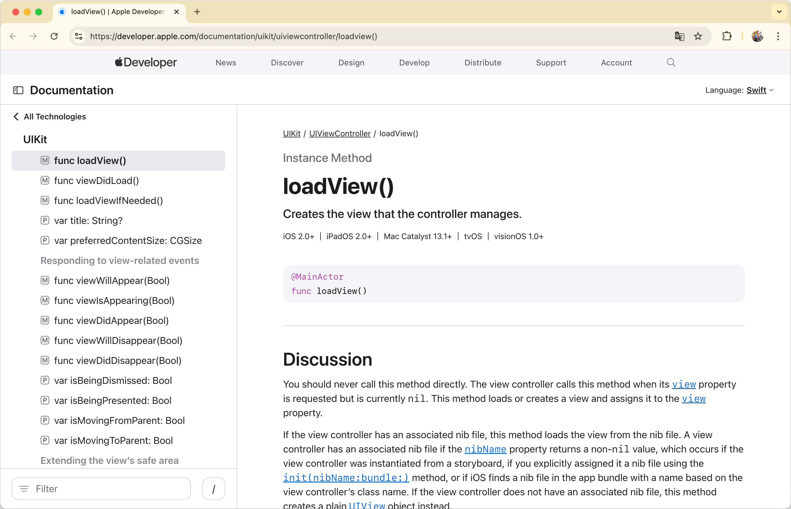
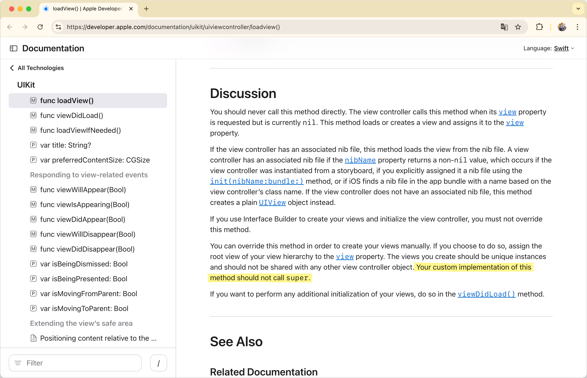
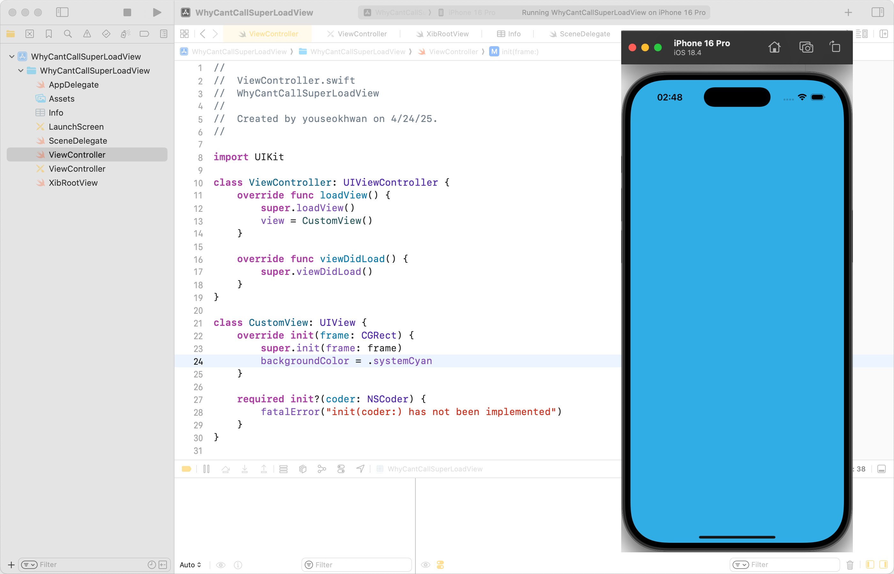
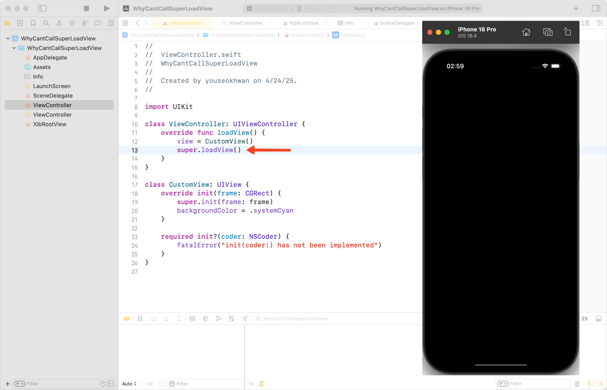
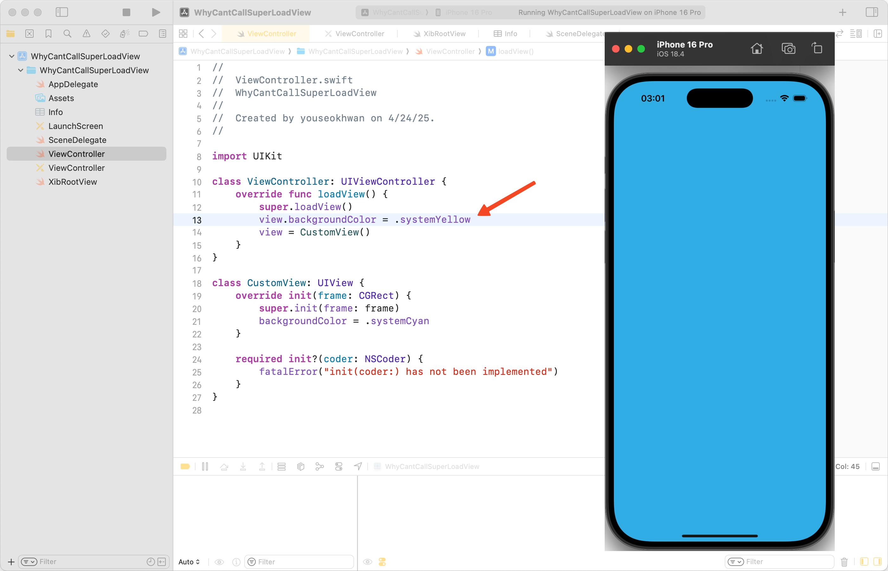
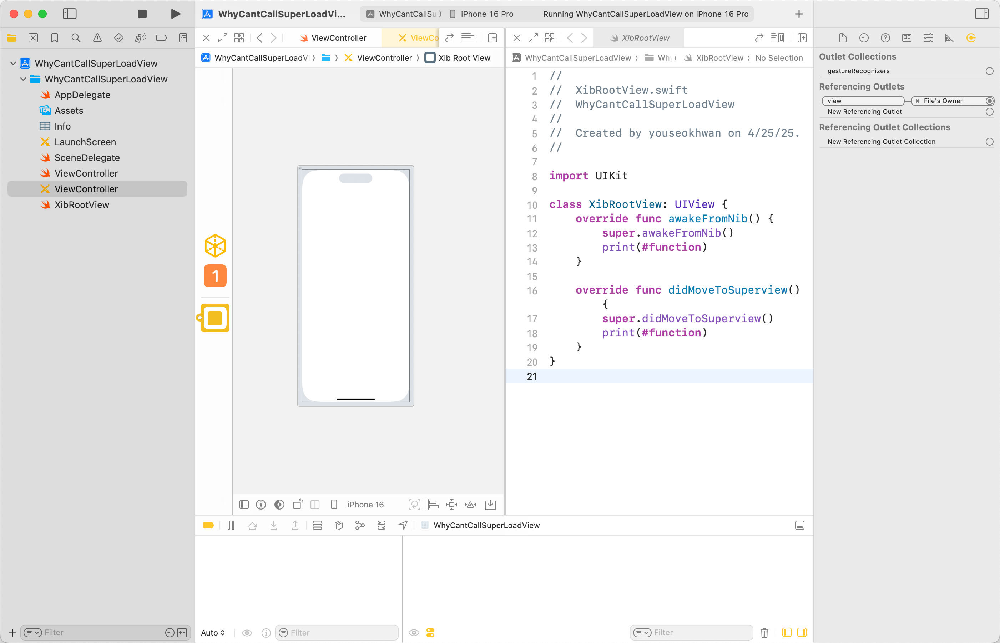
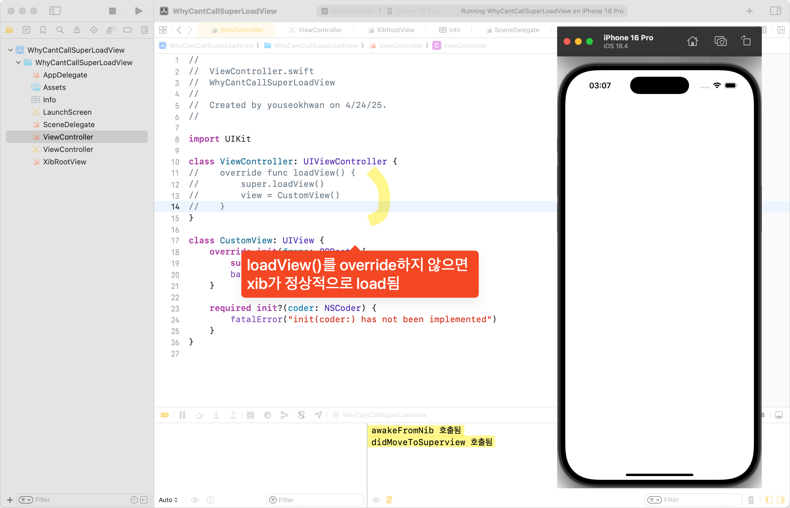
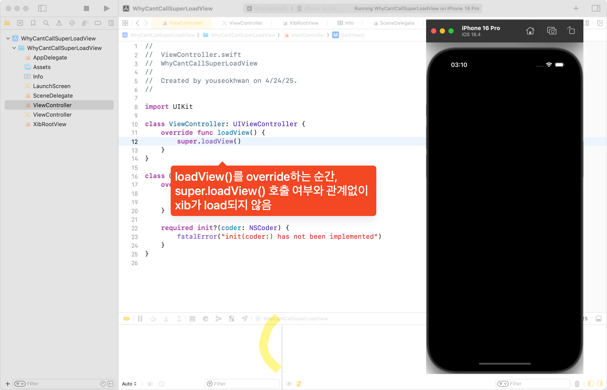
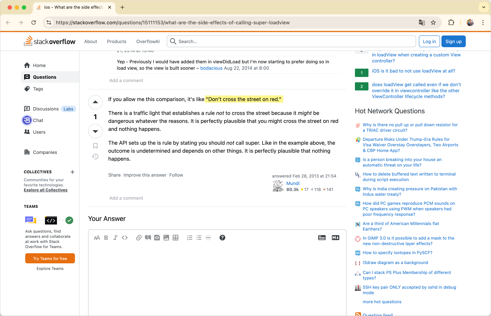

View를 따로 분리하지 않은 VC 구현은 다음과 같다.

```swift
import UIKit

class ViewController: UIViewController {
    override func viewDidLoad() {
        super.viewDidLoad()
        view.backgroundColor = .white
    }
}
```

만약 View를 별도로 분리하고 싶다면, `loadView` 생명주기 메서드에서 Custom View를 대입하면 된다.

```swift
import UIKit

class ViewController: UIViewController {
    override func loadView() {
        view = CustomView()
    }

    override func viewDidLoad() {
        super.viewDidLoad()
    }
}

class CustomView: UIView {
    override init(frame: CGRect) {
        super.init(frame: frame)
        backgroundColor = .white
    }

    required init?(coder: NSCoder) {
        fatalError("init(coder:) has not been implemented")
    }
}
```

## loadView란?



`loadView`는 VC의 `view` 프로퍼티가 요청되었을 때, `nil`인 경우 호출되는 메서드이다.<br>
연결된 xib(혹은 nib)가 있다면, xib의 View를 로드하여 VC의 `view` 프로퍼티에 대입한다.<br>
만약 연결된 xib가 없다면, `UIView()`를 만들어 VC의 `view` 프로퍼티에 대입한다.

## 🚨 super.loadView()는 호출하면 안 된다.

`loadView`는 시스템이 자동으로 호출하는 메서드이기 때문에, 직접 호출하면 안 된다.<br>
만약, Custom View를 VC의 Root View로 설정하고 싶다면, `loadView`를 override하여 직접 할당하면 된다.

```swift
override func loadView() {
    view = CustomView()
}
```

주의할 점은, viewDidLoad()와 같은 다른 생명주기 메서드처럼 관성적으로 `super.loadView()`를 호출하면 안 된다는 점이다.

```swift
override func loadView() {
    super.loadView() // 호출하면 안됨
    view = CustomView()
}
```

## 근거

근거는 [공식 문서](https://developer.apple.com/documentation/uikit/uiviewcontroller/loadview())에 있다.



> Your custom implementation of this method should not call super.

그런데, 하지 말라는 말만 있고 왜 하면 안 되는 지에 대한 내용이 없다.

## 실제로 호출해 보면?

호출하면 어떻게 될까?



crash를 기대했으나, 정상적으로 실행됐다.

## 굳이 하지 않아도 되는 행위

`super.view()`를 호출하면 `UIView`의 인스턴스를 만들어서 `view`에 할당하는데, 어차피 이후에 Custom View를 다시 할당하기 때문에 불필요한 행위가 된다.


`UIView` 인스턴스 1개가 메모리나 성능에 큰 낭비가 되진 않겠지만, 굳이 할 필요가 없는 행위이기도 하다.

## 다른 Side Effect는 없을까?

좀 더 육안으로 확인할 수 있는 치명적인 부작용은 없을까?<br>
아쉽게도 이렇다 할 Worst Case는 찾지 못했다.

`super.loadView()`를 뒤에 호출한다거나,



Custom View를 할당하기 전에 attribute를 설정하는 시나리오를 생각해 봤지만, 이건 Side Effect라기 보다는 그냥 개발자의 단순 실수에 가깝다.



xib 파일을 만들어 이런저런 시도를 해보았으나, 



`loadView`를 override하는 순간, xib 파일을 아예 load하지 않아서 문제가 발생하지 않았다.





## 마무리

'절대 호출하지 말라'는 공식 문서의 강한 워딩 때문에 치명적인 Side Effect를 기대했으나, 육안으로 확인하지 못해 아쉬운 마무리가 되었다.<br>
그래도 Stack Overflow에서 위안이 될 만한 문구를 발견했다.



> 빨간불에 길을 건너도 아무 문제가 발생하지 않을 수 있다.

`super.loadView()`를 호출하지 말라는 규칙은 '혹시나 일어날 수 있는 예외적인 상황'에 대비하기 위한 것으로 이해했다.<br>
당장 문제가 발생하지 않더라도, 해당 구문을 사용하지 않도록 하자.

---

### 참고

- https://developer.apple.com/documentation/uikit/uiviewcontroller/loadview()
- https://stackoverflow.com/questions/9569749/is-it-ok-to-call-super-loadview
- https://ios-daniel-yang.tistory.com/entry/iOSSwift-Life-Cycle%EC%9D%98-loadView
- https://stackoverflow.com/questions/15111153/what-are-the-side-effects-of-calling-super-loadview
