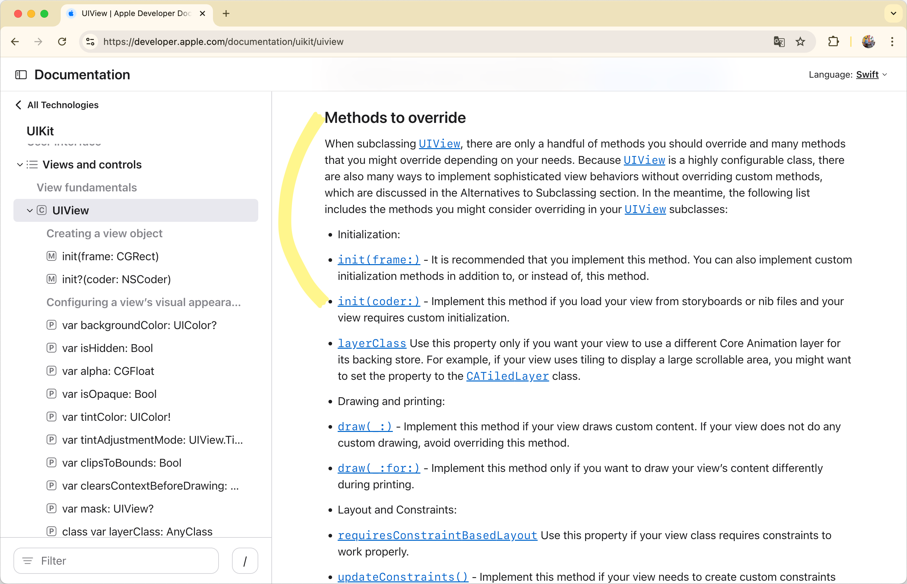
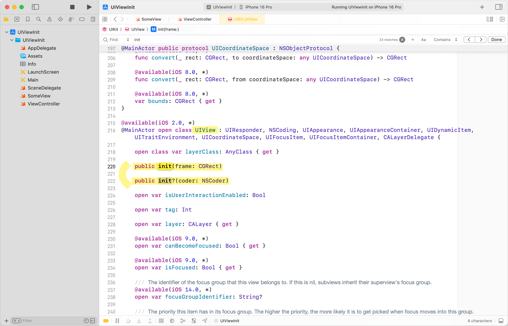

UIKit에서 UI 컴포넌트를 초기화할 때, 다음과 같은 구문을 볼 수 있다.

```swift
class ViewController: UIViewController {
    private let label = UILabel()
    private let someView = SomeView()
}
```

근데 생각해 보면, Custom View를 구현할 때, `init()`을 구현하지 않아도 위와 같은 구문을 사용할 수 있다.

```swift
import UIKit

class ViewController: UIViewController {
    private let someView = SomeView() // SomeView.init()이 없지만 오류가 발생하지 않는다.

    override func viewDidLoad() {
        super.viewDidLoad()
        view.addSubview(someView)
    }
}

class SomeView: UIView {
    override init(frame: CGRect) {
        super.init(frame: frame)
    }

    required init?(coder: NSCoder) {
        fatalError("init(coder:) has not been implemented")
    }
}
```

어떤 원리로 가능한 것인지 살펴보았다.

### UIView 공식 문서 찾아보기

우선, [공식 문서](https://developer.apple.com/documentation/uikit/uiview)를 찾아보았다.




`init(frame:)`과 `init?(coder:)`에 대한 내용은 있으나, `init()`에 대한 내용은 찾을 수 없었다.

### UIView 내부 구현 확인하기

직접적인 코드는 볼 수 없지만, 인터페이스 스텁은 확인해 볼 수 있다.<br>
command + 클릭으로 `UIView`의 인터페이스를 확인했다.



마찬가지로 `init()`에 대한 내용은 찾을 수 없었다.

### 디버깅으로 확인하기

실행시켜서 디버깅을 해보자.<br>
`init()`으로 초기화해도 `init(frame:)`이 실행된다는 것은 경험적으로 알고 있기 때문에, `init(frame:)`에 breakpoint를 넣었다.


내용을 직관적으로 알기는 어렵지만, 아래와 같은 사실을 추측해 볼 수 있다.

* `init()`이 호출되면 `init(frame:)`이 대신 호출된다.
* `UIView.__allocating_init()`이 호출된 스택을 확인할 수 있고, 이 내용은 `NSObject.h`에 있다.

참고로 `UIView`는 `UIResponder`를 상속받고 있고, `UIResponder`는 `NSObject`를 상속받는다.

### NSObject.h 확인하기

`NSObject.h`를 확인해 보자.


Swift 프로젝트에서는 `NSObject`로 Jump to Definition이 작동하지 않아서, Objective-C 프로젝트를 만들어서 확인했다.


`NSObject`에서는 `init()`을 찾을 수 있었다.

* `-`는 인스턴스 메서드, `+`는 클래스 메서드(타입 메서드)이다.
* `()`는 반환 타입이며, `instancetype`은 자기 자신 타입을 반환한다는 뜻이다.<br>Swift로 치면 `func init() -> Self` 이런 느낌.
* `NS_ENFORCE_NSOBJECT_DESIGNATED_INITIALIZER`는 레거시 호환성을 위한 컴파일 지시자인 것 같다.<br>Designated Initializer 규칙을 따르지 않아도 괜찮았던 시절이 있었던 것으로 넘겨짚어 본다.
* `NS_DESIGNATED_INITIALIZER`는 말 그대로 Designated Initializer로 지정하는 구문이다.

`UIResponder`에는 별도로 명시된 생성자가 없기 때문에, `UIView.init()`은 `NSObject.init()`을 Convenience Initializer로 override하여 `UIView.init(frame:)`으로 연결하는 것으로 추측할 수 있다.

```swift
override convenience init() {
    self.init(frame: .zero)
}
```

### 재연해 보기

비슷한 구조를 직접 만들어보자.<br>
`MockUIView`은 `UIView`를 예상하여 구현한 것이고, `UIView`는 UIKit이 Closed Source기 때문에 직접 확인할 수는 없다.<br>
`MockSomeView()`를 호출했을 때, `MockSomeView(frame:)`이 호출되는 것을 확인할 수 있다.


```swift
import UIKit

class ViewController: UIViewController {
    private let mockSomeView = MockSomeView()
}

// Closed Source이므로 직접 확인할 수 없는 코드
class MockUIView: UIResponder {
    override convenience init() {
        self.init(frame: .zero)
    }

    init(frame: CGRect) {}

    required init?(coder: NSCoder) {}
}

// 우리가 CustomView를 만들 때, 작성하는 코드
class MockSomeView: MockUIView {
    override init(frame: CGRect) {
        super.init(frame: frame)
        print("init(frame:) 호출됨")
    }

    required init?(coder: NSCoder) {
        print("init?(coder:) 호출됨")
        fatalError("init(coder:) has not been implemented")
    }
}
```

### 결론

`UIView.init()`의 편의성은 Objective-C의 유산?과 Closed Source인 UIKit의 만난 결과라고 볼 수 있다.<br>
개인적으로는 명시성, 예측 가능성을 통해 안정성을 추구하는 Swift의 방향성과는 정반대라고 느껴졌고, 혼란을 야기할 수 있다고 느껴졌다.

아직 제대로 학습하는 방법을 모르거나 그냥 전반적인 지식이 부족해서겠지만, 이 주제는 조금 불편한 상태로 마무리하게 되었다.<br>
`UIView.init()`을 호출하면 `UIView.init(frame: .zero)`가 호출된다는 숨겨진 규칙을, 공식 문서가 아닌 디버깅을 통해 경험적으로 알아야만 하는 것일까?

---

### 참고

- https://developer.apple.com/documentation/uikit/uiview
- https://developer.apple.com/documentation/objectivec/ns_enforce_nsobject_designated_initializer?changes=l_7&language=objc
