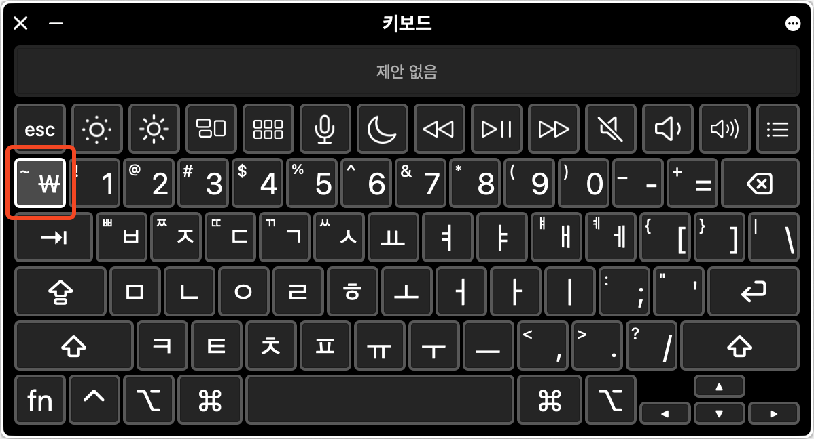
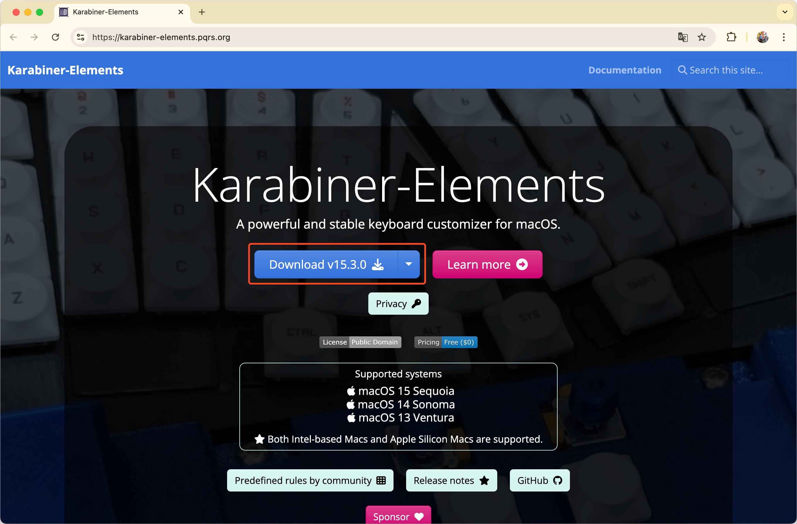
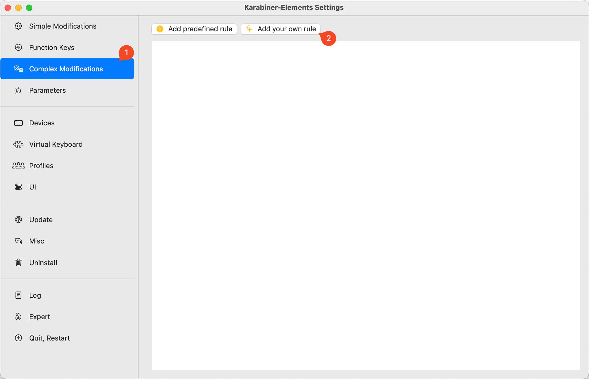
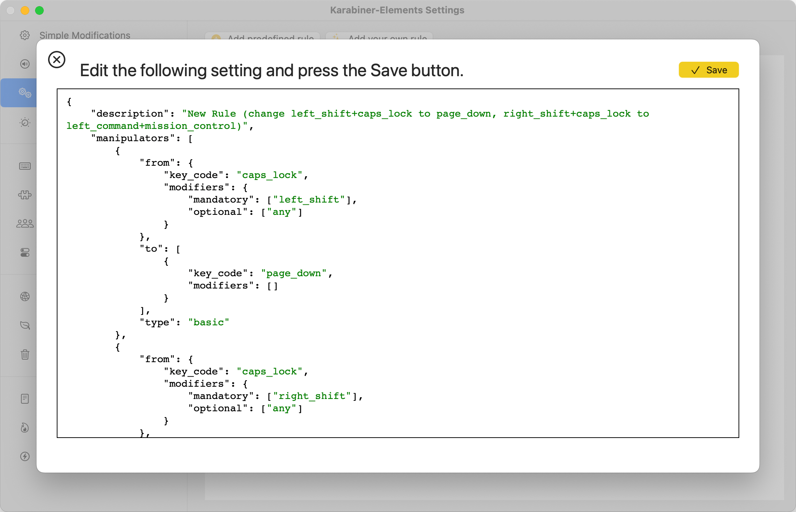
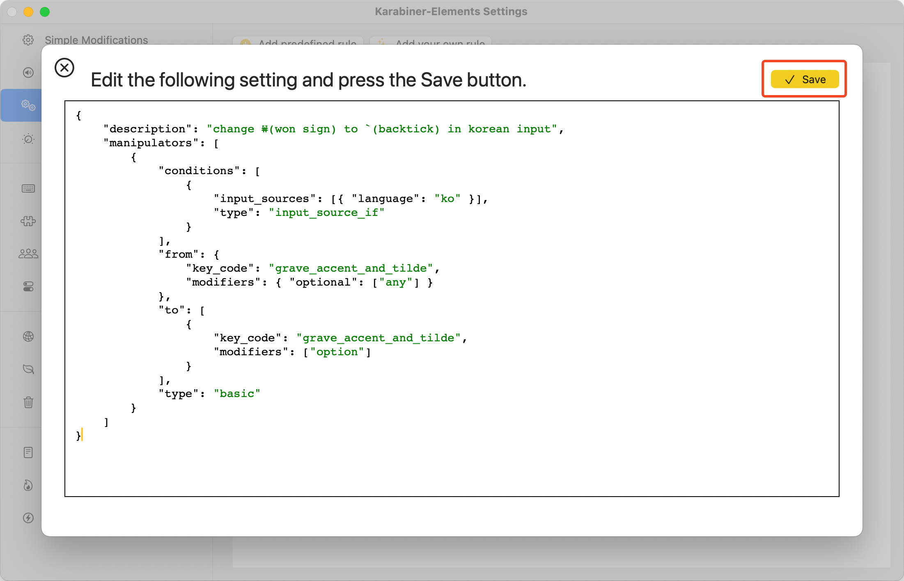
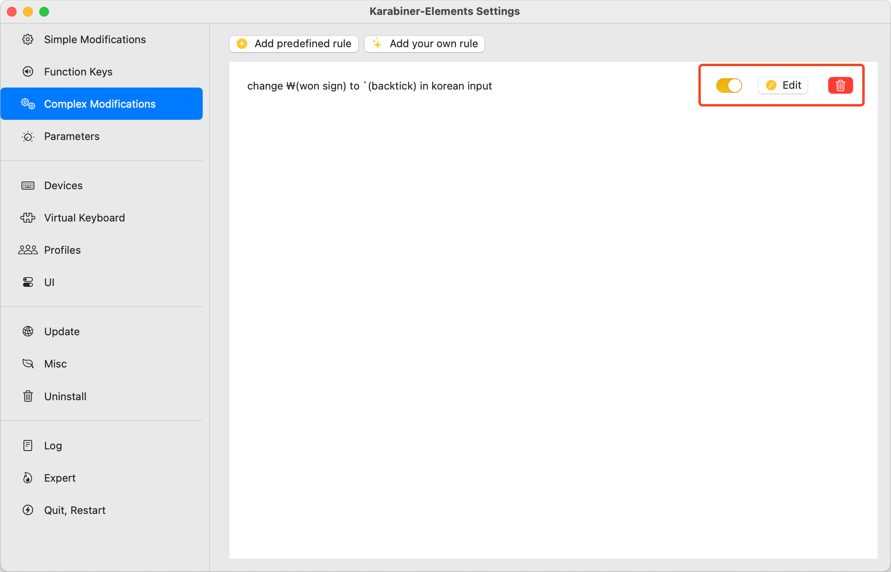

한국어 키보드에서는 `1` 왼쪽에 있는 `` ` ``키[^1]로 `` ` ``, `₩`, `~`를 입력할 수 있다.



한글 입력 상태일 때는 `₩`, 영어 입력 상태일 때는 `` ` ``, `⇧`와 함께 입력하면 `~`가 입력된다.<br>
추가적으로, 한글 입력 상태에서 `` ⌥ + ` ``를 입력하면 `` ` ``가 입력된다.

화폐 단위를 편하게 입력할 수 있지만, `₩`을 쓸 일이 별로 없거나, `` ` ``대신 `₩`가 입력되는 것을 원치 않는다면 Karabiner를 통해 입력 설정을 변경할 수 있다.

## Karabiner 설치

Karabiner-Elements는 macOS에서 키보드 입력을 커스터마이징해주는 앱이다.<br>
[공식 홈페이지](https://karabiner-elements.pqrs.org/)에서 다운받을 수 있다.



## 키보드 입력 커스터마이징

Karabiner-Elements를 실행하고, `Complex Modifications` 탭의 `Add your own rule` 버튼을 클릭한다.



아래와 같이 json 예시가 제공된다.



해당 코드를 모두 지우고, 아래 json을 입력하고 `save` 버튼을 클릭한다.

```json
{
    "description": "change ₩(won sign) to `(backtick) in korean input",
    "manipulators": [
        {
            "conditions": [
                {
                    "input_sources": [{ "language": "ko" }],
                    "type": "input_source_if"
                }
            ],
            "from": {
                "key_code": "grave_accent_and_tilde",
                "modifiers": { "optional": ["any"] }
            },
            "to": [
                {
                    "key_code": "grave_accent_and_tilde",
                    "modifiers": ["option"]
                }
            ],
            "type": "basic"
        }
    ]
}
```



한글 입력 상태에서 `` ` ``키를 누르면 `` ⌥ + ` ``으로 매핑하여, 결과적으로 `` ` ``을 입력한다.<br>
`save` 버튼을 클릭하면 바로 설정이 적용된다.

## 설정 되돌리기

오른쪽 UI에서 비활성화, 수정, 삭제할 수 있다.



## ₩ 기호 입력하려면?

만약 `₩` 기호를 입력하려면, 이모지(`⌘ + ⌃ + space`)를 통해 입력하면 된다.


---

### 참고

- https://karabiner-elements.pqrs.org/
- https://ke-complex-modifications.pqrs.org/

[^1]: grave accent and tilde key