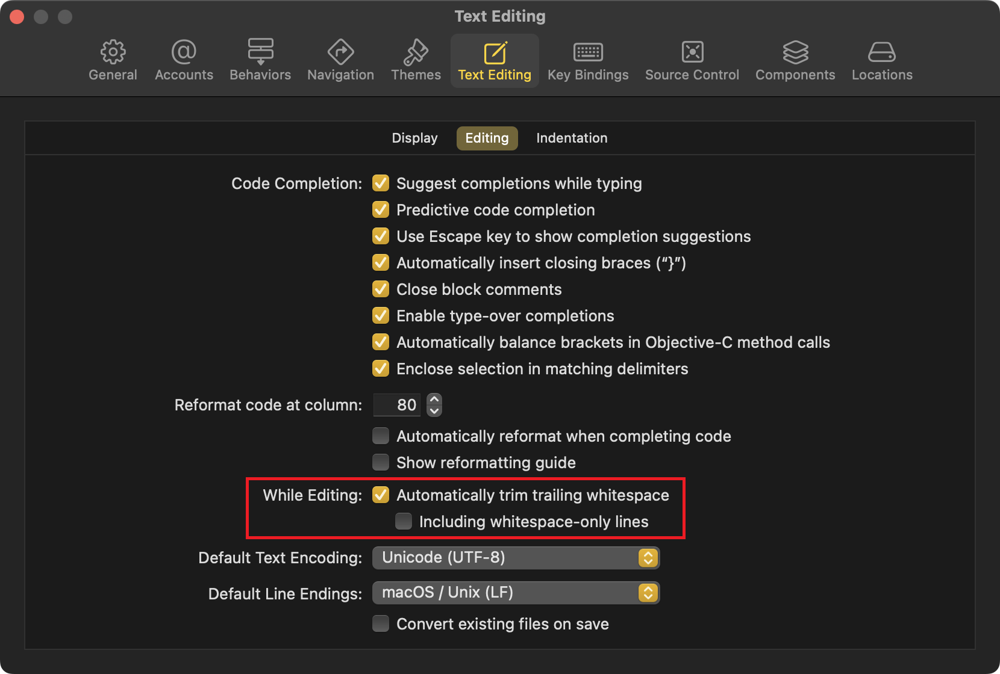
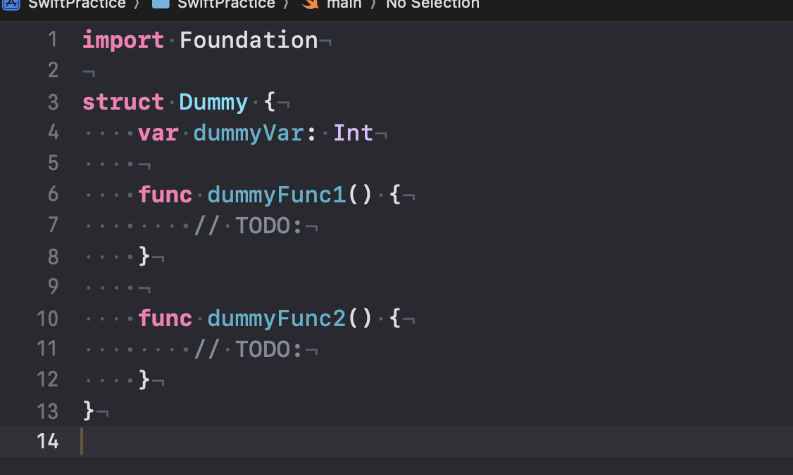
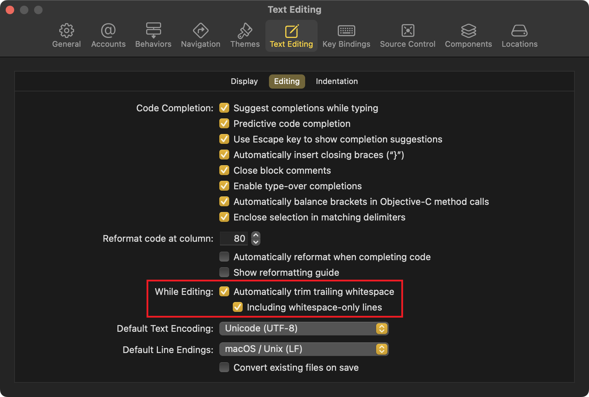
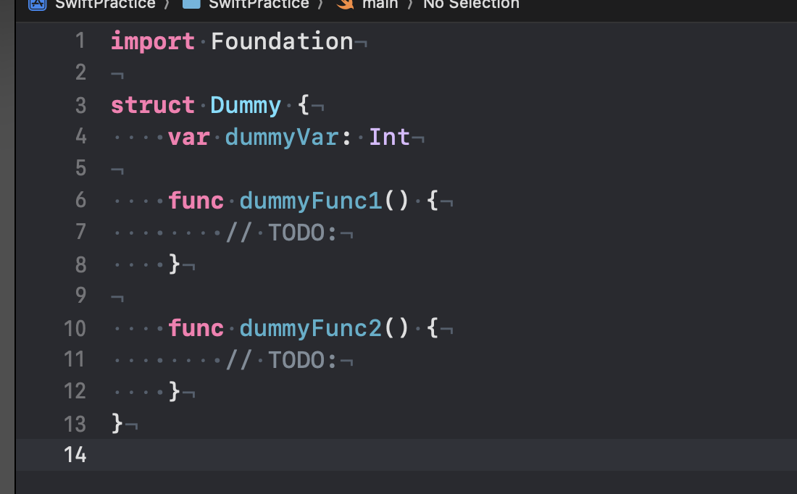

## Terms

* whitespace: 공백을 나타내는 문자 데이터(` `, `\t`, `\n` 등)
* trim: 문자열의 앞뒤에 있는 공백 문자를 제거하는 것

## Xcode의 auto trimming

Xcode는 코드를 작성할 때, 문자열 뒤에 붙는 whitespaces를 자동으로 trim한다. 
`⌘ + ,` > `Text Editing` > `Editing` > `While Editing`에서 `Automatically trim trailing whitespace`가 기본값으로 체크돼있는 것을 확인할 수 있다.

이때, whitespaces로만 이뤄진 line의 경우 자동으로 trim되지 않는다. 
예를 들면 다음과 같다.

line 5와 9의 경우, 공백(` `) 4개 혹은 `\t`가 남아있는 것을 확인할 수 있다. 
이 경우, 아래에 있는 `Including whitespace-only lines` 옵션에도 체크를 해주면 자동으로 trim되도록 설정할 수 있다.

위 옵션들을 on/off하여 불필요한 whitespaces를 제거하거나, lint 설정과 맞출 수 있다.

## Issue

`tab`키로 직접 `\t`를 삽입한 뒤 바로 저장(`⌘ + S`)할 경우, trim되지 않을 수 있는 점에 유의한다.

---

### 참고

- https://developer.apple.com/library/archive/releasenotes/DeveloperTools/RN-Xcode/Chapters/Introduction.html
