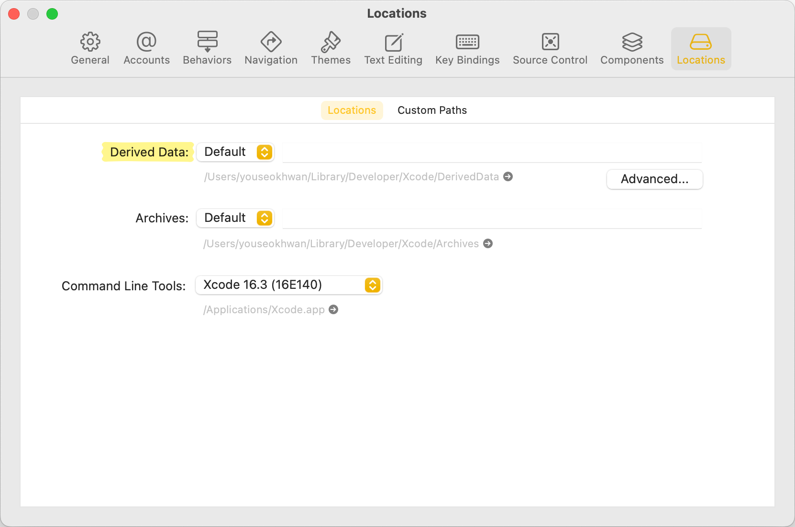

# 올바른 용어 쓰기

<small>마지막 업데이트: 2025.04.06</small>

iOS를 학습하면서 잘못 알았던 발음이나, 헷갈리는 표기법들을 사전 순으로 정리했다. 
발음은 []로 감싸서 표시한다.

## 1️⃣ Pronunciation - 올바른 발음(US)

### Derived

[디라이브드] ✅

### Designated

[Designated Initializer](https://docs.swift.org/swift-book/documentation/the-swift-programming-language/initialization#Designated-Initializers-and-Convenience-Initializers) 
[데지그네이티드] ✅ / [디자이네이티드] ❌

### Opaque

[Opaque Type](https://docs.swift.org/swift-book/documentation/the-swift-programming-language/opaquetypes) 
[오페이크] ✅ / [오파큐] ❌

### Realm

[realm-swift](https://github.com/realm/realm-swift) 
[렘] ✅, [레엄] ✅ / [렐름] ❌ 
https://youtu.be/PmsJW59rNY8?t=12

### Suite

[UserDefaults.init(suiteName:)](https://developer.apple.com/documentation/foundation/userdefaults/1409957-init), [Swift Testing - Suite](https://developer.apple.com/documentation/testing/suite(_:_:)) 
[스위트] ✅ 
sweet와 발음이 같다.

### Usage

[유시지] ✅ / [유세이지] ❌ 
message가 [메시지]로 발음되는 것을 생각하면 기억하기 쉽다.

---

## 2️⃣ Nomenclature - 관습적인 명명법

### HIG

[Human Interface Guidelines](https://developer.apple.com/kr/design/human-interface-guidelines/) 
보통 [히그]라고 읽음

### Xib

WWDC에선 [집]이라고 읽는데, 대화할 때는 그냥 nib과 동일하게 [닙]으로 읽기도 한다. 
https://developer.apple.com/videos/play/wwdc2023/10155/?utm_source=chatgpt.com&time=642 
https://youtu.be/SOgxZLjl2NE?t=72

---

## 3️⃣ Broken English - 콩글리쉬

### 어플, 어플리케이션

어플 ❌ → 앱 ✅ 
어플리케이션 ❌ → 애플리케이션 ✅

---

## 4️⃣ Orthography - 한글 맞춤법, 외래어 표기법 기준

### Directory

디렉터리 ✅ / 디렉토리 ❌

### Method

메서드 ✅ / 메소드 ❌

---

## 5️⃣ Semantics - 단어의 정확한 의미

()
