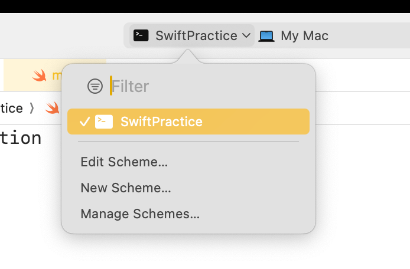
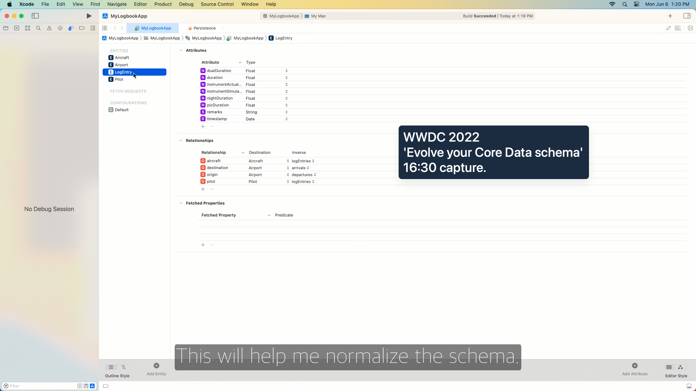

# 용어 올바르게 쓰기

<small>마지막 업데이트: 2025.04.25</small>

iOS를 학습하면서 잘못 알았던 발음이나, 헷갈리는 표기법들을 정리했다.

## 1️⃣ 올바른 발음

### async

[Meet async/await in Swift](https://developer.apple.com/videos/play/wwdc2021/10132/), [https://youtu.be/a1u407aFu9g](https://youtu.be/a1u407aFu9g) 
[에이싱크] ✅ / [어싱크] ❌

### Capacity

[커패시티] ✅ / [카파시티] ❌, [캐패시티] ❌

### Derived

[디라이브드] ✅

### Designated

[Designated Initializer](https://docs.swift.org/swift-book/documentation/the-swift-programming-language/initialization#Designated-Initializers-and-Convenience-Initializers) 
[데지그네이티드] ✅ / [디자이네이티드] ❌

### Disable

[디스에이블] ✅ / [디저블] ❌

### Fatal

[fatalError(_:file:line:)](https://developer.apple.com/documentation/swift/fatalerror(_:file:line:)) 
[페이틀] ✅, [페이털] ✅ / [파탈] ❌, [페이탈] ❌

### Height

[CGSize.height](https://developer.apple.com/documentation/corefoundation/cgsize/height) 
[하이트] ✅ / [헤이트] ❌

### Label

[UILabel](https://developer.apple.com/documentation/uikit/uilabel) 
[레이블] ✅ / [라벨] 🤔❌ 
국립국어원에서 라벨도 관용 표기로 인정하였기에, 라벨이 틀린 단어는 아니다. 
하지만, 개발은 영어를 기반으로 하기에 [레이블]로 발음하는 것이 맞다고 판단했다.

### Opaque

[Opaque Type](https://docs.swift.org/swift-book/documentation/the-swift-programming-language/opaquetypes) 
[오페이크] ✅ / [오파큐] ❌

### Priority

[NSLayoutConstraint.priority](https://developer.apple.com/documentation/uikit/nslayoutconstraint/priority) 
[프라이오리티] ✅ / [프리오리티] ❌

### Realm

[realm-swift](https://github.com/realm/realm-swift) 
[렘] ✅, [레엄] ✅ / [렐름] ❌ 
https://youtu.be/PmsJW59rNY8?t=12

### Suite

[UserDefaults.init(suiteName:)](https://developer.apple.com/documentation/foundation/userdefaults/1409957-init), [Swift Testing - Suite](https://developer.apple.com/documentation/testing/suite(_:_:)) 
[스위트] ✅ 
sweet와 발음이 같다.

### Usage

[유시지] ✅ / [유세이지] ❌ 
message가 [메시지]로 발음되는 것을 생각하면 기억하기 쉽다.

---

## 2️⃣ 보통 이렇게 읽더라

### HIG

[Human Interface Guidelines](https://developer.apple.com/kr/design/human-interface-guidelines/) 
보통 [히그]라고 읽음

### Xib

WWDC에선 [집]이라고 읽는데, 대화할 때는 그냥 Nib과 동일하게 [닙]으로 읽기도 한다. 
https://developer.apple.com/videos/play/wwdc2023/10155/?utm_source=chatgpt.com&time=642 
https://youtu.be/SOgxZLjl2NE?t=72

---

## 3️⃣ 콩글리쉬 조심, 쓰더라도 인지하고 쓰자

### 어플, 어플리케이션

어플 ❌ → 앱 ✅ 
어플리케이션 ❌ → 애플리케이션 ✅

### 코드베이스

Storyboard를 사용하지 않고 UI를 구성할 때, '코드베이스로 구현한다.'라고 표현하는 경우가 있다. 
하지만, codebase는 '소스 코드 전체' 혹은 '공유되는 코드의 기반'을 뜻하는 단어이므로, 'programmatic'이라는 표현을 사용하거나, 'code-based'라고 명확하게 표현하자.

---

## 4️⃣ 문서로 작성할 땐, 외래어 표기법을 참고

### Directory

디렉터리 ✅ / 디렉토리 ❌

### Method

메서드 ✅ / 메소드 ❌

---

## 5️⃣ 기타

### Erase

코딩에서 erase는 단순히 '지우다 🤔'보다는 '추상화하다 ✅'로 해석하자. 
Combine의 [eraseToAnyPublisher](https://developer.apple.com/documentation/combine/just/erasetoanypublisher())는 'AnyPublisher로 추상화하다'라고 해석하면 더 잘 와닿는다.

### Scheme vs Schema

scheme[스킴]은 계획, schema[스키마]는 개요.

출처: https://developer.apple.com/videos/play/wwdc2022/10120/

### Sift

Heap에 SiftUp, SiftDown 연산이 있는데, 이때 sift는 '체로 거르다', '골라내다'라는 뜻이다. 
Shift와 혼동하지 말 것.

### Suffix vs Postfix

suffix는 접미사를 의미하고, postfix는 후위 표기를 뜻한다. 
CancelButton은 Button이라는 Suffix를 가진다. ✅ / Postfix를 가진다. ❌ 
C언어에서 count++;은 ++이라는 Suffix를 가진다. ❌ / Postfix를 가진다. ✅
